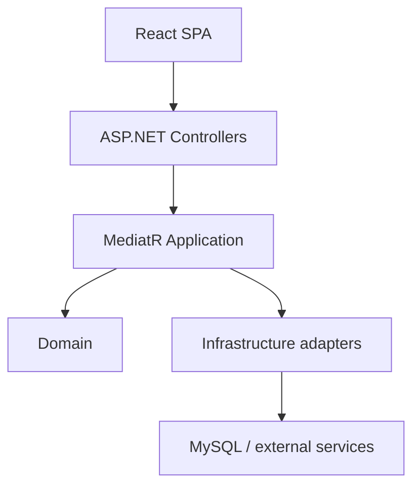
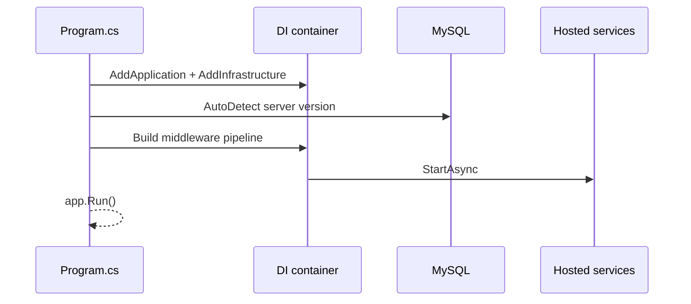
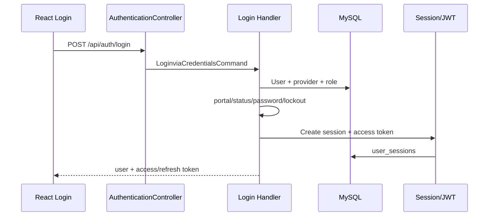
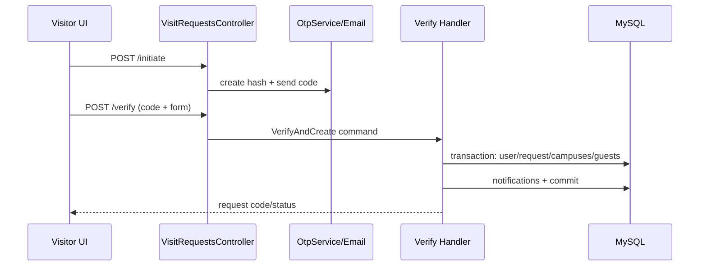
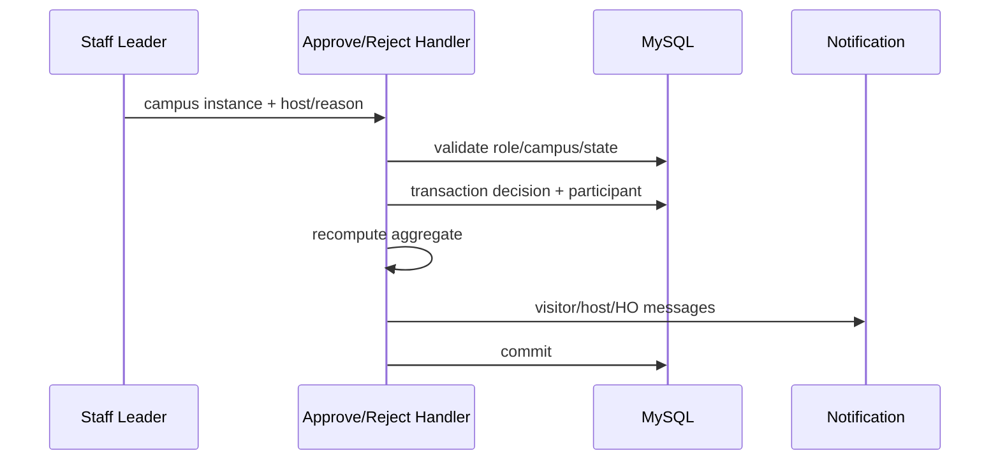
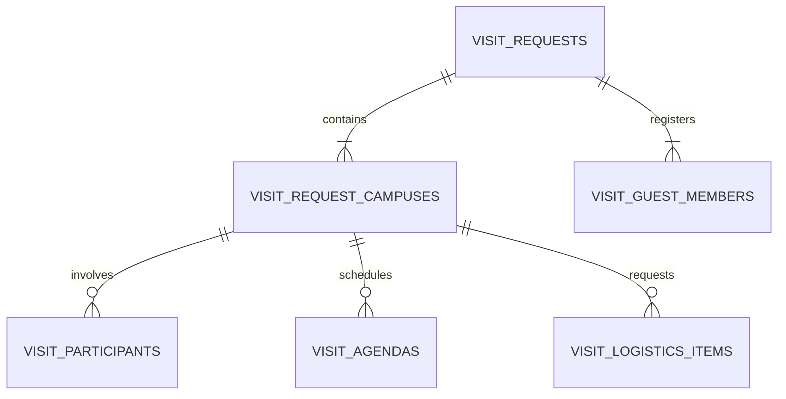
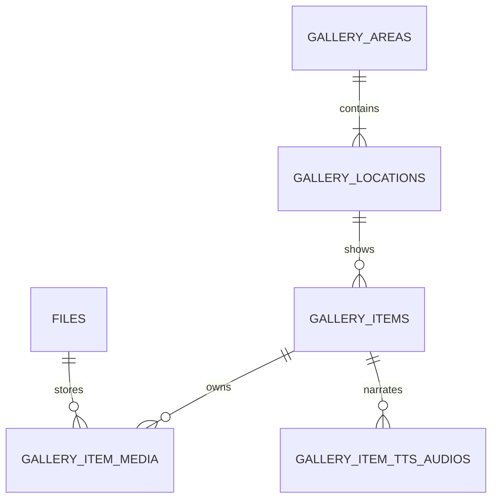
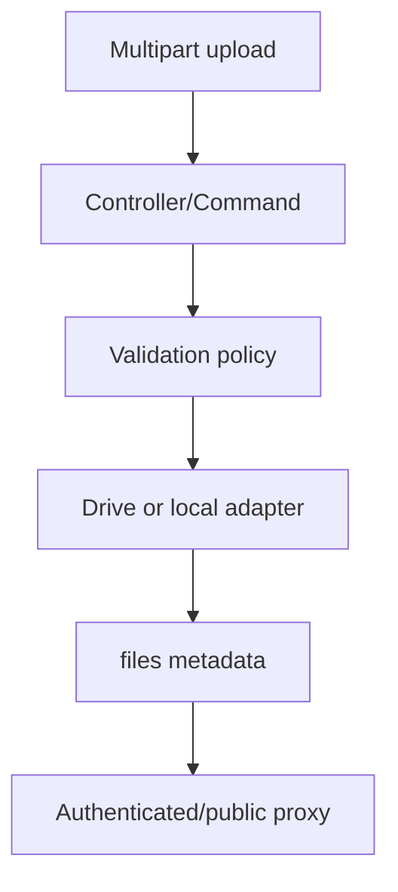
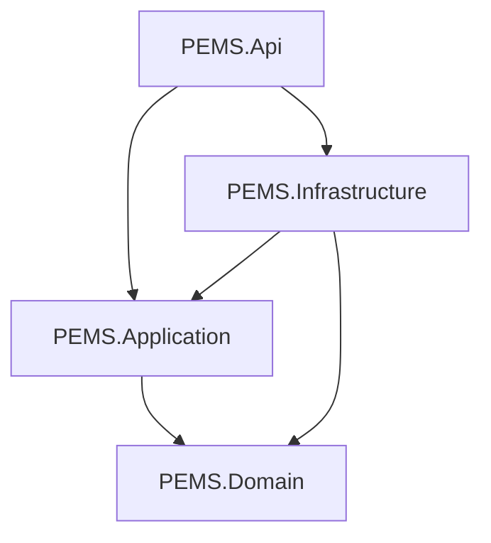
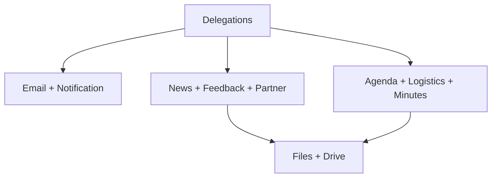

# PROJECT_KNOWLEDGE — PEMS

> Tài liệu kỹ thuật được đối chiếu với repository `quangthoai04/PEMS`, nhánh `Dev`, base commit `09fbf54d7850516bd822b3c3a0e1761bf5adf47c`, ngày 10/07/2026. Tên file/class/method/endpoint/table được giữ nguyên. Giá trị credential, token, mật khẩu, connection string và khóa API đều được thay bằng `[REDACTED]`.

## Mục lục

1. [Tổng quan dự án](#1-tổng-quan-dự-án)
2. [Công nghệ và thư viện](#2-công-nghệ-và-thư-viện)
3. [Cấu trúc thư mục](#3-cấu-trúc-thư-mục)
4. [Kiến trúc tổng thể](#4-kiến-trúc-tổng-thể)
5. [Cách hệ thống khởi động](#5-cách-hệ-thống-khởi-động)
6. [Cấu hình và biến môi trường](#6-cấu-hình-và-biến-môi-trường)
7. [Bản đồ module](#7-bản-đồ-module)
8. [API và giao diện đầu vào](#8-api-và-giao-diện-đầu-vào)
9. [Luồng nghiệp vụ chính](#9-luồng-nghiệp-vụ-chính)
10. [Database và persistence](#10-database-và-persistence)
11. [Authentication và Authorization](#11-authentication-và-authorization)
12. [Validation và chuẩn hóa dữ liệu](#12-validation-và-chuẩn-hóa-dữ-liệu)
13. [Error handling](#13-error-handling)
14. [Logging, monitoring và observability](#14-logging-monitoring-và-observability)
15. [Cache](#15-cache)
16. [Queue, event và background processing](#16-queue-event-và-background-processing)
17. [Cron job và scheduler](#17-cron-job-và-scheduler)
18. [Tích hợp dịch vụ bên ngoài](#18-tích-hợp-dịch-vụ-bên-ngoài)
19. [Frontend hoặc giao diện người dùng](#19-frontend-hoặc-giao-diện-người-dùng)
20. [State management](#20-state-management)
21. [File, storage và upload](#21-file-storage-và-upload)
22. [Email, notification và webhook](#22-email-notification-và-webhook)
23. [Concurrency và transaction](#23-concurrency-và-transaction)
24. [Bảo mật](#24-bảo-mật)
25. [Hiệu năng và khả năng mở rộng](#25-hiệu-năng-và-khả-năng-mở-rộng)
26. [Build và chạy local](#26-build-và-chạy-local)
27. [Docker và hạ tầng](#27-docker-và-hạ-tầng)
28. [CI/CD](#28-cicd)
29. [Testing](#29-testing)
30. [Quy ước code](#30-quy-ước-code)
31. [Các business rules quan trọng](#31-các-business-rules-quan-trọng)
32. [Dependency map](#32-dependency-map)
33. [Call graph cho logic quan trọng](#33-call-graph-cho-logic-quan-trọng)
34. [Những điểm dễ gây lỗi khi chỉnh sửa](#34-những-điểm-dễ-gây-lỗi-khi-chỉnh-sửa)
35. [Hướng dẫn mở rộng hệ thống](#35-hướng-dẫn-mở-rộng-hệ-thống)
36. [Technical debt và vấn đề cần cải thiện](#36-technical-debt-và-vấn-đề-cần-cải-thiện)
37. [Thuật ngữ nghiệp vụ](#37-thuật-ngữ-nghiệp-vụ)
38. [Hướng dẫn onboarding cho developer mới](#38-hướng-dẫn-onboarding-cho-developer-mới)
39. [Câu hỏi chưa được giải đáp](#39-câu-hỏi-chưa-được-giải-đáp)
40. [Báo cáo độ bao phủ](#40-báo-cáo-độ-bao-phủ)

## Quy ước độ tin cậy

- **[Xác nhận]**: đọc trực tiếp từ code/config/schema trên nhánh `Dev`.
- **[Suy luận]**: kết luận hợp lý từ nhiều điểm trong code nhưng repository không khai báo thành specification chính thức.
- **[Chưa xác định]**: không đủ dữ liệu hoặc code hiện tại chỉ là scaffold.

---

# 1. Tổng quan dự án

PEMS là **Partner & Event Management System**, một ứng dụng web full-stack dạng modular monolith phục vụ quản lý đối tác và toàn bộ vòng đời đoàn khách/tham quan tại nhiều cơ sở FPT University. Hệ thống có hai bề mặt chính:

- Website public: homepage, news, FAQ, partners, Visit FPTU/Gallery, form đăng ký tham quan.
- Workspace nội bộ: tài khoản, campus, department, visit request/delegation, lịch, agenda, người tham gia, hậu cần, biên bản, feedback, news, gallery, email, notification, report và API integration.

Các actor được xác nhận từ `EffectiveRole.Resolve()`:

| Effective role | `role_code` + `sub_role` | Trách nhiệm điển hình |
| --- | --- | --- |
| `ADMIN` | `ADMIN` + `NONE` | Quản trị tài khoản/API integration; không tham gia nghiệp vụ visit |
| `HO` | `HO` + `NONE` | Theo dõi liên cơ sở, campus/account/report; không còn duyệt từng campus mới |
| `STAFF_LEADER` | `STAFF` + `LEADER` | Duyệt/từ chối campus instance, chọn host, quản lý campus scope |
| `STAFF` | `STAFF` + `STAFF` | Host/IC support, vận hành chuyến thăm |
| `DEPARTMENT_LEAD` | `DEPARTMENT` + `LEADER` | Nhận yêu cầu phòng ban, phân công nhân sự, ký bàn giao |
| `DEPARTMENT` | `DEPARTMENT` + `STAFF` | Thực hiện nhiệm vụ phòng ban được giao |
| `STUDENT` | `STUDENT` + `NONE` | Nhận lời mời hỗ trợ |
| `VISITOR` | `VISITOR` + `NONE` | Gửi, xem, sửa/gửi lại/hủy đơn của mình; feedback |

**[Xác nhận] Kiến trúc:** ASP.NET Core Web API + Clean Architecture/CQRS/MediatR ở backend; React SPA ở frontend; MySQL database-first/manual SQL ở persistence. `Program.cs` ghi rõ schema thuộc quyền quản lý của SQL thủ công, không phải EF migrations.

**[Xác nhận] Trạng thái repository:** hệ thống có nhiều luồng đã triển khai thật, nhưng xen kẽ scaffold/legacy: `PublishNewsCommandHandler` ném `NotImplementedException`; `DomainEvent`, một số filter/middleware/service chỉ là class rỗng; thư mục `tests/PEMS.ApplicationTests` có nhiều `[Fact(Skip = "Pending UC specification")]` và không nằm trong `PEMS.slnx`.

### Chức năng chính

1. Dual-portal authentication: `INTERNAL` và `VISITOR`; local password, Google SSO; FEID có contract nhưng chưa tích hợp thật.
2. Quản lý organization: campus, department, account, staff leader replacement.
3. Form visit request qua OTP, multi-campus, duyệt độc lập từng campus, chọn host khi approve.
4. Vận hành visit: agenda, participant invitation, department task/logistics, reminders, minutes, feedback, news, close lifecycle.
5. Partner/OCR: partner/contact/alias/document, match/fuzzy link từ khách, Google Document AI business-card OCR.
6. Public content: news, FAQ, partner, gallery/Visit FPTU; TTS gallery qua EverAI.
7. Communication: SMTP email, template/draft, action token, in-app notification.
8. Reporting/export: ClosedXML và QuestPDF.

### File tham chiếu

- `README.md`
- `PEMS.slnx`
- `backend/PEMS.Api/Program.cs`
- `backend/PEMS.Application/Common/Security/EffectiveRole.cs`
- `frontend/pems-react/src/App.tsx`
- `database` schema đối chiếu với file SQL v10 đính kèm

---

# 2. Công nghệ và thư viện

| Thành phần | Công nghệ/thư viện | Phiên bản xác nhận | Vai trò | Nơi sử dụng |
| --- | --- | ---: | --- | --- |
| Backend runtime | .NET / ASP.NET Core | `net8.0` | HTTP API, DI, middleware, hosted service | `backend/PEMS.Api/PEMS.Api.csproj` |
| ORM | EF Core | `9.0.0` | Query/transaction/mapping MySQL | Application/Infrastructure/Api csproj |
| MySQL provider | Pomelo EF Core MySQL | `9.0.0` | `UseMySql`, `ServerVersion.AutoDetect` | `Program.cs` |
| CQRS/message dispatch | MediatR | `14.1.0` | Command/query/handler, pipeline | `PEMS.Application.csproj` |
| Validation | FluentValidation | `12.1.1` | Request validators chạy trong MediatR | `ValidationBehaviour.cs` |
| Password | BCrypt.Net-Next | `4.2.0` | BCrypt work factor 12 | `PasswordHasher.cs` |
| JWT | `System.IdentityModel.Tokens.Jwt` | `8.0.1` | Access token HS256 | `JwtTokenService.cs` |
| Rich HTML sanitation | HtmlSanitizer/Ganss.Xss | `9.0.892` | Sanitize news/email HTML | `HtmlSanitizerService.cs` |
| Excel | ClosedXML | `0.105.0` | Report/export | Application handlers |
| PDF | QuestPDF | `2026.6.1` | Invoice/minutes/report PDF | report/minutes handlers |
| Image processing | ImageSharp | `2.1.9` | Kiểm tra/xử lý image | file pipeline |
| Backend testing | xUnit | `2.9.2` | unit/integration/architecture | `tests/*/*.csproj` |
| Integration test host | ASP.NET MVC Testing | `8.0.28` | `WebApplicationFactory` | `PEMS.IntegrationTests` |
| Architecture test | NetArchTest.Rules | theo csproj | dependency/controller conventions | `PEMS.ArchitectureTests` |
| Frontend | React / React DOM | `19.0.1` | SPA | `frontend/pems-react` |
| Build frontend | Vite | `6.2.3` | dev/build/proxy | `vite.config.ts` |
| Language | TypeScript | `~5.8.2` | type-safe UI | frontend |
| Router | React Router DOM | `7.15.0` | public/dashboard routes | `App.tsx` |
| HTTP client | Axios | `1.18.0` | API + interceptor/refresh | `httpClient.ts` |
| Form | React Hook Form | `7.79.0` | form state | feature forms |
| Schema | Zod | `4.4.3` | visit-request client validation | `visitRequest.schema.ts` |
| i18n | i18next/react-i18next | `26.3.5` / `17.0.8` | Việt/Anh runtime | `shared/i18n/config.ts` |
| Charts | Recharts | `3.8.1` | dashboard/report | frontend |
| 3D/Globe | Three/Fiber/Drei/Cobe | theo `package.json` | homepage visualization | home components |
| E2E | Playwright | `1.61.1` | i18n/excel runtime tests | `frontend/pems-react/tests` |

Lưu ý tương thích: project target .NET 8 nhưng EF Core/Pomelo là 9.0 và `Microsoft.Extensions.DependencyInjection.Abstractions` 10.0.9; đây là tổ hợp cần được giữ trong matrix build thực tế, không nên nâng riêng từng package.

### File tham chiếu

- `backend/PEMS.Api/PEMS.Api.csproj`
- `backend/PEMS.Application/PEMS.Application.csproj`
- `backend/PEMS.Infrastructure/PEMS.Infrastructure.csproj`
- `frontend/pems-react/package.json`
- `tests/PEMS.IntegrationTests/PEMS.IntegrationTests.csproj`

---

# 3. Cấu trúc thư mục

```text
PEMS/
├── backend/
│   ├── PEMS.Api/              # composition root, controllers, middleware
│   ├── PEMS.Application/      # CQRS use cases, DTO, validator, interfaces
│   ├── PEMS.Domain/           # entities, enums, constants, value objects
│   ├── PEMS.Infrastructure/   # EF, identity, storage, external services, jobs
│   └── JsonTest/              # utility project; không nằm trong solution
├── frontend/pems-react/       # React/Vite SPA
├── tests/
│   ├── PEMS.UnitTests/
│   ├── PEMS.IntegrationTests/
│   ├── PEMS.ArchitectureTests/
│   ├── PEMS.ApplicationTests/ # nhiều scaffold, không nằm trong PEMS.slnx
│   └── temp_bcrypt/            # utility, không nằm trong solution
├── docs/                       # specs/prompts/reports, có thể lệch code
├── database/                   # SQL/schema/seed nếu có trên branch
├── scripts/
│   └── guard-project-structure.ps1
├── PEMS.slnx
└── README.md
```

### Trách nhiệm và dependency

- `PEMS.Domain`: không reference project khác; mô hình dữ liệu và constants. Một số `Events`, `ValueObjects`, base class đang là scaffold `namespace PEMS.Shared`.
- `PEMS.Application`: reference Domain; chứa business use case. Handler thường phụ thuộc `IApplicationDbContext` trực tiếp, chỉ một số aggregate dùng repository abstraction.
- `PEMS.Infrastructure`: reference Application + Domain; implement interfaces, chứa `ApplicationDbContext`, Google/SMTP/EverAI/OCR và hosted services.
- `PEMS.Api`: reference Application + Infrastructure; controller rất mỏng, chủ yếu `_mediator.Send(...)`.
- `frontend/pems-react/src/features`: API/hook/component/type theo feature; `src/pages` ghép màn hình; `src/shared` giữ auth/http/i18n/security.
- `docs`: nguồn định hướng, không phải runtime source of truth. Ví dụ tree document hiện có thiếu một số test FAQ mới nên phải luôn đối chiếu code.

Các thư mục generated/binary được bỏ qua khi phân tích chi tiết: `.git`, `.vs`, `bin`, `obj`, `.tmp-build`, `node_modules`, `dist`, uploads runtime và binary assets. Đáng chú ý: `.tmp-build` và một file upload đã từng xuất hiện trong tree được theo dõi; đây là hygiene issue.

### File tham chiếu

- `docs/architecture/PROJECT_STRUCTURE_FULL.md`
- `PEMS.slnx`
- `.gitignore`
- `scripts/guard-project-structure.ps1`

---

# 4. Kiến trúc tổng thể

PEMS là **modular monolith** triển khai Clean Architecture theo project boundary, kết hợp CQRS/MediatR. Nó không phải microservices: mọi module dùng chung process API và một MySQL schema.



### Layer và chiều dependency

1. `PEMS.Api`: composition root; gọi `AddApplication`, `AddInfrastructure`; đăng ký DbContext/auth/CORS/rate limiting; controller gửi command/query.
2. `PEMS.Application`: business orchestration; validators; security scope; transaction ở các use case nhiều ghi. Nó biết EF abstractions (`DbSet`, LINQ, `BeginTransactionAsync`) qua `IApplicationDbContext`.
3. `PEMS.Domain`: entity và constants. Domain model thiên về anemic data model; business rule chủ yếu ở handler/DB trigger, không nằm trong method của entity.
4. `PEMS.Infrastructure`: adapter. Đáng chú ý, Infrastructure reference Application (đúng hướng triển khai interface), nhưng `PEMS.Infrastructure/DependencyInjection.cs` có một dòng `using Application.Common.Interfaces;` khác namespace chuẩn `PEMS.Application...`, cho thấy legacy namespace/coupling cần theo dõi.

### Boundary thực tế

- Controller không truy cập DbContext trực tiếp: tốt.
- Handler thường truy cập `IApplicationDbContext` trực tiếp thay vì repository: hợp lệ với CQRS nhưng làm Application phụ thuộc shape EF (`Include`, `AsNoTracking`, LINQ provider).
- Cross-module coupling cao tập trung ở Delegations: Notification, Email, News, Partners, Feedback, Calendar, Files đều đọc `visit_request_campuses`.
- Business rule được nhân đôi giữa Application và MySQL trigger ở aggregate visit status. Code đã chủ động chú thích phải “mirror EXACTLY”.
- Frontend RBAC chỉ là UX; handler/backend mới là security boundary.

### Những nơi kiến trúc chưa hoàn chỉnh

- `DomainEvent` và 5 event class rỗng; không có dispatcher/subscriber runtime.
- `AuditLogBehaviour`, `AuthorizationBehaviour`, `LoggingBehaviour` xuất hiện trong tree nhưng `AddApplication()` chỉ đăng ký `ValidationBehaviour`.
- `IdempotencyFilter`, `ValidationFilter`, `RequestLoggingMiddleware`, `RateLimitingExtensions` là class rỗng trong `PEMS.Shared`; rate limit thật được viết trực tiếp trong `Program.cs`.
- `FaceRecognitionService` và generic `OcrService` rỗng; OCR business card thật dùng adapter khác.

### File tham chiếu

- `backend/PEMS.Api/Program.cs`
- `backend/PEMS.Application/DependencyInjection.cs`
- `backend/PEMS.Infrastructure/DependencyInjection.cs`
- `tests/PEMS.ArchitectureTests/DependencyRuleTests.cs`
- `backend/PEMS.Domain/Common/DomainEvent.cs`

---

# 5. Cách hệ thống khởi động

## Backend bootstrap theo thứ tự thực thi

1. `WebApplication.CreateBuilder(args)` nạp config chuẩn ASP.NET (`appsettings.json`, file environment, environment variables, command-line).
2. `AddApplication()` scan assembly cho MediatR handler + FluentValidation; đăng ký `ValidationBehaviour`, file foundation, notification, aggregate status và TTS queue/service.
3. `AddInfrastructure(configuration)` đăng ký DbContext abstraction, repositories, identity, email, local/Drive storage, Google OAuth validation, FEID adapter, OCR, Translation, EverAI typed client và 3 hosted service.
4. Bind `AuthOptions` thành singleton.
5. Lấy `ConnectionStrings:DefaultConnection`; `UseMySql(connectionString, ServerVersion.AutoDetect(connectionString))`.
6. Đăng ký controllers, endpoint explorer, Swagger schema + JWT bearer definition.
7. Đăng ký JWT authentication và core authorization.
8. Đăng ký CORS `PemsFrontend`; config origin hoặc fallback localhost.
9. Đăng ký named fixed-window limiter `accounts-read`: ADMIN/HO 60 request/phút, role khác 30; partition theo identity/IP; queue 0.
10. Build app.
11. Pipeline: `ExceptionHandlingMiddleware` → `SecurityHeadersMiddleware` → HSTS ngoài Development → CORS → Swagger chỉ Development → HTTPS redirect ngoài Development → Authentication → `SessionValidationMiddleware` → Authorization → RateLimiter → `MapControllers`.
12. `app.Run()` đồng thời khởi chạy hosted services đã đăng ký.



## Frontend bootstrap

1. Vite chạy `src/main.tsx`.
2. Import CSS và `shared/i18n/config` để khởi tạo `i18next`.
3. Render `StrictMode` → `ErrorBoundary` → `BrowserRouter` → `AuthProvider` → `NotificationsProvider` → `App`.
4. `AuthProvider` đọc token/user/portal/campus từ `localStorage`; nếu có access token thì gọi `/auth/me` để hydrate lại profile.
5. `App.tsx` chọn public layout hoặc dashboard layout và resolve route theo role.

## Shutdown và startup failure

- Hosted service nhận `stoppingToken`; các vòng `Task.Delay` bắt `OperationCanceledException` và dừng.
- Không thấy custom graceful-shutdown hook ngoài lifecycle mặc định của ASP.NET.
- Nếu thiếu JWT secret, startup ném `InvalidOperationException`.
- Nếu connection string sai, `ServerVersion.AutoDetect` có thể làm startup fail trước khi app lắng nghe.

### File tham chiếu

- `backend/PEMS.Api/Program.cs`
- `backend/PEMS.Application/DependencyInjection.cs`
- `backend/PEMS.Infrastructure/DependencyInjection.cs`
- `frontend/pems-react/src/main.tsx`
- `frontend/pems-react/src/shared/auth/AuthContext.tsx`

---

# 6. Cấu hình và biến môi trường

ASP.NET cho phép override JSON bằng environment variable dạng `Section__Key`. Bảng dưới dùng tên environment tương đương; không ghi secret thật.

| Biến/section | Bắt buộc | Default/hiện trạng không nhạy cảm | Nơi dùng | Rủi ro cấu hình sai |
| --- | --- | --- | --- | --- |
| `ConnectionStrings__DefaultConnection` | Có | `[REDACTED]` | `Program.cs` | Không startup/kết nối nhầm DB production |
| `JwtSettings__SecretKey` | Có | `[REDACTED]` | auth extension/token service | Token có thể bị giả mạo nếu lộ/yếu |
| `JwtSettings__Issuer` | Có | `PemsServer` | JWT issue/validate | Tất cả token bị reject nếu lệch |
| `JwtSettings__Audience` | Có | `PemsReactClient` | JWT issue/validate | Tất cả token bị reject nếu lệch |
| `JwtSettings__AccessTokenMinutes` | Không | code fallback 60 phút | `JwtTokenService` | Quá dài tăng impact khi token lộ |
| `JwtSettings__RefreshTokenDays` | Không | code fallback 7 ngày | `SessionService` | Session quá dài/ngắn |
| `GoogleAuth__ClientId` | Cần cho Google | `[REDACTED]` | `GoogleTokenValidator` | Google login bị disable nếu trống |
| `GoogleAuth__AllowedDomains` | Không | trống = không hạn chế domain | Google SSO | Internal SSO cần policy riêng trong handler |
| `GoogleAuth__RequireEmailVerified` | Không | `true` | Google SSO | `false` giảm assurance email |
| `AuthOptions__LoginMode` | Có | `DevMixed` trong base config | login handlers/UI contract | Có thể bật local password ngoài dự kiến |
| `AuthOptions__AllowPasswordLogin` | Có theo mode | `[REDACTED]` | credential login | Mở surface brute-force |
| `AuthOptions__AllowGoogleSso` | Không | `true` | SSO | Google login vô hiệu nếu false |
| `AuthOptions__AllowFeid` | Không | `false` | FEID | Adapter hiện vẫn chưa implement |
| `Security__MaxFailedLoginAttempts` | Không | 5 | credential handler | Lockout quá lỏng/chặt |
| `Security__LockoutMinutes` | Không | 15 | credential handler | DoS account hoặc brute-force |
| `Otp__CodeMinutes` | Không | 15 | `OtpService` | OTP sống quá lâu |
| `Otp__VisitRequestCodeMinutes` | Không | 5 | visit initiate | UX/security tradeoff |
| `Otp__MaxAttempts` | Không | 5 | OTP verify | Brute-force nếu cao |
| `Otp__MaxResendPerHour` | Không | 5 | OTP resend | Spam/cost nếu cao |
| `Smtp__Enabled` | Có cho email | `true` | `EmailService` | Luồng OTP/reset/invite thất bại |
| `Smtp__Host`, `Port`, `User`, `Password` | Có cho SMTP | host/port có config; credential `[REDACTED]` | `EmailService` | Lộ credential, gửi mail thất bại |
| `App__PublicApiBaseUrl` | Không | localhost 5265 | URL file/email action | Email/file URL sai môi trường |
| `App__FrontendBaseUrl` | Không | localhost 5173 | links email | Link điều hướng sai |
| `Cors__AllowedOrigins` | Có production | localhost dev; domain production | `Program.cs` | Frontend bị CORS block hoặc origin quá rộng |
| `Storage__Provider` | Có theo flow | `GoogleDrive` | storage routing | Metadata/provider không đồng bộ |
| `GoogleDrive__Enabled` | Có cho Drive | true ở config hiện tại | Drive services | Upload fail nếu credential/folder sai |
| `GoogleDrive__AuthMode` | Có | `OAuthUser` | Drive token acquisition | Không lấy được access token |
| `GoogleDrive__ClientId/ClientSecret/RefreshToken` | Có | `[REDACTED]` | Drive OAuth REST | Critical nếu commit/lộ |
| `GoogleDrive__*FolderId` | Theo purpose | các ID riêng theo avatar/gallery/news/... | `GoogleDriveFolderResolver` | File vào sai folder hoặc 403/404 |
| `EverAiTts__Enabled` | Không | base false, Development true | TTS service/job | Tăng cost hoặc không sinh audio |
| `EverAiTts__ApiKey` | Có nếu enabled | `[REDACTED]` | `EverAiTtsClient` | Lộ key/call fail |
| `EverAiTts__DefaultVoiceCode` | Không | `vi_female_hoaian_mb` | TTS hash/request | Đổi config invalidates hash/audio |
| `EverAiTts__MaxInputCharacters` | Không | 1000 | ensure/validation | Provider reject/cost |
| `EverAiTts__UseCallback` | Không | false | TTS completion | true mở webhook anonymous |
| `Reminders__HoAlertPollSeconds` | Không | fallback 600 | HO alert job | DB polling quá dày/chậm |
| `VITE_API_BASE_URL` | Không | `/api` | frontend `httpClient` | Gọi sai API base |

### Environment

- Development: Swagger, không HTTPS redirect/HSTS; Google OAuth helper tồn tại; Development config bật Drive/TTS.
- Testing: `PemsWebApplicationFactory` yêu cầu `backend/PEMS.Api/appsettings.Testing.json`, file này bị `.gitignore`; thay JWT bằng `TestAuthHandler`.
- Production: CORS/AllowedHosts/log level riêng; HTTPS redirect + HSTS + CSP security header; secrets phải lấy từ environment/secret store.

### Phát hiện bảo mật cấu hình

**[Xác nhận/Critical]** `backend/PEMS.Api/appsettings.Development.json` đang được Git theo dõi và chứa `ClientSecret`, `RefreshToken`, folder IDs; `appsettings.json` chứa credential SMTP/JWT/connection. Tài liệu này không ghi giá trị. Cần rotate toàn bộ secret từng commit, xóa khỏi history và chuyển sang environment/secret manager. `.gitignore` chỉ bỏ `appsettings.Local.json`, `*.Secrets.json`, không bỏ `appsettings.Development.json`.

### File tham chiếu

- `backend/PEMS.Api/appsettings.json`
- `backend/PEMS.Api/appsettings.Development.json`
- `backend/PEMS.Api/appsettings.Development.example.json`
- `backend/PEMS.Api/appsettings.Production.json`
- `.gitignore`

---

# 7. Bản đồ module

## Tổng quan

| Module | Trách nhiệm | Public interface | Phụ thuộc chính | Được dùng bởi |
| --- | --- | --- | --- | --- |
| Authentication | login/local/Google/FEID, refresh/logout/reset | `api/auth/*` | Users, sessions, OTP, email | toàn SPA |
| Accounts | list/create/status/role/replace leader | `AccountsController` | Users, roles, campus, notifications | Admin/HO/Staff Leader |
| Campuses | CRUD/status/lead/filter | `CampusesController` | Campus, users | accounts/departments/visits/gallery |
| Departments | CRUD/personnel/task coordination | `DepartmentsController` | Campus, users, logistics | Staff Leader/Department |
| DepartmentReceptionTasks | calendar, invitation, logistics assignment | `DepartmentReceptionTasksController` | participant/logistics/handover | Dept Leader/Staff |
| Delegations | visit lifecycle trung tâm | `DelegationsController`, `VisitRequestsController` | hầu hết module | visitor/internal roles |
| AgendaTemplates | template/default/apply | `AgendaTemplatesController` | campus, visit agenda | visit preparation |
| Calendars/Dashboard | personal/office calendar, summaries | `CalendarsController`, `DashboardController` | visit/calendar/logistics | dashboard |
| Partners | partner/contact/alias/document/link | 3 partner controllers | files, campus, OCR, visit | public/internal |
| BusinessCardOcr | scan/job/confirm/discard | `BusinessCardOcrController` | Drive, API config, Google Document AI | partner/minutes |
| Emails/EmailActions | template/draft/send/reply/action token | email controllers/public action | SMTP, files, visit/logistics | workflow communication |
| Notifications | inbox/read/unread + service | `NotificationsController` | users/visit | all workflows |
| News | visit news, review, multilingual/public | `NewsController`, public content | visit, files, translation | public/dashboard |
| Galleries/TTS | areas/locations/items/media/audio | gallery/public controllers | files, Drive, EverAI, campus | public Visit FPTU |
| Feedbacks | eligibility, targets, rating/detail | `FeedbacksController` | visit/participants/logistics | Visitor/Host |
| MeetingMinutes | edit lock, participant snapshot, actions, export | `MeetingMinutesController` | visit/users/PDF/Excel | Host/accepted participant |
| Files/Documents | upload/proxy/metadata/search | `FilesController`, `DocumentsController` | Drive/local storage | email/news/gallery/partners |
| Reports | overview/export/invoice | `ReportsController` | visit/department/news | HO/Staff Leader/Dept Leader |
| ApiIntegrations | encrypted provider config/quota/log/test | `ApiIntegrationsController` | OCR/translation/secrets | Admin/HO |
| PublicContent | homepage/search/FAQ/news/gallery/contact/policy | `PublicContentController` | content tables | anonymous users |
| Profiles | profile/password/avatar | `ProfilesController` | users/auth/files | authenticated users |

## Module quan trọng và logic

### Authentication

- `LoginviaCredentialsCommandHandler.Handle()` kiểm tra mode/portal, user/provider/password, status/lockout; ghi login/security trace; tạo `user_sessions`; phát JWT + raw refresh token.
- `LoginviaSSOCommandHandler.Handle()` validate Google ID token; liên kết provider hoặc auto-provision Visitor theo config; kiểm tra portal/campus/role; tạo session.
- `RefreshTokenCommandHandler.Handle()` lookup SHA-256 hash, kiểm tra user/role active, rotate refresh token và phát access token mới.
- Side effects: `login_logs`, `security_events`, `user_sessions`; failed attempt/lockout.
- Rủi ro sửa: portal invariant còn được DB trigger kiểm tra; phải cập nhật cả handler, constants, schema và FE `LoginPortal`.

### Delegations/Visit Requests

- `InitiateVisitRequestCommandHandler` chưa tạo request: validate email, tạo OTP, gửi email.
- `VerifyAndCreateVisitRequestCommandHandler` chạy transaction, verify OTP, deserialize form, conflict check, provision Visitor, tạo request/campus instances/guests, notification, commit; email xác nhận chạy sau commit.
- `ApproveCampusInstanceCommandHandler`/`RejectCampusInstanceCommandHandler` chỉ Staff Leader đúng campus; transaction; ghi decision; approve bắt buộc host; cập nhật aggregate; participant/audit/notifications.
- `UpdatePending...`, `ResubmitRejected...`, `CancelVisitRequest...` kiểm tra owner/status/24h và cập nhật children trong transaction.
- Coupling: Email, Notification, Calendar, Partners, News, Minutes, Feedback, Logistics.

### Partners/OCR

- Partner có `owner_campus_id`, approval status, visibility; contact/alias/document là submodule.
- `PartnerMatcher`/normalization hỗ trợ tìm ứng viên; `visit_guest_partner_links` giữ snapshot/link/reject suggestion.
- OCR flow upload business card → resolve active encrypted API config → Google service-account token → Document AI → parse fields → job row → người dùng confirm contact. Throttle hiện là in-memory.

### Gallery/TTS

- Gallery normalized theo `gallery_areas` → `gallery_locations` → `gallery_items` → `gallery_item_media`.
- `GalleryItemTtsService.EnsureAudioAsync()` normalize text + hash config, reuse READY, cooldown FAILED, tạo PENDING rồi enqueue.
- Worker submit EverAI → PROCESSING → poll/callback → download → upload Drive → `files` → READY; callback/worker idempotent theo status và request ID.

### Email/Notification

- Email có template, draft, recipient, attachment snapshot và action token; SMTP send cập nhật `SENT/FAILED`.
- Notification được tạo trực tiếp trong handler hoặc hosted service; `DedupeKey` tránh một số notification lặp.
- Không có message broker; email ở một số handler gửi sau transaction nhưng vẫn trong HTTP request.

### Frontend modules

- `features/*/api`: gọi `httpClient`.
- `features/*/hooks`: local orchestration/state; dự án không dùng React Query/Redux.
- `pages/*`: ghép layout và feature component.
- `shared/auth`: token storage, context, route guard/effective role.
- `shared/i18n`: resources Việt/Anh; `Accept-Language` được gắn vào request.

### File tham chiếu

- `backend/PEMS.Application/**`
- `backend/PEMS.Api/Controllers/**`
- `backend/PEMS.Infrastructure/**`
- `frontend/pems-react/src/features/**`
- `frontend/pems-react/src/pages/**`

---

# 8. API và giao diện đầu vào

## Contract chung

- API style: REST-ish controller routes, một phần endpoint giữ tên UC legacy (`viewaccountlist`, `createguestdelegation`), một phần dùng resource style.
- Controller thường bind `[FromBody] Command` hoặc `[FromQuery] Query`, rồi `_mediator.Send(...)`.
- FluentValidation chạy trước handler qua MediatR; exception middleware chuẩn hóa lỗi.
- Auth mặc định không áp dụng global fallback policy; từng controller/action phải có `[Authorize]`, `[RoleAuthorize]` hoặc handler guard. Các public controller dùng `[AllowAnonymous]`.
- Tổng được nhận diện trên `Dev`: **35 controller, 335 HTTP action** (324 từ 34 controller đọc trực tiếp theo path và 11 action của `ApiIntegrationsController` đọc qua commit-index URL).

## Danh mục endpoint đầy đủ

> Input/output chi tiết nằm trong Command/Query/Response cùng tên. Danh mục này giữ toàn bộ route; phần sau phân tích sâu các flow chính.

### Authentication và profile

| Method | Endpoint | Controller action | Authentication |
| --- | --- | --- | --- |
| POST | `/api/auth/login` | `AuthenticationController.Login()` | Anonymous |
| POST | `/api/auth/google` | `AuthenticationController.Google()` | Anonymous |
| POST | `/api/auth/feid` | `AuthenticationController.Feid()` | Anonymous; provider chưa implement |
| POST | `/api/auth/refresh` | `AuthenticationController.Refresh()` | Anonymous + refresh token |
| POST | `/api/auth/logout` | `AuthenticationController.Logout()` | Authorize |
| GET | `/api/auth/me` | `AuthenticationController.Me()` | Authorize |
| POST | `/api/auth/forgot-password` | `AuthenticationController.ForgotPassword()` | Anonymous |
| POST | `/api/auth/reset-password` | `AuthenticationController.ResetPassword()` | Anonymous + OTP |
| GET | `/api/Profiles/viewprofile` | `ProfilesController.ViewProfile()` | Authorize |
| POST | `/api/Profiles/updateprofile` | `ProfilesController.UpdateProfile()` | Authorize |
| PUT | `/api/Profiles/me/avatar` | `ProfilesController.UploadAvatar()` | Authorize |
| POST | `/api/Profiles/change-password` | `ProfilesController.ChangePassword()` | Authorize |

### Account, campus, department

| Controller | Endpoints |
| --- | --- |
| `AccountsController` | `GET /api/Accounts/viewaccountlist`; `POST /createaccount`; `POST /manageaccountstatus`; `GET /viewaccountdetails`; `GET /searchandfilteraccounts`; `POST /updateaccountrole`; `GET /statistics`; `GET /campus-departments`; `GET /staff-leader-availability`; `GET /ho-campus-check`; `GET /staff-leader-replacement-preview`; `POST /replacestaffleader`; `GET /related-visitors`; `GET /related-visitor-details` |
| `CampusesController` | `GET /api/Campuses/active`; `POST /addnewcampus`; `GET /viewcampuslist`; `GET /searchandfiltercampus`; `GET /filter-options`; `GET /viewcampusdetails`; `POST /updatecampus`; `POST /managecampusstatus`; `POST /assigncampuslead` |
| `DepartmentsController` | `POST /api/Departments/addnewdepartment`; `POST /updatedepartment`; `GET /searchandfilterdepartments`; `GET /viewdepartmentlist`; `GET /viewdepartmentdetails`; `POST /managedepartmentstatus`; `POST /adddepartmentpersonnel`; `GET /viewpersonneldetails`; `GET /searchpersonnel`; `POST /reviewassignedtasks`; `POST /assigntasks`; `POST /signtheservicedeliveryreport`; `POST /removepersonnel`; `GET /viewcoordinationtasks`; `GET /searchcoordinationtasks`; `POST /reassigndepartmentlead`; `PUT /updatedepartmentpersonnel` |

`GET /api/Campuses/active` là anonymous; các action quản trị phụ thuộc handler/role guard. Account list/search có named rate limit `accounts-read`.

### Visit request và delegation

| Controller | Endpoints |
| --- | --- |
| `VisitRequestsController` | `POST /api/visit-requests/initiate`; `POST /verify`; `POST /resend-otp`; `GET /{visitRequestId}/edit-detail`; `PUT /{visitRequestId}/pending-edit`; `POST /{visitRequestId}/resubmit` |
| `DelegationsController` — decision/read | `POST /api/Delegations/{visitRequestId}/ho-approve`; `POST /{visitRequestId}/ho-reject`; `GET /visit-requests/{visitRequestId}/submitted-form-detail`; `GET /viewguestdelegationdetails`; `GET /viewguestdelegationlist`; `GET /visit-instances/{visitInstanceId}/process-permissions`; `GET /visit-instances/{visitInstanceId}/contribution`; `GET /visit-instances/{visitInstanceId}/summary`; `GET /searchdelegations`; `GET /campuses/{visitInstanceId}/host-candidates`; `POST /{visitRequestId}/campuses/{visitInstanceId}/approve`; alias `POST /assign-host`; `POST /reject`; `GET /process-detail` |
| `DelegationsController` — preparation | `GET /visit-instances/{visitInstanceId}/agenda-responsible-candidates`; `GET /participants`; `GET /participant-candidates`; `GET /support-departments`; `GET /department-staff-candidates`; `POST /participants/invite`; `PATCH /participants/{participantId}/remove`; `POST /{visitRequestId}/campuses/{visitInstanceId}/agenda`; `PUT /visit-instances/{visitInstanceId}/preparation-note`; `POST /media`; `GET /reminder-settings`; `PUT /reminder-settings`; `PATCH /reminder-settings/cancel`; `GET /logistics`; `PATCH /logistics/{logisticsItemId}/cancel`; `GET /participants/{participantId}/sent-emails`; `GET /logistics/{logisticsItemId}/sent-emails`; `POST /logistics/{logisticsItemId}/handovers/sign-borrower` |
| `DelegationsController` — lifecycle/legacy | `POST /{visitRequestId}/campuses/{visitInstanceId}/process/complete-before-visit`; `POST /complete-during-visit`; `POST /complete-after-visit`; `POST /{visitRequestId}/registrant-info`; `POST /createguestdelegation`; `POST /updateguestdelegation`; `POST /preparevisitlogistics`; `POST /updatevisitlogistics`; `POST /confirmparticipation`; `GET /my-invitations`; `GET /invitations/{participantId}`; `POST /participants/{participantId}/respond`; `POST /approveresourcerequest`; `POST /proposeresourcemodification`; `POST /confirmthechangeproposal`; `POST /createmeetingminutes`; `POST /editmeetingminutes`; `GET /viewmeetingminutesdetails`; `POST /uploadattacheddocuments`; `POST /submitdelegationfeedback`; `POST /scanbusinesscard`; `POST /createpartnerprofile`; `POST /uploadvisitphotos`; `POST /tagfacesonphotos`; `POST /createnewsarticle`; `POST /closedelegation`; `POST /{visitRequestId}/cancel`; `POST /{visitRequestId}/campuses/{visitInstanceId}/cancel` |

Hai endpoint `ho-approve/ho-reject` còn tồn tại trong controller nhưng business rule mới là campus-independent approval. Cần xem handler/feature flag trước khi dùng; không suy luận rằng route tồn tại đồng nghĩa HO vẫn được quyết định request mới.

### Invitation và department reception task

| Controller | Endpoints |
| --- | --- |
| `VisitInvitationsController` | `GET /api/visit-invitations/my`; `GET /{participantId}`; `POST /{participantId}/accept`; `POST /{participantId}/decline`; `POST /{participantId}/assign-department-staff` |
| `DepartmentReceptionTasksController` | `GET /api/department/reception-tasks/calendar`; `GET /assignments-progress`; `GET /attention-items`; `GET /invitations/{participantId}`; `POST /invitations/{participantId}/accept`; `POST /decline`; `POST /assign`; `GET /requests/{logisticsItemId}`; `POST /requests/{logisticsItemId}/confirm`; `POST /accept-self`; `POST /reject`; `POST /propose-change`; `POST /assign`; `POST /accept-assignment`; `POST /decline-assignment`; `POST /handovers/sign`; `GET /assignee-candidates`; `POST /personal-events` |

### Agenda, calendar, dashboard, minutes

| Controller | Endpoints |
| --- | --- |
| `AgendaTemplatesController` | `POST /api/agenda-templates`; `PUT /{agendaTemplateId}`; `DELETE /{agendaTemplateId}`; `GET /`; `GET /defaults`; `PUT /defaults`; `GET /default`; `GET /for-instance/{visitInstanceId}`; `POST /apply`; `GET /{agendaTemplateId}` |
| `CalendarsController` | `GET /api/Calendars/viewmyevents`; `GET /viewdepartmentcalendar`; `POST /switchviewmode`; `POST /addpersonalevent`; `POST /deletepersonalevent`; `POST /updatepersonalevent`; `GET /vieweventdetails` |
| `DashboardController` | `GET /api/dashboard/department-leader/summary`; `GET /ho-overview`; `GET /staff/calendar`; `GET /staff/calendar/{visitInstanceId}/detail`; `GET /debug-user` |
| `MeetingMinutesController` | `GET /api/MeetingMinutes/viewminuteslist`; `GET /searchandfilterminutes`; `GET /{minutesId}/export-pdf`; `GET /{minutesId}/export-excel`; `GET /visit-instances/{visitInstanceId}`; `POST /visit-instances/{visitInstanceId}/create-or-lock`; `POST /{minutesId}/acquire-lock`; `PUT /{minutesId}`; `POST /{minutesId}/release-lock`; `GET /{minutesId}/new-participant-candidates`; `GET /visit-instances/{visitInstanceId}/user-search` |

`DashboardController.debug-user` cần được kiểm tra/loại bỏ hoặc Development-guard trước production; route name cho thấy diagnostic surface.

### Partner và OCR

| Controller | Endpoints |
| --- | --- |
| `PartnersController` | `GET /api/partners`; `GET /pending-approvals`; `GET /match`; `GET /{partnerId}`; `POST /`; `PUT /{partnerId}`; `POST /{partnerId}/approve`; `POST /{partnerId}/reject`; `GET /{partnerId}/contacts`; `POST /contacts`; `PUT /contacts/{contactId}`; `DELETE /contacts/{contactId}`; `POST /contacts/{contactId}/set-primary`; `GET /{partnerId}/aliases`; `POST /aliases`; `DELETE /aliases/{aliasId}`; `GET /documents`; `POST /documents` |
| `VisitPartnerLinksController` | `GET /api/visit-instances/{visitInstanceId}/partner-links`; `POST /`; `PUT /{linkId}`; `POST /{linkId}/reject-suggestion`; `POST /create-partner` |
| `BusinessCardOcrController` | `POST /api/business-card-ocr/scan`; `GET /jobs/{ocrJobId}`; `POST /jobs/{ocrJobId}/confirm-contact`; `POST /jobs/{ocrJobId}/discard` |
| `PublicPartnersController` | `GET /api/public/partners`; `GET /search`; `GET /countries`; `GET /types`; `GET /{partnerIdOrSlug}`; `GET /media/{fileId}/content` |

### News, FAQ, gallery, public content

| Controller | Endpoints |
| --- | --- |
| `FaqsController` | `GET /api/faqs`; `GET /{faqId}`; `POST /`; `PUT /{faqId}`; `PATCH /visibility` |
| `NewsController` | `GET /api/news/visit-instances/{visitInstanceId}`; `POST /visit-instances/{visitInstanceId}`; `PUT /visit-instance-news/{newsId}`; `POST /visit-instance-news/{newsId}/submit-review`; `POST /cover-upload`; `POST /section-file-upload`; `GET /`; `GET /eligible-visit-instances`; `POST /`; `GET /{newsId}`; `PATCH /{newsId}/review`; `PATCH /{newsId}/visibility`; `POST /approvenews`; `POST /publishnews`; `GET /viewnewsdetails`; `POST /addmultilingualnews`; `POST /{newsId}/translations/auto-translate`; `POST /managenewsvisibility`; `PUT /{newsId}` |
| `GalleriesController` | `GET /api/Galleries/viewgalleryitemlist`; `GET /searchgalleryitems`; `GET /viewgalleryitemdetails`; `GET /galleryfilteroptions`; `POST /addgalleryitem`; `POST /updategalleryitem`; `POST /changegalleryitemstatus`; `GET /viewgallerylocationlist`; `POST /creategallerylocation`; `POST /updategallerylocation`; `POST /changegallerylocationstatus` |
| `GalleryManagementTtsController` | `GET /api/gallery-management/items/{galleryItemId}/tts-audio`; `POST /regenerate` |
| `PublicGalleryTtsController` | `POST /api/public/gallery-items/{galleryItemId}/tts-audio/ensure`; `GET /tts-audio` |
| `PublicVisitFptuController` | `GET /api/public/visit-fptu/campuses`; `GET /campuses/{campusCode}/navigation`; `GET /locations/{locationId}/gallery-items`; `GET /locations/{locationId}/showcase`; `GET /gallery-items/{galleryItemId}`; `GET /media/{fileId}/content` |
| `PublicContentController` | `GET /api/public/homepage`; `GET /search`; `GET /contact`; `GET /policy`; `GET /faqs`; `GET /faqs/type-counts`; `GET /news`; `GET /news/{newsId}`; `GET /news-files/{fileId}`; `GET /gallery`; `GET /notifications`; `PATCH /notifications/{notificationId}/read`; `PATCH /notifications/read-all` |

`POST /api/news/publishnews` gọi handler scaffold ném `NotImplementedException`; flow production hiện dùng review/approve/visibility khác.

### Feedback, notification, email

| Controller | Endpoints |
| --- | --- |
| `FeedbacksController` | `GET /api/Feedbacks`; `GET /visit-summary`; `GET /visit-instances/{visitInstanceId}/targets`; `POST /visit-instances/{visitInstanceId}`; `GET /my-pending`; `GET /my-host-feedback/{visitInstanceId}`; `GET /visitor-feedback/{visitInstanceId}`; `GET /{id}`; `GET /visit-summary/{visitRequestId}`; `GET /visit-summary/{visitRequestId}/instances/{visitInstanceId}` |
| `NotificationsController` | `GET /api/Notifications`; `GET /unread-count`; `PATCH /{notificationId}/read`; `PATCH /mark-all-read` |
| `EmailsController` | `GET /api/Emails/viewemaillist`; `GET /viewemailtemplatelist`; `GET /viewemailtemplatedetail`; `POST /updateemailtemplate`; `POST /createemailtemplate`; `POST /editemailcontent`; `POST /sendemail`; `GET /viewemail`; `POST /replytoemail`; `POST /{id}/mark-completed`; `GET /unprocessed-count`; `POST /drafts`; `GET /drafts/{draftId}`; `PUT /drafts/{draftId}`; `PATCH /drafts/{draftId}/discard`; `POST /drafts/{draftId}/send` |
| `EmailTemplatesController` | `POST /api/email-templates/preview`; `GET /`; `GET /{id}`; `POST /`; `PUT /{id}`; `PATCH /{id}/status` |
| `PublicEmailActionsController` | `GET /api/public/email-actions/{token}`; `POST /{token}` |

### File, document, report, API integration

| Controller | Endpoints |
| --- | --- |
| `FilesController` | `POST /api/Files/upload`; `GET /{id}/download`; `GET /{id}/content` |
| `DocumentsController` | `GET /api/Documents/viewdocumentlist`; `GET /searchdocuments`; `GET /{documentId}` |
| `ReportsController` | `GET /api/Reports/ho-overview`; `POST /ho-overview/export`; `GET /staff-leader-overview`; `POST /staff-leader-overview/export`; `GET /department-leader-overview`; `POST /department-leader-overview/export`; `GET /department-leader-invoice/visits`; `GET /department-leader-invoice/visits/{visitInstanceId}/items`; `POST /department-leader-invoice/export-pdf`; `GET /viewdashboardstatistics`; `POST /exportstatisticsreport`; `GET /filterdashboardbytime` |
| `ApiIntegrationsController` | `GET /api/api-integrations`; `GET /{apiConfigId}`; `POST /business-card-ocr/google-document-ai`; `PUT /{apiConfigId}`; `POST /news-translation/google-cloud-translation`; `POST /{apiConfigId}/test`; `POST /enable`; `POST /disable`; `GET /logs`; `GET /quota`; `PUT /quota` |
| `GoogleDriveOAuthController` | `GET /api/google-drive/oauth/connect`; `GET /callback` — anonymous nhưng trả 404 ngoài Development |
| `EverAiTtsCallbackController` | `POST /api/integrations/everai/tts/callback` — anonymous, luôn 200 |

## Status code/error contract

| Tình huống | HTTP | Payload chính |
| --- | ---: | --- |
| FluentValidation | 400 | `success`, `message`, `errors`, `traceId` |
| Auth business | theo exception | `errorCode`, `message`, `traceId` |
| JWT/session fail | 401 | message JSON |
| Không có quyền | 403 | safe message |
| Không tìm thấy | 404 | safe message |
| Conflict/concurrency/duplicate | 409 | `errorCode`, optional `data` |
| Business rule | 422 | `errorCode`, `message` |
| Rate limit | 429 | `RATE_LIMIT_EXCEEDED`, optional `Retry-After` |
| Unhandled | 500 | generic message + `traceId`; diagnostics chỉ Development |

### File tham chiếu

- `backend/PEMS.Api/Controllers/**`
- `backend/PEMS.Application/**/Commands/**`
- `backend/PEMS.Application/**/Queries/**`
- `backend/PEMS.Api/Middleware/ExceptionHandlingMiddleware.cs`

---

# 9. Luồng nghiệp vụ chính

## 9.1. Login local và refresh token



Pseudo-flow xác nhận:

1. Validator kiểm tra email/password/login portal/selected campus.
2. Handler chặn nếu password login bị tắt theo `AuthOptions`.
3. Load user + role + provider; không phân biệt lỗi public theo cách làm lộ account.
4. Kiểm tra status/lockout/portal/campus; BCrypt verify.
5. Ghi login/security data; tạo session có refresh-token hash SHA-256, portal, IP/UA.
6. JWT HS256 chứa `uid`, email, role/sub-role, campus, department, session, portal.
7. Frontend lưu token; interceptor gắn Bearer.
8. Khi 401, `httpClient` thực hiện single-flight `POST /auth/refresh`; backend rotate hash; retry request một lần.
9. `SessionValidationMiddleware` kiểm tra `session_id` của mọi JWT request; revoke session làm access token mất hiệu lực sớm.

Error: sai credential/portal/campus/status/lockout; refresh token expired/revoked; role inactive. Side effect: login logs, security events, session rows.

## 9.2. Google SSO

1. UI lấy Google ID token và gửi portal/campus.
2. `GoogleTokenValidator` tải/cached JWKS 6 giờ; validate issuer, audience, expiry, signature và email verified; optional domain allowlist.
3. Handler tìm provider theo subject/email; với Visitor có thể auto-provision theo config; internal auto-create mặc định false.
4. Kiểm tra role ↔ portal và primary campus.
5. Tạo/link `user_auth_providers`, session, security events; trả tokens như local login.

FEID hiện luôn trả `FEID_NOT_CONFIGURED` dù config đầy đủ, vì `FeidIdentityVerifier.VerifyAsync()` chưa có provider exchange.

## 9.3. Submit visit request qua OTP



Chi tiết:

1. Frontend Zod yêu cầu registrant, delegation, ≥1 campus slot, ≥1 guest, ≥1 support, purpose/content, contact, language, consent; submit mới yêu cầu trước 72h.
2. `Initiate...` kiểm tra contact email có thể dùng cho Visitor; lưu OTP hash và serialized form/purpose trong token flow; SMTP gửi code.
3. `VerifyAndCreate...` mở transaction trước verify; map failure hết hạn/sai/max attempts thành business error.
4. Chống duplicate/submit conflict; ensure Visitor account; `VisitRequestService.CreateAsync()` tạo aggregate.
5. Mỗi selected campus phải tồn tại và có active Staff Leader; tạo `visit_request_campuses` ở `WAITING_REQUEST_APPROVAL` và coordinator tương ứng.
6. Guest/support rows vào `visit_guest_members`; notification Staff Leader; một số notification HO vẫn được tạo cho visibility multi-campus.
7. Commit rồi gửi email account-linked/confirmation. Vì email sau commit, mail fail không rollback request.

## 9.4. Campus-independent approve/reject



- Chỉ `STAFF_LEADER` thuộc `instance.CampusId`.
- Chỉ xử lý `WAITING_REQUEST_APPROVAL`; request tổng `CANCELLED` là terminal.
- Approve bắt buộc `HostUserId`; host phải active, đúng campus, effective role phù hợp; self-host được cho phép.
- Conflict lịch host được tính và trả warning nhưng không block.
- Approve đặt instance `ASSIGNED`, decision fields, official host; upsert participant `IC_HOST/ASSIGNED`.
- Reject bắt buộc reason, đặt instance `REJECTED`, decision actor/time/note.
- `VisitRequestAggregateStatusService` mirror trigger: pending + approved/cancelled → `PARTIALLY_APPROVED`; còn pending → `PENDING_APPROVAL`; có approved và hết pending → `APPROVED`; toàn rejected → `REJECTED`; chỉ cancelled → `CANCELLED`.

## 9.5. Edit, resubmit, cancel

- Pending edit: owner Visitor; aggregate/campus status còn pending; earliest start ≥24h; thay form/guest/campus theo handler và reset routing cần thiết.
- Resubmit: owner Visitor; request `REJECTED` và mọi campus rejected; validate campus/time/leader; snapshot audit; transaction xóa/replace guests, reset decisions/campuses về pending, tăng resubmission fields, notify Staff Leader.
- Visitor cancel request: owner; lý do bắt buộc; phải trước earliest start ≥24h; pending cancellation đóng toàn bộ waiting instances.
- Host cancel campus: đúng official host; không được `DURING_VISIT`, `AFTER_VISIT`, `CLOSED`; cascade logistics/reminder/participant-related state và recompute tổng.

## 9.6. Preparation: agenda, participant, logistics

- Host trong `ASSIGNED/BEFORE_VISIT` cấu hình agenda từ template hoặc custom.
- Participant invitation: host chọn staff/student hoặc department leader; duplicate active invitation bị 409; tạo participant/action token/email/notification trong transaction, SMTP delivery cập nhật sau.
- `ASSIGNED` cho participant được dùng cho official host và Department Staff được Department Leader giao; IC support/student invitation dùng `INVITED/ACCEPTED/DECLINED`.
- Logistics: host chọn department/campus đúng scope; online tạo `REQUESTED` và gửi leader; offline bắt buộc note và có thể tạo `DONE`; lịch sử assign nằm ở `visit_logistics_assignment_attempts`; borrower/provider ký vào handover.

## 9.7. Minutes

1. Host hoặc accepted participant có quyền xem; quyền edit chặt hơn theo `MinuteAccess`.
2. `AcquireMinutesLockCommandHandler` từ chối nếu lock người khác chưa hết; set `edit_locked_by/at`.
3. Save yêu cầu lock owner và version/updated timestamp khớp; nếu không, 409.
4. Transaction cập nhật minute status `DRAFT/SAVED`, reconcile participant snapshot và action items; không cho xóa action đã `DONE`.
5. Commit rồi notification accepted participants.

## 9.8. News lifecycle

- Author đủ điều kiện tạo news gắn visit instance; one-per-author-per-instance được kiểm tra ở handler/schema.
- Edit ở trạng thái cho phép; submit review chuyển pending.
- `ApproveNewsCommandHandler`: chỉ Staff Leader đúng campus; chỉ pending; concurrency timestamp; approve → `PUBLISHED`, reject → `REJECTED` + reason; notify author.
- Public query chỉ trả published translation/sections/files.
- `PublishNewsCommandHandler` riêng là scaffold; không dùng nó để suy ra flow thực tế.

## 9.9. Gallery TTS

1. Public `ensure` kiểm tra item/location/area/campus active+published, description hợp lệ, EverAI configured.
2. Hash gồm text normalized + voice/audio settings; READY cùng hash được reuse.
3. FAILED trong cooldown không gọi lại; nếu không, insert PENDING. Unique generated `running_key` trong DB chặn job đồng thời item+hash+config.
4. In-process channel queue; worker submit EverAI, polling/callback, download audio, validate size/type, upload `GalleryAudioFolderId`, tạo `files`, set READY.
5. Sweep phục hồi PENDING/PROCESSING bị bỏ dở sau restart. Không có durable broker, nhưng DB row là durable job state.

## 9.10. Feedback và close

- Eligibility phụ thuộc actor, visit status và target type; Visitor gửi overall visit; Host gửi delegation/participant/logistics feedback.
- Rating 1..5, comment optional, detailed criteria ở `feedback_rating_items`; trigger chặn feedback tự đánh giá khi có `target_user_id`.
- Close delegation yêu cầu trạng thái/agenda/minutes/news hoặc `news_not_required` theo handler hiện tại; phải kiểm tra `CloseDelegationCommandHandler` khi thay rule.

### File tham chiếu

- `backend/PEMS.Application/Authentication/**`
- `backend/PEMS.Application/Delegations/**`
- `backend/PEMS.Application/News/**`
- `backend/PEMS.Application/Galleries/Tts/GalleryItemTtsService.cs`
- `frontend/pems-react/src/features/visit-request/schema/visitRequest.schema.ts`

---

# 10. Database và persistence

## Tổng quan

- DBMS: MySQL 8/InnoDB, charset/collation `utf8mb4_unicode_ci`.
- ORM: EF Core/Pomelo; `ApplicationDbContext` có **62 `DbSet`**, khớp **62 `CREATE TABLE`** trong SQL v10 được đối chiếu.
- Schema ownership: SQL fresh-create + seed thủ công; không thấy EF migration runtime được áp dụng.
- ID: phần lớn `BIGINT UNSIGNED AUTO_INCREMENT`; C# dùng `ulong`.
- Audit: `created_at/by`, `updated_at/by` tùy bảng; history tổng quát ở `audit_logs` + `audit_log_changes`.
- Transaction: `IApplicationDbContext.BeginTransactionAsync()` trả `IDbContextTransaction`; handler tự xác định boundary.
- SQL hiện có **21 trigger**, không có `CREATE VIEW`, procedure hay scheduled event trong file được kiểm tra. Comment cũ nhắc view nhưng DDL cuối không tạo view.

## Danh mục 62 bảng

| Nhóm | Table | PK | Mục đích/quan hệ chính |
| --- | --- | --- | --- |
| RBAC | `roles` | `role_id` | Phân loại cố định ADMIN/HO/STAFF/DEPARTMENT/STUDENT/VISITOR; không còn dynamic permissions |
| Organization | `campuses` | `campus_id` | Cơ sở, IC head; được tham chiếu xuyên hệ thống |
| Organization | `departments` | `department_id` | Thuộc campus, optional head user; trigger one-IC/validity |
| Auth | `users` | `user_id` | Profile, email, role, sub-role, campus, department, status, password hash |
| Auth | `user_auth_providers` | `auth_provider_id` | LOCAL_PASSWORD/GOOGLE_SSO/FEID link theo user |
| Auth | `user_sessions` | `session_id` | Portal/campus, refresh hash, expiry/revoke, IP/UA |
| Auth | `otp_tokens` | `otp_token_id` | OTP/magic token hash, purpose, attempts, expiry, payload |
| Auth | `login_logs` | `login_log_id` | Login success/failed/blocked snapshot |
| Auth | `security_events` | `security_event_id` | Security audit theo user/campus/session |
| File | `files` | `file_id` | Provider/object/external ID, MIME/size/hash/URLs/purpose |
| Partner | `partners` | `partner_id` | Campus owner, identity/address/profile approval/visibility/media |
| Partner | `partner_contacts` | `contact_id` | Contact thuộc partner, business card file, primary/status |
| Partner | `partner_aliases` | `partner_alias_id` | Tên alias normalized để match |
| Document | `documents` | `document_id` | Metadata tài liệu theo owner/campus/file |
| Visit | `visit_requests` | `visit_request_id` | Aggregate request, registrant/delegation/consent/scope/status/cancel/resubmit |
| Visit | `visit_request_campuses` | `visit_instance_id` | Campus instance, schedule, decision, host, process/preparation status |
| Visit | `visit_guest_members` | `guest_member_id` | Guest/support rows của request |
| Visit | `visit_participants` | `participant_id` | Internal participant/host/student/department support và invitation status |
| Agenda | `agenda_templates` | `agenda_template_id` | Global/campus template theo visit type |
| Agenda | `agenda_template_items` | `agenda_template_item_id` | Offset/duration/title của template |
| Agenda | `agenda_template_defaults` | `agenda_template_default_id` | Default theo `(campus_scope_key, visit_type)` |
| Agenda | `visit_agendas` | `agenda_id` | Agenda instance, optional source template item/responsible user |
| Logistics | `visit_logistics_items` | `logistics_item_id` | Request/resource, department/assignee/status/coordination |
| Logistics | `visit_logistics_item_handovers` | `handover_id` | Borrow/return signatures và evidence file |
| Logistics | `visit_logistics_assignment_attempts` | `assignment_attempt_id` | Lịch sử từng lần Dept Leader phân công/response |
| Minutes | `minutes` | `minutes_id` | Một biên bản/instance, content/status/edit lock/version fields |
| Minutes | `minute_participants` | `minute_participant_id` | Snapshot attendance/user/guest |
| Partner link | `visit_guest_partner_links` | `link_id` | Link request/instance/guest/minute participant với partner/contact |
| Minutes | `minute_action_items` | `action_item_id` | Action, assignee, due date, status |
| Feedback | `feedbacks` | `feedback_id` | Typed target, submitter context, rating/comment |
| Feedback | `feedback_rating_items` | `feedback_rating_item_id` | Rating từng tiêu chí |
| News | `news` | `news_id` | Campus/visit/author/cover, review/publish/visibility fields |
| News | `news_translations` | `news_translation_id` | Language/title/slug/summary/SEO |
| News | `news_content_sections` | `section_id` | Ordered HTML/text sections |
| News | `news_section_files` | `section_file_id` | Ordered file use per section |
| FAQ | `faqs` | `faq_id` | Type/question/answer/order/PUBLISHED-HIDDEN/audit |
| Gallery | `gallery_areas` | `area_id` | Campus area + cover/status/order |
| Gallery | `gallery_locations` | `location_id` | Location thuộc area + cover/status/order |
| Gallery | `gallery_items` | `gallery_item_id` | MEDIA/VISIT_DELEGATION item, description/type/status |
| Gallery | `gallery_item_media` | `media_id` | File/thumbnail/caption/alt/order/primary |
| Gallery | `gallery_item_tts_audios` | `tts_audio_id` | Hash/config/provider request/job status/audio file/error; unique running key |
| Gallery | `photo_face_tags` | `face_tag_id` | Tag file với user/guest/contact/request |
| Email | `email_templates` | `email_template_id` | Code/purpose/campus/body/status |
| Email | `sent_emails` | `sent_email_id` | Template/related entity/subject/body/status/sender snapshot |
| Email | `sent_email_recipients` | `sent_email_recipient_id` | To/CC/BCC, delivery/provider status |
| Email | `sent_email_attachments` | `sent_email_attachment_id` | File/inline content ID/display order |
| Email | `email_drafts` | `email_draft_id` | Owner/template/related/body/status/expiry/sent link |
| Email | `email_draft_recipients` | `email_draft_recipient_id` | Recipient draft snapshot |
| Email | `email_draft_attachments` | `email_draft_attachment_id` | Attachment draft snapshot |
| Email | `email_action_tokens` | `email_action_token_id` | Token hash/intended action/target/expiry/use/result |
| Notification | `notifications` | `notification_id` | Recipient/message/type/category/visit links/read/action/dedupe |
| Calendar | `calendar_events` | `calendar_event_id` | Personal/visit/logistics event, owner/campus/time/status |
| Calendar | `calendar_event_attendees` | `calendar_event_attendee_id` | User/email attendee + response |
| Calendar | `calendar_event_reminders` | `calendar_event_reminder_id` | Reminder schedule/status |
| Reminder | `visit_instance_reminder_settings` | `reminder_setting_id` | Channel/target/days/time/scheduled/status |
| API | `api_configurations` | `api_config_id` | Provider endpoint/settings/encrypted credential/ref/status/sensitivity |
| OCR | `business_card_ocr_jobs` | `ocr_job_id` | File/provider/request/status/raw/parsed/result links/retention |
| API | `api_configuration_headers` | `api_configuration_header_id` | Encrypted/secret header values |
| API | `api_usage_quotas` | `api_usage_quota_id` | API+campus scope+period limit/count |
| API | `api_request_logs` | `api_request_log_id` | External request status/timing/error/cost metadata |
| Audit | `audit_logs` | `audit_log_id` | Actor/campus/action/entity/IP/UA/created |
| Audit | `audit_log_changes` | `audit_log_change_id` | Old/new value theo field |

## Quan hệ lõi





## EF mapping

`ApplicationDbContext.OnModelCreating()` cấu hình collation, enum conversion, quan hệ/delete behavior, unique/index/table/column details. Delete thường `Restrict` với master data và `Cascade` với child snapshot; phải đọc mapping + SQL FK khi đổi quan hệ vì DB là nguồn cuối.

Không có override `SaveChangesAsync` để tự điền audit toàn cục; handler/service phải set audit fields. `BeginTransactionAsync` chỉ là wrapper.

## Trigger

21 trigger được xác nhận:

- Department: `trg_departments_one_ic_bi/bu`.
- User/provider/session invariants: `trg_users_validate_bi/bu`, `trg_auth_providers_validate_bi/bu`, `trg_sessions_validate_bi`.
- Visit cancel/assignment/aggregate: `trg_visit_requests_cancel_validate_bu`, `trg_visit_campuses_cancel_validate_bu`, `trg_visit_campuses_assignment_validate_bi/bu`, `trg_visit_campuses_aggregate_ai/au`.
- API quota scope: `trg_api_usage_quotas_scope_bi/bu`.
- Agenda scope/default: `trg_agenda_templates_scope_bi/bu`, `trg_agenda_template_defaults_scope_bi/bu`.
- Feedback no-self: `trg_feedbacks_not_self_bi/bu`.

Rủi ro lớn nhất là rule drift giữa C# và trigger, đặc biệt aggregate/cancellation/role-campus. Mọi thay đổi status enum phải cập nhật Domain constants/enums, handler, EF mapping, SQL enum/trigger, seed và frontend types/labels.

## Index/constraint đáng chú ý

- Unique business keys: role code, campus code, user email, auth provider identity, minute/visit instance, translation language/news, agenda default scope/type, TTS running key, notification dedupe tùy schema.
- Nhiều query list có pagination; SQL tạo index cho login, campus, visit, logistics, audit, API và search.
- Soft delete không phải policy toàn cục; nhiều module dùng `status`/`is_active`, một số entity kế thừa `SoftDeleteEntity` nhưng phải xác nhận từng table.

### File tham chiếu

- `backend/PEMS.Infrastructure/Persistence/ApplicationDbContext.cs`
- `backend/PEMS.Application/Common/Interfaces/IApplicationDbContext.cs`
- SQL v10 `pems_full_v10_TTS_Gallery_FULL_UPDATED_NOTIFICATIONS_FIXED...sql`
- `backend/PEMS.Domain/Entities/**`

---

# 11. Authentication và Authorization

## Authentication

### Password

- BCrypt salted/adaptive, work factor 12 (`PasswordHasher`). Malformed hash được coi là verify fail.
- Local password được điều khiển bởi `AuthOptions`; production intent là SSO-first nhưng base config hiện là `DevMixed`.
- Failed login/lockout dùng `Security:MaxFailedLoginAttempts` và `LockoutMinutes` trong handler/user fields.

### JWT/session

- HS256; issuer/audience/lifetime/signature; clock skew 30 giây khi validate.
- Access token claims: `sub`, `jti`, `uid`, email, `role_id`, `role_code`, `sub_role`, `primary_campus_id`, `department_id`, `session_id`, `login_portal`, standard role/name/email.
- Refresh token opaque chỉ trả client một lần; DB lưu SHA-256 hash, rotate mỗi refresh.
- `SessionValidationMiddleware` từ chối JWT nếu thiếu/invalid `session_id` hoặc session revoked/expired.
- Logout revoke current/target session; password reset/change và account/role mutation cần revoke session theo service/handler tương ứng.

### External identity

- Google ID token: validate JWKS/issuer/audience/expiry/email verified/domain; key cache 6 giờ có `SemaphoreSlim`.
- FEID: contract và config có, nhưng adapter luôn fail controlled; chưa có token exchange.

## Authorization

Ba lớp:

1. API boundary: `[Authorize]`, `[RoleAuthorize(EffectiveRole...)]`, `[AllowAnonymous]`.
2. Application handler: `ICurrentUserService`, `EffectiveRole.Resolve`, campus/department/owner/participant checks. Đây là lớp quan trọng nhất.
3. DB trigger/FK/unique: bảo vệ invariants cuối.

`RoleAuthorizeAttribute` resolve `role_code + sub_role`; invalid combination bị cấm. `ProtectedRoute`/`RoleGuard` ở frontend chỉ hỗ trợ UX.

### Resource ownership/scope

- Visitor: `visit_requests.visitor_user_id`.
- Staff Leader: `primary_campus_id == visit_request_campuses.campus_id`.
- Host: `current_host_user_id` hoặc official IC_HOST participant tùy flow.
- Department: `department_id` + assignment/logistics/participant relation.
- Student/Staff support: participant row được mời/accepted.
- HO: multi-campus visibility; Admin bị chặn visit business.

### Điểm không nhất quán

`RoleAccessPolicy.CanViewVisitRequest()` trả `true` mặc định cho Staff/Department/Student và comment thừa nhận “simplified”; `CanProcessVisitRequest()` còn logic HO multi-campus/Staff Leader single-campus cũ. Handler query cụ thể chặt hơn, nhưng không được tái sử dụng policy này như authorization hoàn chỉnh nếu chưa sửa.

### Public endpoint

Auth login/refresh/reset, campus active, public content/partner/gallery/TTS, public email action, EverAI callback và dev-only Google Drive OAuth là anonymous. Public email/TTS routes phải dựa token/random request ID và handler validation, không dựa authentication.

### File tham chiếu

- `backend/PEMS.Api/Extensions/AuthenticationExtensions.cs`
- `backend/PEMS.Infrastructure/Identity/*`
- `backend/PEMS.Application/Common/Security/*`
- `backend/PEMS.Api/Filters/RoleAuthorizeAttribute.cs`
- `frontend/pems-react/src/shared/auth/*`

---

# 12. Validation và chuẩn hóa dữ liệu

| Lớp | Cơ chế | Ví dụ |
| --- | --- | --- |
| Client boundary | Zod/React Hook Form, input components | visit required fields, 72h/24h, overlap confirmation |
| API binding | ASP.NET model binding/route constraints | `{faqId:long}`, multipart limits |
| Request validation | FluentValidation trong MediatR | command/query validators |
| Business validation | Handler/guard/helper | role, owner, campus, status transition, active leader |
| Persistence | FK/unique/enum/trigger | role-campus invariant, aggregate, no-self feedback |
| Content | HTML/file sanitizer | Ganss.Xss, file policy/magic bytes |

`ValidationBehaviour<TRequest,TResponse>` chạy mọi validator song song, gom lỗi theo property, distinct message và ném custom `ValidationException` → 400. Handler vẫn phải kiểm tra rule cần DB.

Chuẩn hóa điển hình:

- Email/name/code: trim/case-insensitive trong handler/helper.
- Partner: `PartnerNormalization`, alias key, fuzzy matcher.
- FAQ duplicate: trimmed/case-insensitive query trước insert/update.
- HTML: backend sanitize news/email; frontend sanitize trước `dangerouslySetInnerHTML`.
- File name: `Path.GetFileName`; purpose policy kiểm tra size/extension/MIME; image purpose kiểm magic bytes.
- Time: visit planned fields là Vietnam wall-clock; một số code vẫn dùng `DateTime.Now`, trong khi shared clock có `UtcNow/VietnamNow`; cần tránh trộn.

Frontend validation không phải security boundary. Ví dụ dropdown status/type vẫn phải được backend validator kiểm tra vì Postman/mobile có thể gửi giá trị bất kỳ.

### File tham chiếu

- `backend/PEMS.Application/Common/Behaviours/ValidationBehaviour.cs`
- `backend/PEMS.Application/**/*Validator.cs`
- `frontend/pems-react/src/features/visit-request/schema/visitRequest.schema.ts`
- `backend/PEMS.Infrastructure/Security/HtmlSanitizerService.cs`
- `backend/PEMS.Application/Common/Files/FileValidationPolicy.cs`

---

# 13. Error handling

| Loại lỗi | Nơi phát sinh | Xử lý | HTTP | Log |
| --- | --- | --- | ---: | --- |
| `ValidationException` | pipeline/handler | errors theo field | 400 | Information |
| `AuthBusinessException` | auth | code/status do exception | biến đổi | Information, không log secret |
| `AuthenticationFailedException` | refresh/auth | safe message | 401 | Information + internal reason |
| `ForbiddenException` | handler | safe message | 403 | không bắt buộc |
| `NotFoundException` | handler | entity/id message | 404 | không bắt buộc |
| `ConflictException` | duplicate/concurrency/state | code + optional data | 409 | không bắt buộc |
| `BusinessRuleException` | domain workflow | code/message | 422 | không bắt buộc |
| `BadHttpRequestException` | binding/body | invalid data | 400 | Information |
| Unhandled | bất kỳ | generic VI + traceId | 500 | Error + stack |

Production không trả exception/SQL/connection/stack. Development trả diagnostic ở fields riêng nhưng `message` vẫn generic. Middleware cố ý không `Response.Clear()` để giữ CORS header.

Transaction rollback: nhiều handler dùng `await using`; `VerifyAndCreate...` rollback explicit trong catch; handler khác dựa dispose khi exception. External side effect sau commit có thể fail độc lập; status/delivery record thường lưu failure.

Retry/circuit breaker: không thấy Polly/circuit breaker. Hosted job tự tick lại; TTS có polling max attempt/cooldown/sweep. HTTP external call chủ yếu manual timeout/error mapping.

### File tham chiếu

- `backend/PEMS.Api/Middleware/ExceptionHandlingMiddleware.cs`
- `backend/PEMS.Application/Common/Exceptions/*`

---

# 14. Logging, monitoring và observability

- Logging: `Microsoft.Extensions.Logging`; level base Information, production Warning; EF SQL Information ở base config.
- Trace: `Activity.Current?.Id ?? HttpContext.TraceIdentifier` đưa vào error response.
- Security audit: `login_logs`, `security_events`; business audit `audit_logs/audit_log_changes`.
- Hosted jobs log tick failure, TTS request ID, không cố ý log audio URL/key.
- Không thấy Serilog sink, OpenTelemetry trace/metric, APM, structured log backend ngoài built-in logger.
- Không thấy `AddHealthChecks`, readiness/liveness endpoint hoặc `/health` controller.
- `RequestLoggingMiddleware` là class rỗng và không được pipeline dùng.

Rủi ro log:

- JWT query token cho `/api/files` có thể xuất hiện trong reverse-proxy/access log URL.
- Development EF command logging có thể lộ business data/query parameter tùy sensitive-data config.
- External exception log có thể chứa provider response; cần scrub credential/PII.

### File tham chiếu

- `Program.cs`, `appsettings*.json`
- `ExceptionHandlingMiddleware.cs`
- `SecurityAuditService.cs`, `AuditLogService.cs`
- `BackgroundJobs/*`

---

# 15. Cache

Không có distributed cache/Redis hoặc application query cache tổng quát.

Cache được xác nhận:

- Google JWKS: static process cache 6 giờ + semaphore.
- HTTP response: authenticated file/avatar `private, max-age=3600`; public partner/gallery media `public, max-age=3600`.
- Frontend server state: local component/context; notification unread count polling; không có React Query cache.
- `localStorage`: auth/user/i18n/draft, đây là persistence client chứ không phải server cache.

Hệ quả scale-out: mỗi instance có JWKS cache, OCR throttle và TTS in-memory queue riêng. Không có cross-node cache invalidation/lock.

### File tham chiếu

- `GoogleTokenValidator.cs`
- `FilesController.cs`, public media controllers
- `NotificationsContext.tsx`

---

# 16. Queue, event và background processing

| Event/Job | Producer | Consumer | Payload/state | Side effect |
| --- | --- | --- | --- | --- |
| Gallery TTS | `GalleryItemTtsService.EnsureAudioAsync` | `GalleryTtsBackgroundService` | in-memory ID queue + DB audio row | EverAI → Drive → files/READY |
| Visit reminder | reminder settings command | `VisitReminderDispatchHostedService` | DB rows PENDING, scheduled_at | notification/email, SENT/FAILED |
| HO urgent campus alert | time/DB query | `HoUnprocessedCampusAlertHostedService` | waiting multi-campus within 24h | deduped HO notification |
| Domain events | không có producer runtime rõ | không có consumer | class rỗng | chưa hoạt động |

Không có Kafka/RabbitMQ/Azure Service Bus/DLQ. TTS durable state nằm trong DB nhưng enqueue là process-local. Worker sweep re-enqueue stuck PENDING/PROCESSING; nhờ vậy restart có khả năng phục hồi, nhưng multi-instance có thể cùng sweep; unique key/status idempotency giảm duplicate chứ không thay distributed lock.

Visit reminder xử lý batch `.Take(...)`/poll; mỗi row được set SENT hoặc FAILED. Không thấy exponential backoff/dead-letter; tick sau chỉ lấy PENDING nên FAILED cần thao tác/logic riêng để retry.

### File tham chiếu

- `backend/PEMS.Infrastructure/BackgroundJobs/*`
- `backend/PEMS.Application/Galleries/Tts/*`
- `backend/PEMS.Domain/Events/*`

---

# 17. Cron job và scheduler

Các job là `BackgroundService` polling, không dùng cron expression/Hangfire/Quartz.

| Job | Lịch chạy | Method | Query/tác động | Lock/retry |
| --- | --- | --- | --- | --- |
| Gallery TTS worker | đợi 5s startup; queue liên tục + sweep định kỳ trong code | `ExecuteAsync`, `ProcessAsync`, `SweepAsync` | PENDING/PROCESSING TTS | status/idempotency/unique running key; không distributed lock |
| Visit reminders | đợi 10s; `_pollInterval` từ config/default code | `DispatchDueRemindersAsync` | PENDING `scheduled_at <= now`; email/notification | per-row status; lỗi set FAILED |
| HO alert | đợi 15s; default 600s | `DispatchDueAlertsAsync` | tối đa 100 waiting multi-campus trước 24h | notification `DedupeKey` |

Không có database `CREATE EVENT`. Với nhiều API replica, cả ba hosted service chạy ở mỗi replica; cần leader election/distributed lock hoặc tách worker khi production scale-out.

### File tham chiếu

- `backend/PEMS.Infrastructure/DependencyInjection.cs`
- `backend/PEMS.Infrastructure/BackgroundJobs/*`

---

# 18. Tích hợp dịch vụ bên ngoài

| Dịch vụ | Mục đích | Client/file | Auth | Timeout/retry |
| --- | --- | --- | --- | --- |
| Google Identity | validate login ID token | `GoogleTokenValidator` | JWKS + audience | HttpClient default; JWKS cache 6h |
| Google Drive API v3 | private object storage | `GoogleDriveStorageService` | OAuth user refresh token | manual error mapping; không Polly |
| Gmail SMTP | OTP/reset/invite/mail | `EmailService` | SMTP user/password | `SmtpClient`; không circuit breaker |
| Google Document AI | business card OCR | `GoogleDocumentAiBusinessCardOcrProvider` | encrypted service-account JSON → OAuth token | config timeout; request logs/quota |
| Google Cloud Translation v3 | news auto translation | `GoogleNewsTranslationService` | cùng credential resolver/token | config timeout; batch text/html |
| EverAI TTS | gallery narration | `EverAiTtsClient` | API key | typed client 100s; poll/cooldown/sweep |
| FEID | planned identity | `FeidIdentityVerifier` | client ID/secret | **chưa implement** |
| Face recognition | planned photo tag | `FaceRecognitionService` | chưa có | class rỗng |
| Generic OCR | planned interface | `OcrService` | chưa có | class rỗng; không phải business-card adapter |

## Google Drive flow

OAuth helper Development-only tạo consent URL, exchange code và hiển thị refresh token cho operator. Runtime refresh token lấy access token, upload multipart vào folder theo purpose, lưu `external_file_id`/metadata trong `files`; download đi qua backend proxy. Delete được gọi best-effort khi save metadata fail.

## Google Document AI/Translation

Credential provider configuration lưu trong `api_configurations.credentials_json_encrypted`; `AesGcmSecretProtector` bảo vệ at rest nhưng master key/config cần được quản lý ngoài repo. Quota/log tables lưu call count/status/timing. Translation tách text/HTML và map error thành `BusinessRuleException`.

## EverAI callback

Endpoint anonymous, không thấy HMAC/signature verification. Handler chỉ match `request_id`; SUCCESS nhận `audio_link` từ payload và backend download URL đó. Khi bật callback, đây là nguy cơ spoof/SSRF nếu request ID lộ/đoán được; cần allowlist host + signature/shared secret + size/content validation trước fetch. Polling mode hiện mặc định giảm surface này.

### File tham chiếu

- `backend/PEMS.Infrastructure/FileStorage/GoogleDrive/*`
- `backend/PEMS.Infrastructure/Ocr/*`
- `backend/PEMS.Infrastructure/Translation/*`
- `backend/PEMS.Infrastructure/ExternalServices/Tts/*`
- `backend/PEMS.Api/Controllers/EverAiTtsCallbackController.cs`

---

# 19. Frontend hoặc giao diện người dùng

## Entry point và layout

`main.tsx` render `ErrorBoundary → BrowserRouter → AuthProvider → NotificationsProvider → App`. `App.tsx` dùng `Routes`, public `Header/Footer`, dashboard `DashboardLayout`, và `ScrollToTop` riêng cho dashboard/window.

### Public routes

| Route | Page | API chính |
| --- | --- | --- |
| `/` | `HomePage`/public or role-aware home | public homepage/news/partner/gallery |
| `/news`, `/news/:id` | `NewsPage`, `NewsDetailPage` | `/api/public/news*` |
| `/partners`, `/partners/:id` | `PartnersPage`, `PartnerDetailPage` | `/api/public/partners*` |
| `/visit-fptu`, `/visit-fptu/:id` | `VisitFPTUPage`, `CampusDetailVisitPage` | `/api/public/visit-fptu*` |
| `/faq` | `FAQPage` | `/api/public/faqs` |
| `/login` | `LoginPage` | `/api/auth/login`, `/google` |
| `/forgot-password`, `/reset-password` | auth pages | auth reset endpoints |
| `/403`, `/invalid-account`, `*` | error pages | không |

### Protected routes

`/change-password`, `/notifications` và mọi `/dashboard/*` đi qua `ProtectedRoute`. Dashboard có profile, news, email, partners, departments, accounts, campus, FAQ, visits, agenda templates, process/contribution/feedback, documents, gallery, minutes, reports và API integrations.

Role routing trong `App.tsx` vẫn đọc legacy `currentUser` từ `localStorage`; `AuthContext` chủ động mirror user mới sang key này. Đây là hidden dependency: xóa legacy mirror sẽ làm route/layout sai dù context vẫn đúng.

## Page → Component → Hook/API → Backend

| Page/flow | Component/hook | API file | Backend |
| --- | --- | --- | --- |
| Login | `DualPortalLoginForms`, `AuthContext` | `authenticationApi.ts` | `AuthenticationController` |
| Visit create/edit | sections + `useVisitRequestForm` | `visitRequestApi.ts` | `VisitRequestsController` |
| Visit list/process | modals/tabs/`VisitProcess` | `delegationsApi.ts` | `DelegationsController` |
| Department task | staff/leader tabs | `departmentReceptionTasksApi.ts` | department task controller |
| Account | `AccountManagement`, related visitors | `accountManagementApi.ts` | `AccountsController` |
| Campus/Department | management hooks | feature API files | campus/department controllers |
| News | create/edit/detail/list | page-local/service calls | `NewsController` |
| Gallery | management/location/upsert | `galleryManagementApi.ts` | Galleries/TTS controllers |
| Partner/OCR | management/modals/cells | `partnersApi`, `businessCardOcrApi` | partner/OCR controllers |
| Reports | HO/SL/Dept pages + `useReports` | `reportsApi.ts` | `ReportsController` |
| Notifications | provider/bell/page/detail | notification API | `NotificationsController` |

## Form, loading, error

- Forms: React Hook Form + Zod ở visit; nhiều feature khác dùng local state/manual validation.
- API error: Axios error helpers/toast theo feature; response interceptor xử lý 401/refresh.
- Loading: local boolean/skeleton/spinner; không có global server-state library.
- Permission UI: `ProtectedRoute`, `RoleGuard`, `usePermission`, effective role; backend vẫn recheck.
- Rich text: Quill; frontend `sanitizeHtml()` trước render.

## i18n

`shared/i18n/config.ts` nạp VI/EN resources, normalize detector result, default VI và persist `pems.language`. `httpClient` gửi `Accept-Language`. Visit schema là factory nhận `t` để đổi message khi language thay đổi. Repository vẫn có hard-coded Vietnamese/placeholder ở một số route/page; pipeline tự động i18n chưa xuất hiện trong `.github/workflows`.

## Build

Vite dev port 3000 host `0.0.0.0`; proxy `/api` đến backend theo `vite.config.ts`; production `npm run build` tạo `dist`. `npm run lint` thực chất chạy `tsc --noEmit`, không có ESLint script. `.npmrc` đặt `legacy-peer-deps=true`, được thêm khi xử lý lỗi deploy Vercel; npm vì vậy bỏ qua một phần peer-dependency conflict thay vì chứng minh version contract tương thích.

### File tham chiếu

- `frontend/pems-react/src/main.tsx`
- `frontend/pems-react/src/App.tsx`
- `frontend/pems-react/src/features/**`
- `frontend/pems-react/src/shared/**`
- `frontend/pems-react/.npmrc`

---

# 20. State management

Không dùng Redux/Zustand/MobX/React Query.

| State | Cơ chế | Persistence/sync |
| --- | --- | --- |
| Auth user/token/portal/campus | `AuthContext` + `authStorage` | `localStorage`; `/auth/me` hydrate |
| Notification/unread/pending feedback | `NotificationsContext` | API fetch + unread polling interval |
| Language | i18next | `localStorage` `pems.language` |
| Visit draft | `visitRequestDraftStorage` | `localStorage`, TTL mặc định 30 phút |
| Page/filter/modal/form | component hooks | memory/URL tùy page |
| Server data | manual Axios call | refetch thủ công; không cache invalidation framework |

Auth refresh dùng module-level `refreshPromise` để gom concurrent 401 thành một request. Nếu refresh fail, storage bị clear và phát `pems:auth-expired`; context nghe event rồi logout UI.

Risks:

- `AuthContext`, `App.tsx` và legacy component cùng đọc/write nhiều keys (`token`, `refreshToken`, `pems_user`, `currentUser`).
- Visit draft có PII của đoàn khách trong localStorage 30 phút; XSS/local machine access có thể đọc.
- Manual server-state dễ stale sau mutation; mỗi hook phải tự refetch/update.

### File tham chiếu

- `frontend/pems-react/src/shared/auth/AuthContext.tsx`
- `frontend/pems-react/src/shared/auth/authStorage.ts`
- `frontend/pems-react/src/shared/api/httpClient.ts`
- `frontend/pems-react/src/features/notifications/context/NotificationsContext.tsx`
- `frontend/pems-react/src/features/visit-request/utils/visitRequestDraftStorage.ts`

---

# 21. File, storage và upload

## Kiến trúc



- `files` chỉ lưu metadata; binary nằm Google Drive hoặc local adapter.
- Business upload chuẩn dùng `IFileUploadService` + `FileValidationPolicy` + folder resolver; generic email/partner upload có handler routing riêng.
- Purpose folders: avatar, partner document, gallery area/location/item/delegation/audio, news, minutes, visit document/photo.
- Stable UI URL nên là backend `/api/files/{id}/content|download`, không phải direct Drive link.

## Validation

| Purpose | Limit | Types |
| --- | ---: | --- |
| Avatar | 2 MB | JPEG/PNG/WebP + magic bytes |
| Gallery/news image | 5 MB | JPEG/PNG/WebP + magic bytes |
| Gallery video | 100 MB | MP4/WebM; no deep magic check |
| TTS audio | 20 MB | MP3/WAV; provider-supplied |
| Document/partner/logistics | 20 MB | PDF/DOCX/XLSX/PPTX/JPEG/PNG |
| Minutes | 10 MB | PDF/DOCX |
| Visit attachment | 10 MB | PDF/DOCX/JPEG/PNG |
| Business card | 15 MB | PDF/JPEG/PNG/WebP; config may narrow |

Generic `FileValidationService` có denylist dangerous extension/MIME và hard cap 25 MB; strict purpose policy mới là allowlist. SVG/HTML/JS/executable bị chặn. Không thấy antivirus/malware scanning.

## Upload lifecycle

1. Controller caps multipart request, đọc stream (generic `FilesController` hiện copy toàn bộ thành `byte[]`).
2. Handler kiểm auth, `Path.GetFileName`, size/type/purpose.
3. Drive adapter refresh OAuth token và multipart upload; local adapter tạo object key/hash.
4. Insert `files`. Nếu DB save fail sau Drive upload, handler best-effort delete; delete fail để lại orphan.
5. Download proxy load metadata rồi stream bytes. Hiện generic `GetFileContentQueryHandler` chỉ kiểm “authenticated”, không kiểm owner/related resource.

## Security/lifecycle issues

- **IDOR risk:** mọi authenticated user có thể thử file ID và download generic file nếu route/handler không kiểm relation. Public media handler chặt hơn theo content status.
- `FilesController.Upload()` buffer toàn file vào memory; 25–30 MB/request tạo memory pressure.
- Không có lifecycle job xóa orphan/expired draft files.
- Không thấy virus scan hoặc Content-Disposition hardening riêng cho user-controlled active content; denylist giảm nhưng không thay scan.

### File tham chiếu

- `backend/PEMS.Application/Common/Files/*`
- `backend/PEMS.Application/Files/*`
- `backend/PEMS.Infrastructure/FileStorage/*`
- `backend/PEMS.Api/Controllers/FilesController.cs`

---

# 22. Email, notification và webhook

## Email

- Provider: SMTP (`EmailService` dùng configuration; `SmtpEmailSender` class khác chỉ scaffold).
- Model: template → draft/recipient/attachment → sent email snapshot/recipient/attachment.
- Trigger: reset/OTP/visit confirmation, participant invite, department logistics, reminders, account/partner/news state và manual email UI.
- Rich HTML được sanitize; inline images dùng `cid:`/file ID; links ép `target=_blank`, `rel=noopener noreferrer`.
- Delivery status lưu `QUEUED/SENT/FAILED`; provider message ID/error tùy flow.
- Một số handler tạo DB sent-email rows trong transaction, gửi SMTP sau/bên ngoài transaction rồi update status. Như vậy DB business commit không phụ thuộc SMTP.

## Action token

`email_action_tokens` lưu **hash**, intended action/target/recipient/expiry/use/result. Public GET render landing HTML; POST execute accept/decline. Handler phải kiểm token chưa dùng/hết hạn, intended action và target state; preview nội bộ cố neutralize action links.

## Notification

`NotificationService.CreateAsync/CreateManyAsync` ghi in-app notification. Payload có recipient/actor/title/message/type/category/priority, visit/campus link, action type/URL và dedupe key. Frontend poll unread count và fetch list, mark one/all read.

## Webhook

Chỉ webhook rõ ràng là EverAI callback. Nó luôn trả 200 để tránh retry storm, kể cả unknown/failure. Không có signature verification; xem Security/External integrations.

Không thấy inbound email/webhook delivery callback của SMTP; delivery status phản ánh kết quả gửi từ ứng dụng, không đảm bảo mail tới inbox.

### File tham chiếu

- `backend/PEMS.Infrastructure/Email/EmailService.cs`
- `backend/PEMS.Application/Emails/**`
- `backend/PEMS.Application/EmailActions/**`
- `backend/PEMS.Application/Notifications/**`
- `backend/PEMS.Api/Controllers/PublicEmailActionsController.cs`

---

# 23. Concurrency và transaction

## Transaction được xác nhận

| Use case | Boundary | Dữ liệu cùng transaction |
| --- | --- | --- |
| Verify visit | explicit transaction | OTP use, user, request, campuses, guests, notification |
| Approve/reject campus | explicit transaction | decision, host participant, aggregate, audit/notification |
| Resubmit/cancel | explicit transaction | request/campuses/children/audit/notification |
| Invite/logistics | explicit transaction | participant/item, email action/snapshot, notification |
| Save minutes | explicit transaction | minutes, participant snapshot, action items |
| TTS store | nhiều SaveChanges | job state, external call, file metadata |

## Lock/idempotency

- Minutes: application edit lock (`edit_locked_by/at`) + optimistic timestamp/version check; conflict 409.
- TTS: generated unique `running_key`, status idempotency, request ID, sweep.
- Notification: optional unique/dedupe key.
- Refresh: token hash rotation; frontend single-flight giảm race trong một tab/process.
- `IdempotencyFilter` hiện rỗng; không có generic `Idempotency-Key` enforcement.

## Race condition tiềm năng

1. Approve/reject load instance trước `BeginTransactionAsync` và không thấy `SELECT ... FOR UPDATE`/rowversion. Hai Staff Leader request song song có thể cùng qua state check; DB trigger/unique participant có thể làm một request fail nhưng deterministic “first wins” chưa được bảo đảm ở Application.
2. Multi-replica hosted services cùng poll. Notification dedupe/TTS unique giúp một phần; reminder row cần atomic claim (`UPDATE ... WHERE status=PENDING`) hoặc lock để tránh double send.
3. Refresh cùng token từ hai client: một request rotate trước, request sau fail; hợp lý về bảo mật nhưng UX multi-tab cần xử lý.
4. File external upload trước DB insert có orphan window; cleanup chưa có.
5. `DateTime.Now`, `UtcNow`, `VietnamNow` trộn có thể làm boundary 24h/reminder sai timezone.

### File tham chiếu

- các handler transaction trong Delegations/Minutes
- `SessionService.cs`
- `GalleryItemTtsService.cs`
- SQL trigger/unique constraints

---

# 24. Bảo mật

## Control hiện có

- BCrypt 12; Google token cryptographic validation.
- JWT issuer/audience/lifetime/signature + server-side session revocation.
- Refresh token hash + rotation.
- Role/effective-role/campus/department/owner checks trong handler.
- FluentValidation + DB FK/unique/trigger.
- HTML sanitization backend/frontend; block dangerous URL/tag/event handler.
- File allowlist/denylist/magic bytes cho ảnh; path file name sanitized.
- Security headers, HSTS/HTTPS production, CORS allowlist, Swagger development-only.
- Một named rate limit cho account read; auth handler có failed-login/OTP counters.
- Secrets trong API integration được AES-GCM encrypt và không echo.

## Phát hiện/rủi ro

| Mức độ | Vấn đề | Vị trí | Tác động | Đề xuất |
| --- | --- | --- | --- | --- |
| Critical | Secret/credential thật được commit | `appsettings.json`, `appsettings.Development.json` | JWT/DB/SMTP/Drive/provider compromise | Rotate; purge history; env/secret manager; secret scan CI |
| High | Access + refresh token trong `localStorage` | `authStorage.ts` | XSS chiếm phiên dài hạn | HttpOnly Secure SameSite refresh cookie; access token memory/BFF |
| High | Generic file download thiếu resource authorization | `GetFileContentQueryHandler` | Authenticated IDOR/PII leak | Map file purpose/owner/related entity + policy per request |
| High | EverAI webhook không verify và download payload URL | callback + TTS service | Spoof/SSRF/malicious content/cost | HMAC, allowlist, HTTPS/IP validation, nonce, size/type streaming |
| Medium | Query `access_token` cho `/api/files` | `AuthenticationExtensions` | Token vào URL log/history/referrer | Auth header/signed short-lived file token |
| Medium | Chỉ account read có ASP.NET rate limiter | `Program.cs` | brute-force/spam/cost endpoint | Named limit cho login/OTP/reset/upload/OCR/TTS/public search |
| Medium | Multi-replica job không distributed claim | background services | email/TTS/notification duplicate | DB atomic lease/leader election/dedicated worker |
| Medium | `debug-user` endpoint | `DashboardController` | leak claim/context nếu production | Environment guard/remove/strict Admin |
| Medium | `RoleAccessPolicy` simplified/legacy | `RoleAccessPolicy.cs` | future authorization bypass nếu tái dùng | fail closed, precise scoped policy tests |
| Medium | Generic upload không antivirus, 일부 type no magic check | file services | malicious document/storage risk | AV scan/quarantine, content sniffing |
| Low/Medium | In-memory visit draft chứa PII | `visitRequestDraftStorage.ts` | local/XSS exposure | session memory/encrypt/minimize/short TTL/clear robustly |
| Low | CSP chỉ production API/non-Swagger; SPA deployment config chưa thấy | security middleware | SPA CSP phụ thuộc host khác | CSP ở frontend reverse proxy/CDN |

SQL injection: query được viết LINQ/parameterized EF; chưa thấy raw SQL với string input trong flow đã đọc. Không khẳng định tuyệt đối cho 100% file.

CSRF: bearer token header giảm CSRF so với cookie; public email-action POST vẫn là bearer-by-URL token và cần one-time/intended-action checks. Nếu chuyển refresh sang cookie phải thêm SameSite/CSRF control.

### File tham chiếu

- auth/security middleware/services
- file/TTS/email action handlers
- config files (giá trị đã redacted)

---

# 25. Hiệu năng và khả năng mở rộng

## Điểm tốt

- Query list thường `AsNoTracking`, filter/pagination/select DTO.
- Index rộng trong schema; file bytes không nằm MySQL.
- Public media có cache header; Google JWKS cached.
- TTS async background + DB state; email status snapshot.
- `Take(100)` ở HO alert tránh batch vô hạn.

## Bottleneck/risk

| Khu vực | Hiện trạng | Rủi ro/đề xuất |
| --- | --- | --- |
| Startup DB | `ServerVersion.AutoDetect` | mở connection lúc startup; pin server version nếu cần predictable cold start |
| Generic upload | toàn bộ `IFormFile` → MemoryStream → byte[] | stream trực tiếp, limit concurrency |
| File download | Drive stream rồi copy thành byte[] DTO | trả streaming `FileStreamResult`, range support cho video |
| External HTTP | no Polly | timeout/retry jitter/circuit breaker theo idempotency |
| Notification | frontend polling | tăng request; cân nhắc SSE/WebSocket khi cần realtime |
| DB jobs | polling mỗi replica | atomic leasing/index `(status, scheduled_at)` |
| EF query | nhiều graph `Include` trong visit | split query/projection, đo N+1/cartesian explosion |
| No distributed cache | mọi read tới DB | cache public FAQ/campus/filter với invalidation |
| Export | PDF/Excel trong request | job/artifact async cho report lớn |
| App architecture | stateless API trừ in-memory queue/cache/throttle | externalize queue/throttle/lease để scale ngang |

Không thấy benchmark/load test hoặc metrics để định lượng; các mục trên là nguy cơ từ code, không phải kết luận production đang chậm.

### File tham chiếu

- query handlers, file controllers/services, background jobs, report handlers

---

# 26. Build và chạy local

## Yêu cầu

- .NET SDK hỗ trợ `net8.0` và `.slnx`.
- Node.js phù hợp Vite 6/package lock; npm.
- MySQL 8.
- SMTP/Google Drive/provider credentials nếu test integration thật.

## Backend

```bash
dotnet restore PEMS.slnx
dotnet build PEMS.slnx
dotnet run --project backend/PEMS.Api/PEMS.Api.csproj
```

Launch profile HTTP: `http://localhost:5265`, environment Development, Swagger `/swagger`.

Database không dùng migration command. Tạo database bằng fresh-create SQL được dự án cung cấp, rồi cấu hình `ConnectionStrings:DefaultConnection` qua local secret/environment. Không dùng production DB để chạy test.

## Frontend

```bash
cd frontend/pems-react
npm ci
npm run dev
npm run lint
npm run build
npm run preview
```

- `dev`: Vite port 3000, host all interfaces.
- `lint`: TypeScript `tsc --noEmit`.
- `build`: production bundle.
- `npm ci` chịu ảnh hưởng `.npmrc` với `legacy-peer-deps=true`.

## Test

```bash
dotnet test tests/PEMS.UnitTests/PEMS.UnitTests.csproj
dotnet test tests/PEMS.ArchitectureTests/PEMS.ArchitectureTests.csproj
dotnet test tests/PEMS.IntegrationTests/PEMS.IntegrationTests.csproj
cd frontend/pems-react && npx playwright test
```

Integration test yêu cầu `backend/PEMS.Api/appsettings.Testing.json` dựa example, trỏ DB test riêng. `PemsWebApplicationFactory` tự fail nếu thiếu/sai config; không tự fallback production.

Guard trước merge:

```powershell
.\scripts\guard-project-structure.ps1
```

### File tham chiếu

- `README.md`, `PEMS.slnx`
- `launchSettings.json`
- `package.json`, `vite.config.ts`, `playwright.config.ts`
- test factory

---

# 27. Docker và hạ tầng

**[Xác nhận]** Không tìm thấy Dockerfile, `docker-compose.yml`, Kubernetes manifest, Terraform hay reverse-proxy config trong chỉ mục code được kiểm tra. Không có lệnh Docker bắt buộc để chạy local.

`appsettings.Production.json` chỉ khai báo production CORS/AllowedHosts/log level; không mô tả cloud resource, deployment topology, secret injection, database HA hoặc backup.

**[Xác nhận từ Git history]** frontend đang được thử deploy bằng Vercel: commit `145402e...` có message `Fix Vercel deploy error` và thêm `frontend/pems-react/.npmrc`; commit `f202619...` có message `Trigger Vercel build`. Tuy nhiên không tìm thấy `vercel.json` hoặc project/deployment metadata trong repo, nên URL, root directory, environment variables, rewrite và production status chưa thể xác nhận.

Deployment còn lại chỉ có thể suy luận: API ASP.NET phía sau HTTPS proxy; MySQL; outbound SMTP/Google/EverAI. Đây không phải IaC được xác nhận.

### File tham chiếu

- `appsettings.Production.json`
- `frontend/pems-react/.npmrc`
- Git commits `145402e...`, `f202619...`
- Kết quả code search Docker/IaC: không có file runtime phù hợp

---

# 28. CI/CD

**[Xác nhận]** Không tìm thấy `.github/workflows` hoặc pipeline YAML có `actions/checkout`, `pull_request`, build/test/deploy. Vercel có thể build theo Git integration ngoài repo, nhưng repository không chứa setting/quality gate để chứng minh lint/test/security scan chạy khi PR.

Pipeline tối thiểu nên có (đề xuất, chưa tồn tại):

1. Trigger PR vào `Dev`.
2. Secret scan trước build.
3. `dotnet restore/build/test` cho solution projects.
4. MySQL service cho integration tests với DB test riêng.
5. `npm ci`, `npm run lint`, `npm run build`, Playwright smoke/i18n.
6. Dependency/SAST scan và artifact retention.
7. Deploy gated theo environment; production approval/rollback.

Không ghi nhận pipeline hiện tại là “pass” vì không có workflow để chạy.

### File tham chiếu

- repository code-search index
- `PEMS.slnx`, package scripts

---

# 29. Testing

## Test projects

| Khu vực | File/project | Loại | Nội dung |
| --- | --- | --- | --- |
| FAQ validator | `tests/PEMS.UnitTests/Faqs/*` | unit | Create/Update/ViewList/Visibility validators |
| FAQ API | `tests/PEMS.IntegrationTests/Faqs/*` | integration | auth/RBAC/validation/DB/duplicate/sanitize/list/search/visibility |
| Test infra | `PemsWebApplicationFactory`, `DatabaseResetHelper`, `TestAuthHandler` | infrastructure | Testing env, DB reset/seed, fake claims |
| Architecture | `tests/PEMS.ArchitectureTests/*` | architecture | project dependencies, controller/handler conventions |
| Frontend i18n | 3 Playwright specs | E2E/smoke | locale runtime, public pages, Excel header i18n |
| Legacy application tests | `tests/PEMS.ApplicationTests/*` | scaffold | nhiều `[Fact(Skip)]`; project không có trong `PEMS.slnx` |

`PEMS.slnx` chỉ gồm Api/Application/Domain/Infrastructure và Unit/Integration/Architecture tests. `PEMS.ApplicationTests` không có csproj ở path dự kiến, nên hàng trăm scaffold file không được solution test runner compile/chạy.

## Integration infrastructure

- `PemsWebApplicationFactory<FaqsController>` chọn content root thật, environment Testing.
- Load `appsettings.Testing.json`; connection string bắt buộc; thay JWT bằng header-driven `TestAuthHandler`.
- `DatabaseResetHelper` dọn bảng/seed minimal role/user/campus/department/session, xử lý trigger requirement cho STAFF.
- Test gọi HTTP thật qua middleware/controller/MediatR/EF/MySQL, ngoại trừ auth scheme fake.

## Coverage thực tế

FAQ mới có test thật tương đối sâu. Phần lớn module lớn (visit lifecycle, auth, partners, TTS, jobs, file authorization, concurrency) thiếu test project chạy thật hoặc chỉ có scaffold skipped. Architecture tree document cũ còn liệt kê một số dummy/integration tests không xuất hiện trong code search hiện tại; cần chạy `rg --files tests` trong full checkout để chốt số chính xác.

## Kết quả chạy

**Chưa chạy test trong lần phân tích này.** Lý do: công việc được thực hiện qua GitHub connector trên private repository, workspace không có checkout và `gh` không được cài; không được khẳng định test pass. Tài liệu chỉ ghi commands được xác nhận từ csproj/package.

### File tham chiếu

- `tests/PEMS.UnitTests/**`
- `tests/PEMS.IntegrationTests/**`
- `tests/PEMS.ArchitectureTests/**`
- `frontend/pems-react/tests/**`

---

# 30. Quy ước code

## Quy ước được xác nhận

- Backend namespace/folder theo feature + `Commands|Queries/<UseCase>`; quartet thường Command, Handler, Validator, Response/DTO.
- Controller action mỏng, async, `CancellationToken`, MediatR.
- Entity/property PascalCase; DB snake_case; constants giữ string canonical để mirror MySQL ENUM.
- DTO projection ưu tiên ở query; read query thường `AsNoTracking`.
- Auth check fail closed trong handler, exception typed.
- Frontend feature-first: `api`, `hooks`, `components`, `types`; shared auth/http/i18n/security.
- TypeScript alias chưa thể xác nhận rộng; import chủ yếu relative.
- Formatting/lint: nullable/implicit usings bật; frontend typecheck là lint; không thấy EditorConfig/ESLint/Prettier enforcement trong file đã kiểm tra.

## Không nhất quán

- Route naming trộn resource REST và UC verb legacy.
- Namespace legacy `PEMS.Shared`/`Application.Common.Interfaces` tồn tại cùng `PEMS.*`.
- Một số file/class chỉ scaffold nhưng nằm cạnh production code.
- Time API trộn `DateTime.Now`, shared UTC và Vietnam time.
- Frontend có dual auth state (`AuthContext` + direct legacy localStorage).
- Documentation/tree có thể stale so với code.
- Một số source-generated/build artifact `.tmp-build` từng được Git theo dõi.

### File tham chiếu

- source tree và architecture tests
- `.gitignore`, guard script

---

# 31. Các business rules quan trọng

| Business rule | Vị trí thực thi | Điều kiện | Kết quả |
| --- | --- | --- | --- |
| Role/sub-role chỉ có 8 tổ hợp hợp lệ | `EffectiveRole.Resolve`, DB user trigger | login/request authorization | Invalid combination fail/invalid-account |
| Hai portal tách biệt | auth handlers + `trg_sessions_validate_bi` | INTERNAL vs VISITOR | Visitor không campus; internal cần primary campus/role phù hợp |
| Admin không xem/xử lý visit business | `RoleAccessPolicy`, visit handlers/queries | effective role Admin | 403/empty scope |
| Dynamic permission DB đã bị loại | schema/constants | mọi authorization | dùng role/sub-role/campus/department/ownership cố định |
| Mỗi campus tự duyệt | Approve/Reject handlers | instance waiting, Staff Leader đúng campus | chỉ row campus đó đổi |
| Approve bắt buộc host | `ApproveCampusInstanceCommandHandler`, trigger | host active/đúng campus/role | instance `ASSIGNED`, official IC_HOST |
| Staff Leader được self-host | approve handler | actor thỏa host rule | actor trở thành host |
| Host conflict không block | approve handler/response | trùng active planned range | `hasHostingConflict=true`, vẫn commit |
| Aggregate request mirror campus | aggregate service + two triggers | sau campus decision/cancel | PENDING/PARTIAL/APPROVED/REJECTED/CANCELLED |
| Cancel tổng là terminal | aggregate service + handlers | current total CANCELLED | aggregate không override |
| Visitor cancel trước 24h | cancel handler + SQL trigger | owner, reason, earliest start | request/campus cancel, notify |
| Host không cancel khi started | cancel handler/trigger | DURING/AFTER/CLOSED | 422 |
| Resubmit chỉ khi toàn rejected | resubmit handler | owner, request rejected, all instances rejected, ≥24h | reset decision/routing, audit, count++ |
| Submit phải có active Staff Leader mỗi campus | verify handler | selected campuses | fail `CAMPUS_HAS_NO_ACTIVE_STAFF_LEADER` |
| Participant status semantics | invite/assign/respond handlers | role/type | IC support/student invited; official host/Dept Staff assignment dùng ASSIGNED |
| Department Staff có thể accept/decline assignment | department task handlers | đúng department/assignee/status | ACCEPTED/DECLINED + attempt history |
| Logistics không transfer sau accept/progress | logistics handlers/schema intent | attempt status | chỉ reassign sau decline/eligible state |
| Một minutes cho một instance | unique `minutes.visit_instance_id` | create/lock | duplicate bị chặn |
| Minutes edit cần lock/version | `MinuteAccess`, acquire/save handlers | lock owner + current version | 409 nếu stale/locked |
| Action item DONE không xóa | save minutes handler | existing DONE | business error |
| News review theo campus | `ApproveNewsCommandHandler` | Staff Leader đúng campus, pending, version | PUBLISHED hoặc REJECTED |
| Public content chỉ published/active | public query handlers | news/FAQ/gallery/partner | hidden/rejected không trả public |
| Feedback rating 1..5, không tự đánh giá | handlers + feedback triggers | typed target | invalid/self-target reject |
| Gallery TTS theo content/config hash | `GalleryItemTtsService` + DB unique | item public, description valid | reuse READY, cooldown FAILED, one running job |
| Agenda default campus ưu tiên global | `AgendaDefaultResolver` | campus + visit type | campus-specific → GLOBAL fallback |
| Email action token intended/one-time | EmailActions handlers/table | hash, expiry, target/status/action | accept/decline once, result recorded |
| File binary không lưu MySQL | storage services | upload | Drive/local bytes + files metadata |
| FAQ duplicate normalized | Create/Update FAQ handlers | same trimmed/case-insensitive question/type | 409; update self excluded |

Test tương ứng rõ nhất hiện nằm ở FAQ unit/integration. Nhiều rule visit ở trên chưa có test project chạy thật dù có scaffold trong `PEMS.ApplicationTests`.

### File tham chiếu

- constants/enums/security helpers
- Delegations/Minutes/News/Feedback/Gallery handlers
- SQL schema/triggers

---

# 32. Dependency map





### Module trung tâm/coupling

- `Delegations` là core domain hub; thay entity/status có blast radius lớn nhất.
- `IApplicationDbContext` là shared dependency rất rộng, làm handler coupling trực tiếp schema.
- `Files`, `Notifications`, `Emails` là cross-cutting nhưng implementation và business snapshot đan xen handler.
- `Infrastructure.DependencyInjection` là composition hub cho mọi adapter/job.
- Không phát hiện circular project reference: Domain độc lập; Application → Domain; Infrastructure → Application+Domain; Api → Application+Infrastructure. Architecture tests bảo vệ hướng này.
- Có namespace/copy scaffold `PEMS.Shared` nhưng không phải project dependency cycle; đó là code-organization debt.

### File tham chiếu

- `*.csproj`, `PEMS.slnx`
- `DependencyInjection.cs`
- `tests/PEMS.ArchitectureTests/DependencyRuleTests.cs`

---

# 33. Call graph cho logic quan trọng

## Login local

```text
AuthenticationController.Login()
└── IMediator.Send(LoginviaCredentialsCommand)
    └── LoginviaCredentialsCommandHandler.Handle()
        ├── IUser/DbContext query: User + Role + AuthProvider
        ├── PasswordHasher.VerifyPassword()
        ├── SecurityAudit/LoginLog writes
        ├── SessionService.CreateSessionAsync()
        │   └── SecureTokenGenerator.Hash() + user_sessions INSERT
        └── JwtTokenService.GenerateAccessToken()
```

## Submit visit

```text
VisitRequestsController.Initiate()
└── InitiateVisitRequestCommandHandler.Handle()
    ├── UserProvisionService.ValidateContactEmailCanBeUsedForVisitorAsync()
    ├── OtpService.CreateForEmailAsync()
    └── EmailService.SendVisitRequestOtpAsync()

VisitRequestsController.Verify()
└── VerifyAndCreateVisitRequestCommandHandler.Handle()
    ├── BeginTransactionAsync()
    ├── OtpService.VerifyAsync()
    ├── UserProvisionService.EnsureVisitorAccountAsync()
    ├── VisitRequestService.CreateAsync()
    ├── ApprovalRoutingService / active Staff Leader lookup
    ├── NotificationService.CreateManyAsync()
    ├── CommitAsync()
    └── EmailService.SendRegistrantConfirmationAsync()
```

## Approve campus

```text
DelegationsController.ApproveCampusInstance()
└── ApproveCampusInstanceCommandHandler.Handle()
    ├── CurrentUser + EffectiveRole/campus validation
    ├── Load VisitRequest + VisitRequestCampus + Host
    ├── ScheduleConflict query
    ├── BeginTransactionAsync()
    ├── Set decision/current_host/status
    ├── Upsert VisitParticipant(IC_HOST, ASSIGNED)
    ├── VisitRequestAggregateStatusService.Apply()
    ├── Audit + NotificationService.CreateManyAsync()
    └── CommitAsync()
```

## Save minutes

```text
MeetingMinutesController.Save()
└── SaveMinutesCommandHandler.Handle()
    ├── MinuteAccess view/edit checks
    ├── lock owner + version checks
    ├── BeginTransactionAsync()
    ├── ReconcileParticipants()
    ├── ReconcileActionItems()
    ├── SaveChangesAsync() + CommitAsync()
    └── NotificationService.CreateManyAsync()
```

## Gallery TTS

```text
PublicGalleryTtsController.EnsureTtsAudio()
└── GalleryItemTtsService.EnsureAudioAsync()
    ├── LoadItemAsync() + public hierarchy guard
    ├── GalleryTtsHashService.ComputeHash()
    ├── Find READY/FAILED/running row
    ├── INSERT PENDING
    └── GalleryTtsJobQueue.Enqueue(id)
        └── GalleryTtsBackgroundService.ProcessAsync()
            └── GalleryItemTtsService.ProcessJobAsync()
                ├── EverAiTtsClient.CreateAsync()
                ├── poll or callback
                ├── DownloadAndStoreAsync()
                ├── GoogleDriveStorageService.UploadFileAsync()
                └── files + gallery_item_tts_audios READY
```

### File tham chiếu

- `AuthenticationController.cs` và auth handlers/services
- `VisitRequestsController.cs`, `DelegationsController.cs` và handlers
- `MeetingMinutesController.cs` và minutes handlers
- public TTS controller/service/worker

---

# 34. Những điểm dễ gây lỗi khi chỉnh sửa

| Thay đổi | File/bảng cần sửa đồng thời | Lỗi hay gặp |
| --- | --- | --- |
| Role/sub-role | EffectiveRole, AuthConstants, JWT/UI resolver, handlers, users trigger, seed | invalid workspace hoặc quyền quá rộng |
| Visit status | constants/enums, handlers/query filters, aggregate service, SQL enum/triggers, FE types/labels/tests | aggregate drift/ẩn sai item |
| Campus approval | approve/reject, host candidate, notifications, audit, trigger, aggregate | duplicate decision/host |
| Cancel 24h | FE schema/UI action, edit-detail DTO, cancel handler, DB trigger | FE cho nút nhưng backend từ chối hoặc ngược lại |
| Participant status | invite/respond/assign, list filters, SQL enum/seed | Student/Staff xuất hiện ASSIGNED sai |
| Logistics status | host/department handlers, attempt history, handover, notifications, report | REJECTED/DECLINED semantics lẫn |
| File purpose | enum/policy/folder resolver/options/config/handler/public ACL | upload sai folder/limit hoặc file inaccessible |
| Gallery TTS config/hash | options, hash service, DB fields/unique, worker, FE polling | reuse audio sai hoặc gọi trùng tốn credit |
| News language | translations/sections/slug/public query/FE locale | public thiếu nội dung/duplicate slug |
| Auth storage | `authStorage`, interceptor, AuthContext, legacy `currentUser`, App/Sidebar | login thành công nhưng route/header sai |
| Error response | exception types/middleware/feature error helpers | UI không map message/code |
| Time | VietnamTime/IDateTimeService/DateTime.Now/SQL seed | 24h/reminder/status lệch 7 giờ |
| Database field | entity, `IApplicationDbContext`, mapping, SQL DDL/seed, DTO/query, tests | runtime unknown column/null/trigger fail |

Hidden dependencies đáng chú ý:

- Aggregate C# phải giống hai MySQL trigger.
- Staff/Department user seed cần `department_id` theo trigger dù một số code chỉ nghĩ theo role.
- `App.tsx` đọc localStorage trực tiếp, không chỉ AuthContext.
- TTS/Reminder hosted services tự chạy khi API start; đổi DI có side effect nền.
- Email/action token/notification thường được tạo trong cùng business transaction; bỏ một save có thể làm UI/email lệch.
- API có route legacy alias; xóa route tưởng “trùng” có thể phá frontend/docs/client cũ.

### File tham chiếu

- handlers và helpers nêu trong bảng
- SQL triggers/seed
- frontend route/API/type files

---

# 35. Hướng dẫn mở rộng hệ thống

## Thêm module/use case backend

1. Tạo feature folder trong `PEMS.Application/<Module>/Commands|Queries/<UseCase>`.
2. Tạo `IRequest<TResponse>`, handler, validator và DTO/response.
3. Dùng interface sẵn (`IApplicationDbContext`, storage/email/notification); không reference Infrastructure từ Application.
4. Authorization fail closed ở handler: auth → effective role → scope → ownership → state.
5. Dùng typed exception; mở transaction nếu nhiều aggregate/side effect DB phải atomic.
6. Thêm action controller mỏng; `[Authorize]/[RoleAuthorize]/[AllowAnonymous]` rõ ràng.
7. Unit validator + integration HTTP/DB + architecture test.

Không cần đăng ký handler/validator thủ công vì assembly scan. Service mới phải đăng ký trong Application/Infrastructure DI đúng lifetime.

## Thêm entity/table

1. Thiết kế fresh-create SQL/table/index/FK/trigger/seed; không chỉ thêm entity.
2. Tạo Domain entity và `DbSet` trong cả `IApplicationDbContext` + `ApplicationDbContext`.
3. Cấu hình relationship/index/column conversion trong `OnModelCreating` nếu convention không đủ.
4. Xác định audit/delete/status policy và transaction owner.
5. Update reset helper DB test theo FK order.

## Thêm background job

1. Nếu job cần durable, tạo state table với status/lease/attempt/error timestamps.
2. Implement `BackgroundService`, tạo DI scope mỗi tick/item.
3. Atomic claim/idempotency; cancellation token; bounded batch; retry/backoff/dead-letter policy.
4. `AddHostedService` trong Infrastructure; config poll interval; multi-replica test.

## Thêm external integration

1. Interface/DTO ở Application; adapter ở Infrastructure.
2. Credential encrypted/secret ref, không config source; timeout/retry/rate/quota/audit.
3. Validate response/payload/URL; redact log; idempotency.
4. Admin test/status UI qua `api_configurations` nếu phù hợp.

## Thêm frontend page

1. `features/<name>/{api,hooks,components,types}` + page composition.
2. Route trong `App.tsx`, `ProtectedRoute`/role UX; Sidebar route visibility.
3. i18n key cả VI/EN; loading/empty/error; mobile responsive.
4. Không tin FE authorization; backend endpoint phải tự bảo vệ.
5. Typecheck/build/Playwright smoke.

## Thêm config

1. Options class + `SectionName` + `Configure<T>`; default an toàn/fail fast nếu bắt buộc.
2. Thêm placeholder vào example; production secret qua environment.
3. Không ghi secret vào `appsettings*.json` tracked.
4. Document risk/rotation và test config.

### File tham chiếu

- pattern hiện có ở FAQ/AgendaTemplates/Gallery TTS
- DependencyInjection files
- TestInfrastructure

---

# 36. Technical debt và vấn đề cần cải thiện

| Mức độ | Loại | Vấn đề/vị trí | Tác động | Hướng xử lý |
| --- | --- | --- | --- | --- |
| Critical | Confirmed security | committed secrets trong appsettings | compromise | rotate/purge/secret manager/CI scan |
| High | Security risk | file proxy IDOR | PII/file leak | resource ACL policy |
| High | Security risk | localStorage refresh token | XSS session theft | HttpOnly/BFF |
| High | Security risk | EverAI callback unsigned + remote URL | spoof/SSRF | HMAC/allowlist |
| High | Missing test | core visit/auth/job/file flows không có test chạy thật | regression cao | ưu tiên integration/concurrency/security tests |
| Medium | Confirmed scaffold | `PublishNewsCommandHandler` NotImplemented nhưng endpoint tồn tại | 500 runtime | remove route hoặc implement/deprecate |
| Medium | Confirmed scaffold | Idempotency/Validation/RequestLogging/RateLimit extension, events, face/OCR services rỗng | false sense of control | xóa hoặc implement và test |
| Medium | Legacy rule | `RoleAccessPolicy` simplified/cũ | future bypass | rewrite precise/fail closed |
| Medium | Concurrency | approve/jobs thiếu atomic lease/row lock | duplicate/lost update | rowversion/conditional update/lease |
| Medium | Configuration | .NET 8 + EF9 + DI abstractions10 mix | upgrade/build fragility | lock compatibility matrix |
| Medium | Dependency | `.npmrc legacy-peer-deps=true` che peer conflict | deploy có thể build với tổ hợp không tương thích | xử lý dependency version, bỏ flag khi có thể |
| Medium | Deployment | không CI/CD/IaC/health checks | chất lượng/vận hành thủ công | PR pipeline + health + deployment docs |
| Medium | Observability | no metrics/tracing/APM | khó debug SLA/job | OpenTelemetry + metrics |
| Medium | Memory | upload/download buffer byte[] | memory spike | streaming/range |
| Medium | Namespace/code smell | `PEMS.Shared`, duplicate legacy placeholders | discoverability/architecture noise | cleanup after reference scan |
| Medium | Test debt | `PEMS.ApplicationTests` skipped, không trong solution | coverage ảo | migrate/delete scaffolds |
| Low/Medium | Repo hygiene | `.tmp-build`, utility projects/upload artifact | repo bloat/secrets | ignore/remove/history cleanup |
| Low/Medium | Consistency | REST/legacy route duplicates | client confusion | version/deprecation plan |
| Low/Medium | Time | mixed local/UTC/Vietnam APIs | boundary bugs | one clock policy + tests |
| Low | Frontend | no server-state cache, manual stale update | UX/requests | standardized hooks/query library nếu cần |
| Low | Documentation | tree/spec có chỗ stale | onboarding sai | generate index in CI |

“Risk” không đồng nghĩa exploit/bug đã xảy ra. Các mục confirmed được quan sát trực tiếp; concurrency/security risk cần reproduction/penetration test để nâng thành confirmed vulnerability.

### File tham chiếu

- config/auth/file/TTS/background source được nêu trong bảng
- test projects, solution và frontend `.npmrc`

---

# 37. Thuật ngữ nghiệp vụ

| Thuật ngữ | Ý nghĩa trong PEMS | Thành phần |
| --- | --- | --- |
| PEMS | Partner & Event Management System | toàn hệ thống |
| HO | Head Office role/scope liên cơ sở | account/report/multi-campus visibility |
| Staff Leader | `STAFF + LEADER` ở một campus | campus approval/host assignment |
| Department Leader | `DEPARTMENT + LEADER` | department task/logistics assignment |
| Visit Request | đơn tổng của Visitor | `visit_requests` |
| Campus Instance | phần thực hiện của request tại một campus | `visit_request_campuses` |
| Campus-independent approval | mỗi Staff Leader tự xử lý campus của mình | approve/reject handlers |
| Official Host / IC_HOST | người phụ trách chính được chọn khi approve | current host + participant |
| IC_SUPPORT | staff nội bộ hỗ trợ host | participant role |
| DEPT_SUPPORT | phòng ban/nhân sự hỗ trợ logistics | participant/logistics |
| Guest member | thành viên đoàn/nhóm hỗ trợ ngoài hệ thống | `visit_guest_members` |
| Agenda | lịch trình thực tế của campus instance | templates + `visit_agendas` |
| Logistics | yêu cầu tài nguyên/hỗ trợ phòng ban | logistics tables |
| Assignment attempt | một lần Dept Leader giao logistics cho staff | assignment attempts |
| Handover | ký mượn/trả/tài liệu bàn giao | handovers |
| Minutes | biên bản sau/đang tiếp khách | minutes + participants/actions |
| Partner link | liên kết snapshot khách với partner/contact | `visit_guest_partner_links` |
| Email action token | link one-time accept/decline từ email | `email_action_tokens` |
| TTS | Text-to-Speech mô tả gallery | EverAI + Drive audio |
| PARTIALLY_APPROVED | tổng có campus đã xử lý/tích cực nhưng còn pending | aggregate request status |
| Vietnam wall-clock | planned schedule được coi theo giờ Việt Nam | visit/reminder logic |

### File tham chiếu

- Domain constants/enums/entities
- Delegations, Logistics, Minutes và Gallery TTS handlers

---

# 38. Hướng dẫn onboarding cho developer mới

## Ngày đầu tiên

Đọc theo thứ tự:

1. `README.md`, `PEMS.slnx`.
2. `backend/PEMS.Api/Program.cs`.
3. bốn `*.csproj` + hai `DependencyInjection.cs`.
4. `ApplicationDbContext.cs` và SQL schema sections 1–12.
5. `EffectiveRole.cs`, `AuthConstants.cs`, `JwtTokenService.cs`, `SessionValidationMiddleware.cs`.
6. `frontend/pems-react/src/main.tsx`, `App.tsx`, `httpClient.ts`, `AuthContext.tsx`.
7. Module được giao: Controller → Command/Query → Handler → Entity/SQL → frontend API/hook/page → tests.

## Sau khi chạy được dự án

1. Import DB test/dev và login từng portal.
2. Breakpoint `AuthenticationController.Login`, credential handler, session/JWT service.
3. Trace UC17: `/visit-requests/initiate` → OTP → `/verify` → request/campus tables.
4. Login Staff Leader, breakpoint approve handler và quan sát aggregate/trigger.
5. Theo visit instance qua Agenda → Participant → Logistics → Minutes → News/Feedback.
6. Quan sát hosted service logs/TTS/reminder rows.

API nên thử đầu tiên: `/api/auth/login`, `/api/auth/me`, `/api/Campuses/active`, public content, visit initiate/verify trên DB dev an toàn.

## Trước khi sửa tính năng

- Xác định actor/effective role/scope/owner/state.
- Kiểm tra enum/constants ở Domain và FE.
- Kiểm tra SQL table/FK/index/trigger/seed.
- Tìm tất cả handler/query/filter dùng status/field bằng `rg`.
- Kiểm tra email/notification/audit/external side effect và transaction boundary.
- Cập nhật validator, API contract, FE types/i18n/error handling.
- Chạy targeted unit/integration, architecture, frontend typecheck/build, regression flow.
- Không dùng `pems_db` production/dev thật cho integration test.

### File tham chiếu

- `README.md`, `Program.cs`, `ApplicationDbContext.cs`
- auth/visit core handlers, frontend bootstrap/router và test projects

---

# 39. Câu hỏi chưa được giải đáp

1. Frontend có commit Vercel nhưng production URL/project setting chưa có trong repo; API deploy ở đâu, topology/API replica/MySQL backup/secret manager nào? Repository không có IaC/pipeline.
2. `PublishNewsCommandHandler` và route `/api/news/publishnews` có phải legacy cần xóa hay UC chưa hoàn thiện?
3. `ho-approve/ho-reject` còn client nào gọi sau campus-independent approval không?
4. `RoleAccessPolicy` simplified có còn caller production nào dựa vào `CanViewVisitRequest` mặc định true?
5. `DashboardController.debug-user` có environment/role guard ở phần code ngoài đoạn index hay cần xóa production?
6. FEID provider contract/endpoint/eligibility chính thức và lịch triển khai là gì?
7. EverAI có cung cấp webhook signature/shared secret và allowlisted callback IP/domain không?
8. Generic file ACL mong muốn theo purpose/owner/related entity là gì? Hiện chỉ auth.
9. Retention/delete policy cho files, OCR raw text, TTS versions, email bodies, audit và PII theo quy định nội bộ là gì?
10. Có process riêng chạy cleanup expired sessions/OTP/drafts/orphan Drive không? Không thấy hosted job tương ứng.
11. Có CI ngoài GitHub Actions (Azure DevOps/Jenkins/manual) không? Repository không cung cấp.
12. `docs/architecture/PROJECT_STRUCTURE_FULL.md` được generate bằng script nào và tại sao thiếu test FAQ mới?
13. SQL canonical nằm ở path nào trên branch `Dev`? Lần phân tích có file SQL đính kèm, còn code search không cung cấp recursive directory list để xác nhận duy nhất.
14. `PEMS.ApplicationTests` có chủ đích giữ làm backlog hay nên xóa/migrate vào test projects thật?
15. Chính sách optimistic concurrency chuẩn cho approve/reject/logistics là gì? Chỉ minutes có contract rõ.

### File tham chiếu

- các file/route nêu trong từng câu hỏi
- Git history Vercel và source/config trên branch `Dev`

---

# 40. Báo cáo độ bao phủ

## Phạm vi đã kiểm tra

| Chỉ số | Kết quả |
| --- | ---: |
| Repository/branch | `quangthoai04/PEMS` / `Dev` |
| File path được lập chỉ mục từ code search (unique) | 1.476 |
| File đọc trực tiếp toàn bộ/phần logic quan trọng (unique) | 149 |
| Application module được phân nhóm | 25 |
| Controller đọc/index | 35 |
| HTTP action nhận diện | 335 |
| `DbSet`/SQL table đối chiếu | 62/62 |
| SQL trigger | 21 |
| Hosted background service | 3 |
| External integration adapter chính | 6 hoạt động/khả dụng một phần + 3 scaffold/planned |
| Effective role | 8 |
| Test project trong solution | 3 |
| Frontend Playwright spec nhận diện | 3 |

`docs/architecture/PROJECT_STRUCTURE_FULL.md` tự liệt kê 2.062 non-excluded file entries, nhưng đối chiếu cho thấy tài liệu tree này stale (ví dụ thiếu một số FAQ integration/unit test hiện tại). Vì GitHub connector không cung cấp recursive tree/download private checkout, số 2.062 **không được dùng như tổng file hiện tại tuyệt đối**.

## Khu vực đã phân tích sâu

- Composition root/DI/middleware/auth/error/security headers/rate limit.
- 35 controller và toàn bộ route inventory.
- 25 Application feature namespaces; handler sâu cho auth, visit submit/approve/reject/resubmit/cancel, participant/logistics, minutes, news, TTS.
- 62-table schema, relationship chính và 21 trigger.
- Storage/Google Drive, SMTP/action token/notification, Google SSO/OCR/Translation, EverAI.
- Frontend bootstrap/router/auth/http/i18n/visit validation/draft/notification.
- Unit/integration/architecture/E2E test infrastructure và trạng thái scaffold.

## Bỏ qua nội dung chi tiết

- `.git`, `.vs`, `bin`, `obj`, `.tmp-build`, `node_modules`, `dist`, cache: generated.
- Binary/image/xlsx/docx/pdf: không phải runtime source; chỉ dùng schema SQL và tài liệu text cần thiết.
- Hàng trăm DTO/response/validator nhỏ: đã lập chỉ mục/module-map, không đọc từng dòng; logic chính được kiểm qua handler/controller/schema.
- Seed data hàng nghìn dòng: kiểm schema/rule/coverage comments và table/trigger, không đưa PII/credential/record cụ thể vào tài liệu.

## File không thể đọc/không tồn tại

- `tests/PEMS.ApplicationTests/PEMS.ApplicationTests.csproj`: 404; folder test scaffold không nằm solution.
- Không có local checkout để chạy build/test.
- Không xác nhận được recursive live tree qua connector; dùng code search + file fetch + tree document và cross-check.

## Đánh giá

**Gần hoàn chỉnh đối với kiến trúc runtime, API, database, core business flow, security, integration và onboarding; một phần đối với phân tích từng dòng của mọi file trong repository.** Tài liệu không tuyên bố đã đọc toàn bộ 100% file. Khu vực cần ưu tiên vòng tiếp theo nếu có full checkout: đọc từng handler còn lại trong Delegations/Departments/Reports, chạy build/test, tạo endpoint/DbContext index tự động và kiểm tra production deployment/config ngoài repo.

## Checklist cuối

- [x] Xác định entry point backend/frontend.
- [x] Mô tả request flow và dependency direction.
- [x] Lập danh mục controller/endpoint.
- [x] Đối chiếu 62 bảng/21 trigger.
- [x] Mô tả auth/session/RBAC/scope.
- [x] Mô tả validation/error/log/cache/job/integration.
- [x] Mô tả frontend/state/file/email/notification.
- [x] Ghi build/test commands có thật.
- [x] Tách confirmed/risk/inference/unknown.
- [x] Không đưa secret thật vào tài liệu.
- [ ] Build/test runtime — chưa thể chạy trong connector-only workspace.

### Nguồn kiểm tra

- GitHub code search/file fetch/commit metadata trên base commit nêu đầu tài liệu
- `docs/architecture/PROJECT_STRUCTURE_FULL.md` (chỉ dùng làm index và đã đánh dấu stale)
- SQL v10 được cung cấp cùng yêu cầu
