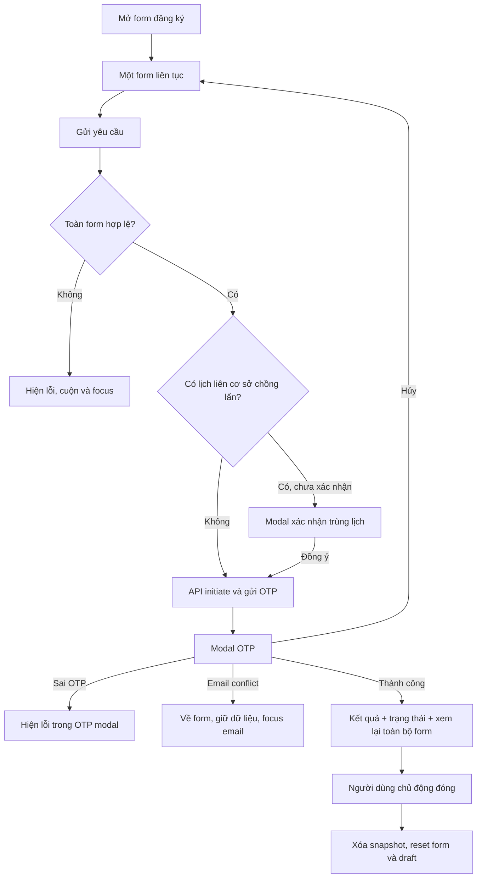

# PEMS UC17 — Kế hoạch triển khai form đăng ký một trang và màn hình xem lại sau OTP

> Tài liệu triển khai chi tiết cho repository `quangthoai04/PEMS`.
>
> Phạm vi chuẩn: frontend public visit request, use case UC17.
>
> Baseline rà soát: nhánh `Dev`, commit `480bdde6f18c39660318041b60c11acd0791162e`.
>
> Mức thay đổi dự kiến: frontend-only; không migration database, không đổi SQL, không đổi quy tắc phê duyệt.

---

## 1. Mục tiêu tài liệu

Tài liệu này là đặc tả triển khai để cập nhật form đăng ký tham quan trường hiện tại từ wizard ba bước thành một form liên tục, đồng thời bổ sung màn hình kết quả sau khi xác thực OTP để người đăng ký:

1. Nhập và kiểm tra toàn bộ thông tin trên cùng một màn hình.
2. Không phải chuyển qua lại giữa ba bước.
3. Không bị rối bởi nhiều card, border, shadow và tiêu đề lồng nhau.
4. Không mất dữ liệu khi mở, hủy hoặc nhập sai OTP.
5. Sau OTP thành công, xem được toàn bộ thông tin vừa gửi ở chế độ chỉ đọc.
6. Nhìn thấy mã yêu cầu và trạng thái chính xác `Đang chờ duyệt`.
7. Chủ động đóng màn hình kết quả thay vì bị tự động đóng sau bốn giây.

Tài liệu này không yêu cầu người triển khai thay đổi nghiệp vụ tạo đơn, routing phê duyệt, quyền, dữ liệu SQL hoặc API backend hiện có.

---

## 2. Nguồn chuẩn và thứ tự ưu tiên

Khi có khác biệt giữa các mô tả, áp dụng thứ tự ưu tiên sau:

1. Code đang chạy trên nhánh `Dev` tại baseline nêu trên.
2. `PEMS_CANONICAL_BUSINESS_RULES_v8_4_refined_v6_v10_FULL_UPDATED.md`.
3. `PEMS_UC_IMPLEMENTATION_RULEBOOK_FRONTEND_BACKEND_DATABASE_VALIDATION_SECURITY_v8_4_refined_v6_v10_FULL_UPDATED.md`.
4. `PEMS_UI_DESIGN_SYSTEM_PROMPT.md`.
5. `PROJECT_KNOWLEDGE.md` và tài liệu kiến trúc liên quan.
6. Tài liệu kế hoạch này.

Các quy tắc không được phá vỡ:

- Public Visitor phải xác thực OTP trước khi tạo visit request.
- Backend phải validate toàn bộ form ở bước verify.
- Submit chỉ tạo yêu cầu, không thực hiện approve, reject, cancel, assign host hoặc close.
- Request mới có trạng thái tổng `PENDING_APPROVAL`.
- Mỗi campus instance mới có trạng thái `WAITING_REQUEST_APPROVAL` theo kiến trúc hiện tại.
- Form phải tiếp tục yêu cầu tối thiểu một Guest và một External Support theo schema/nghiệp vụ hiện hành.
- Nút “Là tôi” ở đội hỗ trợ chỉ copy người đăng ký thành External Support; không tự động biến người đăng ký thành Guest.
- Backend là nguồn quyết định cuối cùng đối với validation và trạng thái.

---

## 3. Hiện trạng đã xác minh trong code

### 3.1. Component điều phối form

File:

- [`frontend/pems-react/src/components/modals/VisitingFormPopup.tsx`](https://github.com/quangthoai04/PEMS/blob/480bdde6f18c39660318041b60c11acd0791162e/frontend/pems-react/src/components/modals/VisitingFormPopup.tsx)

Hiện trạng:

- Khai báo `STEPS` gồm ba bước.
- Dùng `currentStep` để điều khiển nội dung đang hiển thị.
- Dùng `stepAttempted` để điều khiển lỗi theo từng bước.
- `handleNextStep` validate một nhóm field rồi mới chuyển bước.
- Khi lỗi submit, `handleInvalidSubmit` phân loại field về bước 1, 2 hoặc 3 rồi nhảy bước.
- Nội dung từng bước được render có điều kiện bằng `motion`.
- Footer có `Quay lại`, `Tiếp theo`, `Gửi yêu cầu` và bộ đếm `x / 3`.
- `handleSuccess` hiển thị success overlay rồi gọi `onClose()` sau bốn giây.
- Success overlay chỉ có biểu tượng, thông báo và mã đơn; không có bản xem lại form.

### 3.2. Hook quản lý form và OTP

File:

- [`frontend/pems-react/src/features/visit-request/hooks/useVisitRequestForm.ts`](https://github.com/quangthoai04/PEMS/blob/480bdde6f18c39660318041b60c11acd0791162e/frontend/pems-react/src/features/visit-request/hooks/useVisitRequestForm.ts)

Hiện trạng:

- React Hook Form giữ toàn bộ dữ liệu trong browser.
- `/initiate` validate frontend, yêu cầu backend gửi OTP và nhận `sessionToken`.
- `verifyOtp` gửi lại `form.getValues()` cùng OTP tới `/verify`.
- Khi verify thành công, hook xóa session token/draft rồi gọi `onSuccess(result)`.
- Khi contact email xung đột nghiệp vụ, OTP modal đóng và lỗi được gắn vào `contactPoint.email`.
- Vì toàn bộ form vẫn còn trong React Hook Form, không cần endpoint mới để cho người dùng xem lại dữ liệu họ vừa gửi.

### 3.3. API response sau OTP

Frontend:

- [`frontend/pems-react/src/features/visit-request/api/visitRequestApi.ts`](https://github.com/quangthoai04/PEMS/blob/480bdde6f18c39660318041b60c11acd0791162e/frontend/pems-react/src/features/visit-request/api/visitRequestApi.ts)

Backend:

- [`backend/PEMS.Application/Delegations/Commands/VerifyAndCreateVisitRequest/VerifyAndCreateVisitRequestResponse.cs`](https://github.com/quangthoai04/PEMS/blob/480bdde6f18c39660318041b60c11acd0791162e/backend/PEMS.Application/Delegations/Commands/VerifyAndCreateVisitRequest/VerifyAndCreateVisitRequestResponse.cs)
- [`backend/PEMS.Application/Delegations/Commands/VerifyAndCreateVisitRequest/VerifyAndCreateVisitRequestCommandHandler.cs`](https://github.com/quangthoai04/PEMS/blob/480bdde6f18c39660318041b60c11acd0791162e/backend/PEMS.Application/Delegations/Commands/VerifyAndCreateVisitRequest/VerifyAndCreateVisitRequestCommandHandler.cs)

Response hiện có:

```ts
interface VerifyResponse {
  visitRequestId: number;
  requestCode: string;
  status: string;
  message: string;
}
```

Response đã đủ để hiển thị:

- ID request nếu cần giữ nội bộ trong state.
- Mã yêu cầu cho người dùng.
- Trạng thái do backend trả về.
- Thông điệp kết quả.

Không cần đổi contract API để đáp ứng yêu cầu hiện tại.

### 3.4. Nguồn gây “ô lồng ô”

Các file section:

- `RegisterInfoSection.tsx`
- `VisitInfoSection.tsx`
- `VisitorListSection.tsx`
- `ContactSection.tsx`
- `AdditionalSection.tsx`

Mẫu lồng hiện tại thường là:

```text
Modal card
└── Step content
    └── Section
        ├── Section title riêng
        └── Card bo góc + border + shadow
            ├── Group title + divider
            └── Card hoặc table frame bên trong
                └── Input có border + shadow
```

Các ví dụ cần xử lý:

- `RegisterInfoSection`: tiêu đề section bên ngoài và tiêu đề group bên trong gần như trùng nhau.
- `VisitInfoSection`: card nền xám có viền cam chứa tiếp một card lịch trình màu trắng.
- `VisitorListSection`: card ngoài chứa tiếp table frame có border, rounded và shadow.
- `ContactSection`: card đội hỗ trợ và card đầu mối; trong mỗi card lại có header, content và table frame.
- `AdditionalSection`: card nền xám, border trái cam, border toàn khối, shadow và divider riêng.
- Input/select/textarea dùng nhiều `shadow-sm`, làm tăng cảm giác mỗi control là một “ô nổi”.

---

## 4. Phạm vi triển khai

### 4.1. Trong phạm vi

- Refactor `VisitingFormPopup` thành một form liên tục.
- Bỏ stepper và navigation ba bước.
- Chuyển validation sang validation toàn form.
- Giữ xác nhận trùng lịch trước khi initiate OTP.
- Làm phẳng toàn bộ section UI của public visit request.
- Bổ sung màn hình kết quả và bản xem lại chỉ đọc sau OTP.
- Giữ dữ liệu khi OTP sai, OTP bị hủy hoặc backend trả lỗi nghiệp vụ.
- Reset sạch dữ liệu sau khi người dùng đóng màn hình đã gửi.
- Bổ sung i18n VI/EN.
- Bổ sung Playwright E2E và kiểm tra responsive/accessibility.

### 4.2. Ngoài phạm vi

- Không đổi API URL hoặc request payload.
- Không đổi schema Zod ngoại trừ điều chỉnh kỹ thuật thật sự cần thiết cho refactor.
- Không đổi backend handler.
- Không đổi SQL schema, trigger, seed hoặc stored procedure.
- Không đổi OTP TTL, số lần thử hoặc resend rate limit.
- Không thay đổi approval routing.
- Không thêm khả năng sửa request ngay trên màn hình thành công.
- Không thêm nút “Xem đơn của tôi” nếu public flow chưa bảo đảm auth/session tương ứng.
- Không thêm chức năng in, PDF hoặc tải biên nhận trong task này.
- Không đổi các trang quản trị visit request.

---

## 5. Luồng mục tiêu



---

## 6. Kiến trúc state đề xuất

Không cần state machine library. Dùng state React hiện có, nhưng chuẩn hóa ba phase giao diện:

```ts
type FormPhase = 'editing' | 'otp' | 'submitted';

interface SubmittedVisitRequest {
  response: VerifyResponse;
  values: VisitRequestSchema;
}
```

Phase có thể được suy ra thay vì lưu riêng:

```ts
const phase: FormPhase = submission
  ? 'submitted'
  : sessionToken
    ? 'otp'
    : 'editing';
```

State chính trong `VisitingFormPopup` sau refactor:

```ts
const [submission, setSubmission] =
  useState<SubmittedVisitRequest | null>(null);
const [submitAttempted, setSubmitAttempted] = useState(false);
const [showOverlapConfirm, setShowOverlapConfirm] = useState(false);
```

Các state cần xóa:

```ts
currentStep
stepError
stepAttempted: Record<number, boolean>
successResult
```

`successResult` được thay bằng `submission`, vì màn hình kết quả cần cả response và dữ liệu vừa gửi.

---

## 7. Kế hoạch thay đổi theo file

### 7.1. `VisitingFormPopup.tsx`

#### 7.1.1. Xóa wizard

Xóa:

- Hằng `STEPS`.
- Toàn bộ thanh progress ba bước.
- Button điều hướng trực tiếp tới step.
- `currentStep` và mọi `setCurrentStep`.
- `handleNextStep`.
- Logic phân loại field về step trong `handleInvalidSubmit`.
- Ba wrapper `motion` render có điều kiện theo step.
- Button `Quay lại`.
- Button `Tiếp theo`.
- Bộ đếm `currentStep / 3`.

Giữ animation fade cho chính modal nếu cần. Xóa animation trượt giữa các trang vì không còn trang con.

#### 7.1.2. Render một form liên tục

Thứ tự render bắt buộc:

```tsx
<form onSubmit={handleSingleFormSubmit} noValidate>
  <RegisterInfoSection />
  <VisitInfoSection />
  <VisitorListSection />
  <ContactSection />
  <AdditionalSection />
</form>
```

Mỗi component nhận chung:

```ts
showErrors={submitAttempted}
```

`AdditionalSection` hiện chưa có `showErrors`; bổ sung prop để lỗi chỉ hiển thị đúng thời điểm tương tự các section khác.

#### 7.1.3. Submit toàn form

Pseudocode đề xuất:

```ts
const handleSingleFormSubmit = async (
  event: React.FormEvent<HTMLFormElement>
) => {
  event.preventDefault();
  setSubmitAttempted(true);
  setSubmitErrorPresentation(null);

  const valid = await form.trigger(undefined, { shouldFocus: true });

  if (!valid) {
    scrollToFirstInvalidField();
    return;
  }

  const values = form.getValues();
  const overlaps = findCampusTimeOverlaps(values.visits || []);

  if (
    values.visitMode === 'multiple' &&
    overlaps.length > 0 &&
    !values.timeOverlapConfirmed
  ) {
    setShowOverlapConfirm(true);
    return;
  }

  await onSubmit();
};
```

Lưu ý:

- `onSubmit` từ hook đã là handler do `form.handleSubmit` tạo, nên gọi không truyền event là hợp lệ.
- `form.trigger()` đầu tiên phục vụ UX và xác định thời điểm hiển thị modal overlap.
- `onSubmit()` validate lại trước khi gọi API; đây là lớp phòng vệ cần giữ.
- Không được initiate OTP khi bất kỳ field bắt buộc nào chưa hợp lệ.

#### 7.1.4. Xác nhận lịch chồng lấn

Khi người dùng đồng ý:

```ts
const handleConfirmOverlap = async () => {
  form.setValue('timeOverlapConfirmed', true, {
    shouldDirty: true,
    shouldValidate: false,
  });
  setShowOverlapConfirm(false);
  await onSubmit();
};
```

Khi người dùng thay đổi campus hoặc thời gian, logic hiện có trong `VisitInfoSection` tiếp tục reset `timeOverlapConfirmed` về `false`.

#### 7.1.5. Cuộn tới lỗi đúng phạm vi modal

Không dùng `document.querySelector()` toàn trang. Thêm ref cho vùng scroll:

```ts
const formScrollRef = useRef<HTMLDivElement>(null);
```

Tìm lỗi trong `formScrollRef.current`:

```ts
const scrollToFirstInvalidField = () => {
  requestAnimationFrame(() => {
    const root = formScrollRef.current;
    const target = root?.querySelector<HTMLElement>(
      '[aria-invalid="true"], [data-field-error="true"], .error-scroll-target'
    );

    target?.scrollIntoView({ behavior: 'smooth', block: 'center' });

    if (
      target instanceof HTMLInputElement ||
      target instanceof HTMLSelectElement ||
      target instanceof HTMLTextAreaElement
    ) {
      target.focus({ preventScroll: true });
    } else {
      target?.querySelector<HTMLElement>('input, select, textarea, button')
        ?.focus({ preventScroll: true });
    }
  });
};
```

Không phụ thuộc vào class màu như `.border-red-500`, vì class màu có thể thay đổi trong lần chỉnh UI tiếp theo.

#### 7.1.6. Footer mới

Editing state:

```text
Trái:  Hủy | Lưu tạm 30 phút
Phải: Gửi yêu cầu
```

Submitted state:

```text
Phải: Đóng
```

Yêu cầu:

- `Gửi yêu cầu` là button `type="submit"`.
- Các button khác là `type="button"`.
- Disable primary CTA khi `isSubmitting` hoặc `isVerifying`.
- Có spinner và text ổn định, không làm footer thay đổi chiều rộng đột ngột.
- Footer sticky, border trên nhẹ, không shadow đậm.

#### 7.1.7. Success state

Xóa hoàn toàn:

```ts
setTimeout(() => {
  setSuccessResult(null);
  onClose();
}, 4000);
```

Thay `handleSuccess`:

```ts
const handleSuccess = (
  response: VerifyResponse,
  values: VisitRequestSchema
) => {
  clearVisitRequestDraft();
  setSubmission({ response, values });
  setSubmitAttempted(false);

  requestAnimationFrame(() => {
    formScrollRef.current?.scrollTo({ top: 0, behavior: 'smooth' });
    submittedHeadingRef.current?.focus({ preventScroll: true });
  });
};
```

Không dùng overlay tuyệt đối che form cũ. Render một view riêng trong modal body:

```tsx
{submission ? (
  <SubmittedVisitRequestSummary submission={submission} />
) : (
  <VisitRequestEditableForm />
)}
```

#### 7.1.8. Đóng màn hình thành công

Khi `submission !== null`, nút close và click overlay không được mở xác nhận hủy form.

Luồng đóng:

1. Xóa submission snapshot.
2. Reset form về `DEFAULT_VISIT_REQUEST_VALUES`.
3. Reset các field arrays.
4. Xóa lỗi frontend/server.
5. Xóa OTP/session state còn sót nếu có.
6. Xóa draft.
7. Gọi `onClose()`.

Lần mở modal tiếp theo phải là form trắng, không phải dữ liệu của request vừa tạo.

### 7.2. `useVisitRequestForm.ts`

#### 7.2.1. Mở rộng callback thành công

Thay signature:

```ts
onSuccess: (result: VerifyResponse) => void
```

thành:

```ts
onSuccess: (
  result: VerifyResponse,
  submittedValues: VisitRequestSchema
) => void
```

`useVisitRequestForm` hiện chỉ được dùng bởi `VisitingFormPopup`, nên thay đổi này có phạm vi nhỏ và kiểm soát được.

#### 7.2.2. Tạo snapshot bất biến đúng dữ liệu gửi

Trong `verifyOtp`:

```ts
const submittedValues = structuredClone(form.getValues());
const result = await visitRequestApi.verify(submittedValues, otpCode);

setSessionToken(null);
clearVisitRequestDraft();
onSuccess(result, submittedValues);
```

Nếu target browser không bảo đảm `structuredClone`, dùng helper clone cho dữ liệu JSON-safe:

```ts
const cloneVisitRequest = (value: VisitRequestSchema): VisitRequestSchema =>
  JSON.parse(JSON.stringify(value)) as VisitRequestSchema;
```

Dữ liệu UC17 hiện gồm string, number, boolean, nullable và array; không có `Date`, `File`, function hoặc cyclic reference trong payload, nên JSON clone là lựa chọn fallback hợp lệ.

Không dùng trực tiếp object sống từ `form.getValues()` làm summary vì field array/reset sau đó có thể gây sai dữ liệu hiển thị.

#### 7.2.3. Không lưu OTP vào snapshot

OTP code là tham số riêng của `verifyOtp`, không thuộc `VisitRequestSchema`. Không thêm OTP vào:

- React form values.
- submission snapshot.
- localStorage draft.
- log browser.
- summary UI.

#### 7.2.4. Reset state tập trung

Khuyến nghị trả thêm helper từ hook:

```ts
resetVisitRequestForm(): void
```

Helper chịu trách nhiệm:

- `form.reset(DEFAULT_VISIT_REQUEST_VALUES)`.
- Replace `visits`, `visitors`, `supportTeam` về array mặc định.
- Xóa `sessionToken`, `maskedEmail`, `otpError`, `submitError`.
- Xóa server errors.
- Dùng cờ suppress draft save trong lúc reset nếu cần.

Mục đích là tránh ba nơi reset theo ba cách khác nhau: hủy form, bỏ draft và đóng success view.

#### 7.2.5. Contact email conflict sau OTP

Giữ nguyên mapping hiện tại:

- `CONTACT_EMAIL_CANNOT_BE_USED_FOR_VISITOR_ACCOUNT`.
- `VISITOR_ACCOUNT_INACTIVE`.

Bổ sung callback hoặc effect ở popup để khi OTP đóng vì lỗi này:

1. Editable form được render lại.
2. Dữ liệu không bị reset.
3. Vùng Contact được cuộn vào giữa modal.
4. `contactPoint.email` nhận focus.
5. Lỗi server xuất hiện ngay dưới field.

### 7.3. Component section dùng chung

Tạo file đề xuất:

```text
frontend/pems-react/src/features/visit-request/components/shared/FormSection.tsx
```

API tối thiểu:

```ts
interface FormSectionProps {
  id: string;
  title: string;
  description?: string;
  children: React.ReactNode;
  className?: string;
}
```

Markup gợi ý:

```tsx
<section
  id={id}
  aria-labelledby={`${id}-title`}
  className="scroll-mt-24 border-b border-slate-200 py-7 first:pt-0 last:border-b-0 last:pb-0"
>
  <div className="mb-5">
    <h2
      id={`${id}-title`}
      className="text-lg font-extrabold text-[#004c91] sm:text-xl"
    >
      {title}
    </h2>
    {description && (
      <p className="mt-1 text-sm leading-6 text-slate-500">
        {description}
      </p>
    )}
  </div>
  {children}
</section>
```

Không dùng:

- Số tròn.
- Số La Mã.
- Border trái cam.
- Background riêng cho section.
- Shadow cho section.
- Card title lặp lại bên trong.

### 7.4. `RegisterInfoSection.tsx`

Thay đổi:

- Xóa `SectionTitle index={1}` cũ.
- Xóa card `rounded-3xl border ... border-l-4 ... shadow-sm`.
- Xóa group header lặp `I. THÔNG TIN NGƯỜI ĐĂNG KÝ` nếu section title đã thể hiện cùng ý.
- Dùng `FormSection` với một tiêu đề duy nhất.
- Giữ grid một cột trên mobile, hai cột từ desktop/tablet phù hợp.
- Organization tiếp tục full-width.
- Giữ nguyên binding, validation, partner combobox, country select và phone input.

Không thay đổi tên field:

```text
registerInfo.fullName
registerInfo.nationality
registerInfo.organization
registerInfo.jobTitle
registerInfo.phone
registerInfo.email
partnerId
partnerSelectionMode
```

### 7.5. `VisitInfoSection.tsx`

Thay đổi:

- Xóa `SectionTitle index={2}` và card nền xám ngoài.
- Xóa card trắng lồng quanh visit slots.
- Dùng subheading văn bản nếu cần phân biệt “Lịch trình”.
- Mỗi visit slot là một row phẳng có divider dưới.
- Chỉ thêm nền cảnh báo cho row bị duplicate hoặc overlap.
- Badge timezone là text/badge nhẹ, không phải một card có shadow.
- Button “Thêm cơ sở” có thể giữ dashed border, nhưng không đặt trong card khác.
- Bỏ shadow khỏi select/datetime/textarea.

Giữ nguyên:

- Single/multiple campus.
- Không tự hạ multi-campus thành single-campus.
- Kiểm tra campus trùng.
- Min advance time.
- Overlap warning và confirm.
- `visitType === 'OTHER'` hiển thị field bổ sung.
- Purpose và working content bắt buộc.

Desktop row đề xuất:

```text
Campus | Từ | Đến | Múi giờ | Xóa
```

Mobile row đề xuất:

```text
Campus
Từ
Đến
Múi giờ
Xóa lịch trình
```

Không tạo horizontal scroll cho toàn modal.

### 7.6. `VisitorListSection.tsx`

Thay đổi:

- Xóa card ngoài `rounded-2xl border bg-white shadow-sm`.
- Xóa một trong hai lớp frame; desktop chỉ giữ một table frame có border.
- Header section dùng `FormSection` hoặc flat subsection heading.
- Error summary chỉ xuất hiện khi có lỗi thật.
- Download template, upload và add visitor nằm trên một toolbar phẳng.
- Alert upload thành công/thất bại vẫn có background theo trạng thái.

Responsive:

- `lg` trở lên: bảng.
- Dưới `lg`: danh sách row xếp dọc, phân cách bằng `border-b`.
- Không dùng bảng `min-w-[680px]` làm giao diện chính trên mobile.
- Mobile row không cần card shadow; dùng padding và divider.

Giữ nguyên:

- Add/remove visitor.
- Excel validation.
- Skip duplicate logic.
- Country và organization combobox.
- Tối thiểu một Guest.

### 7.7. `ContactSection.tsx`

Tách rõ hai subsection nhưng không bọc hai card nổi:

1. Đội hỗ trợ khách.
2. Đầu mối liên hệ.

Đội hỗ trợ:

- Một heading và mô tả ngắn.
- Checkbox “Tôi là thành viên hỗ trợ” hiển thị như checkbox label đơn giản.
- Một table frame desktop hoặc list mobile.
- Toolbar add/download/upload phẳng.

Đầu mối liên hệ:

- Một heading và mô tả ngắn.
- Checkbox “Tôi cũng là đầu mối liên hệ” không cần pill có border/background riêng.
- Bỏ card ngoài và info box xanh có border nếu nội dung chỉ là hướng dẫn; dùng paragraph text phụ.
- Desktop có thể dùng grid bốn field thay vì table một dòng để giảm cảm giác bảng trong card.
- Mobile luôn xếp dọc.

Giữ nguyên:

- Sync liên tục với người đăng ký khi checkbox đang được chọn.
- Bỏ checkbox phải clear hoặc khôi phục theo logic hiện hành.
- Email contact là email dùng để tạo/link VISITOR account.
- Contact email conflict phải gắn vào đúng field.
- Tối thiểu một External Support.

### 7.8. `AdditionalSection.tsx`

Thay đổi:

- Đổi root từ card nền xám thành `FormSection` phẳng.
- Xóa border trái cam, shadow và rounded card.
- Bỏ uppercase nếu làm tiêu đề quá nặng.
- Working language và transportation giữ grid hai cột từ `md` nếu đủ rộng.
- Media consent dùng divider nhẹ, không tạo card mới.
- Textarea/input bỏ shadow.
- Bổ sung `showErrors?: boolean` để thống nhất lỗi sau lần submit đầu tiên.

Giữ nguyên field:

```text
workingLanguage
transportationNote
mediaConsentStatus
mediaConsentNote
notes
```

### 7.9. `FormField.tsx` và control dùng chung

Chuẩn hóa control cho riêng public visit request:

```tsx
className="flex h-11 w-full min-w-0 items-center rounded-xl border border-slate-300 bg-white px-3 text-sm font-semibold text-slate-800 outline-none transition-colors focus:border-[#004c91] focus:ring-2 focus:ring-[#004c91]/10"
```

Thay đổi:

- `h-12` → `h-11` nếu không làm giảm khả năng thao tác.
- Bỏ `shadow-sm` khỏi input/select/textarea thông thường.
- Giữ border một lớp.
- Error dùng border đỏ và focus ring nhẹ.
- Valid icon chỉ dùng khi không đè lên chevron/clear icon.
- Không đổi dropdown shadow của combobox/popover nếu shadow cần để phân tách lớp nổi.

Kiểm tra các component:

- `CountrySelect.tsx`.
- `PhoneInput.tsx`.
- `OrganizationCombobox.tsx`.
- `PartnerOrgCombobox.tsx`.

Mục tiêu là cùng chiều cao, border và focus style; không thay đổi logic chọn dữ liệu.

---

## 8. Component màn hình xem lại sau OTP

Tạo file:

```text
frontend/pems-react/src/features/visit-request/components/SubmittedVisitRequestSummary.tsx
```

### 8.1. Props

```ts
interface Props {
  submission: SubmittedVisitRequest;
}
```

Nút đóng do footer/modal owner quản lý để component summary chỉ chịu trách nhiệm presentational.

### 8.2. Header kết quả

Nội dung bắt buộc:

- Icon success màu xanh lá.
- Heading focusable: `Đã gửi yêu cầu tham quan`.
- Badge trạng thái.
- Mã yêu cầu.
- Mô tả trạng thái.
- Ghi chú kiểm tra email nếu nghiệp vụ hiện tại có gửi email xác nhận.

Copy đề xuất tiếng Việt:

```text
Đã gửi yêu cầu tham quan
Yêu cầu của bạn đã được hệ thống tiếp nhận.
Trạng thái: Đang chờ duyệt
Mã yêu cầu: {{requestCode}}
Vui lòng giữ mã yêu cầu để theo dõi và kiểm tra email khi có cập nhật.
```

Không dùng câu “Đăng ký đã được duyệt” hoặc “Lịch tham quan đã được xác nhận”.

### 8.3. Status badge

Expected status sau submit:

```text
PENDING_APPROVAL → Đang chờ duyệt
```

Class theo design system:

```tsx
className="inline-flex min-w-[96px] items-center justify-center whitespace-nowrap rounded-full border border-yellow-200 bg-yellow-50 px-2.5 py-1 text-xs font-semibold text-yellow-700"
```

Tạo mapper có fallback an toàn:

```ts
const getSubmittedStatusPresentation = (status: string) => {
  switch (status) {
    case 'PENDING_APPROVAL':
      return { labelKey: 'result.status.pendingApproval', kind: 'pending' };
    default:
      return { labelKey: 'result.status.received', kind: 'neutral' };
  }
};
```

Không hard-code label từ `result.message` vì backend hiện trả chuỗi tiếng Việt; điều đó sẽ làm giao diện English bị lẫn ngôn ngữ. Dùng `response.status` làm nguồn trạng thái và i18n frontend làm nội dung hiển thị. `response.message` chỉ là fallback kỹ thuật nếu thật sự cần.

### 8.4. Cách trình bày dữ liệu

Không render disabled form controls.

Dùng:

- `dl/dt/dd` cho label-value.
- Grid hai cột trên desktop.
- Một cột trên mobile.
- Divider giữa các section.
- Bảng phẳng cho array trên desktop.
- List row có divider trên mobile.

Helper đề xuất:

```tsx
function ReviewField({ label, value }: { label: string; value?: React.ReactNode }) {
  return (
    <div className="min-w-0">
      <dt className="text-xs font-semibold uppercase tracking-wide text-slate-500">
        {label}
      </dt>
      <dd className="mt-1 break-words text-sm font-semibold text-slate-800">
        {value || '—'}
      </dd>
    </div>
  );
}
```

Không đặt mỗi `ReviewField` vào một card.

### 8.5. Các nhóm dữ liệu phải hiển thị

#### A. Người đăng ký

- Họ và tên.
- Quốc tịch.
- Đơn vị/tổ chức.
- Chức danh/phòng ban.
- Số điện thoại.
- Email.

#### B. Chuyến thăm

- Tên đoàn.
- Phạm vi một cơ sở/liên cơ sở.
- Loại chuyến thăm.
- Loại khác nếu `visitType === 'OTHER'`.
- Mục đích.
- Nội dung làm việc.

#### C. Lịch trình

Với mỗi `visits[]`:

- Cơ sở bằng label thân thiện, không chỉ code HN/DN/CT/HCM/QN.
- Thời gian bắt đầu.
- Thời gian kết thúc.
- Múi giờ `VN (GMT+7)`.

#### D. Khách tham dự

Với mỗi `visitors[]`:

- STT.
- Họ tên.
- Chức danh.
- Tổ chức.
- Quốc tịch.

#### E. Đội hỗ trợ

Với mỗi `supportTeam[]`:

- STT.
- Họ tên.
- Chức danh.
- Tổ chức.
- Quốc tịch.

#### F. Đầu mối liên hệ

- Họ tên.
- Tổ chức.
- Số điện thoại.
- Email.

#### G. Yêu cầu bổ sung

- Ngôn ngữ làm việc.
- Thông tin phương tiện.
- Trạng thái chấp thuận truyền thông/chụp ảnh.
- Ghi chú truyền thông.
- Ghi chú chung.

### 8.6. Field không hiển thị

- OTP code.
- Session token.
- `partnerId`.
- `partnerSelectionMode`.
- `timeOverlapConfirmed`.
- `visitRequestId` nếu UI không cần; vẫn giữ trong state cho telemetry/navigation tương lai.
- Dữ liệu hệ thống không phải nội dung người dùng đã nhập.

### 8.7. Format dữ liệu

Ngày giờ:

```ts
new Intl.DateTimeFormat(locale, {
  dateStyle: 'medium',
  timeStyle: 'short',
  timeZone: 'Asia/Ho_Chi_Minh',
}).format(date);
```

Không hiển thị raw `datetime-local` nếu có thể format an toàn.

Enum phải map qua i18n:

- Campus code.
- Visit mode.
- Visit type.
- Working language.
- Media consent.
- Request status.

Optional field rỗng hiển thị `—` hoặc key i18n `Không có`, thống nhất trong toàn summary.

---

## 9. UI specification

### 9.1. Modal

Overlay:

```tsx
className="fixed inset-0 z-[100] flex items-center justify-center bg-slate-900/40 p-0 backdrop-blur-sm sm:p-4"
```

Modal card:

```tsx
className="relative flex h-[100dvh] w-full flex-col overflow-hidden bg-white sm:h-auto sm:max-h-[92dvh] sm:max-w-6xl sm:rounded-3xl sm:border sm:border-slate-200 sm:shadow-2xl"
```

Header:

```tsx
className="flex shrink-0 items-start justify-between bg-[#004c91] px-4 py-4 text-white sm:px-6"
```

Body:

```tsx
className="min-h-0 flex-1 overflow-y-auto px-4 py-6 sm:px-6 lg:px-8"
```

Footer:

```tsx
className="flex shrink-0 flex-wrap items-center justify-between gap-3 border-t border-slate-200 bg-white px-4 py-3 sm:px-6"
```

### 9.2. Nguyên tắc giảm visual noise

- Tối đa một surface modal + một frame cho bảng desktop.
- Section chỉ dùng spacing và divider.
- Không dùng gradient mạnh.
- Không dùng orange border trang trí ở mọi khối.
- Không dùng shadow cho input/textarea/select.
- Không dùng card nhỏ trong row thời gian.
- Không dùng icon trang trí không có chức năng.
- Error/success/warning mới dùng màu nền ngữ nghĩa.
- Heading chỉ xuất hiện một lần cho mỗi nhóm nội dung.

### 9.3. CTA

Primary submit:

```tsx
className="inline-flex h-11 items-center justify-center rounded-xl bg-[#F37021] px-5 text-sm font-bold text-white transition-colors hover:bg-[#d95f18] focus-visible:outline-none focus-visible:ring-2 focus-visible:ring-[#F37021]/40 disabled:cursor-not-allowed disabled:opacity-60"
```

Secondary:

```tsx
className="inline-flex h-11 items-center justify-center rounded-xl border border-slate-300 bg-white px-4 text-sm font-semibold text-slate-600 transition-colors hover:bg-slate-50 hover:text-[#004c91] focus-visible:outline-none focus-visible:ring-2 focus-visible:ring-[#004c91]/20"
```

### 9.4. Mobile behavior

Ở viewport nhỏ:

- Modal chiếm toàn màn hình theo `100dvh`.
- Header và footer không bị cuộn khỏi màn hình.
- Body là vùng cuộn duy nhất.
- Footer có thể xếp button thành hai hàng.
- `Gửi yêu cầu` có thể full-width ở hàng cuối.
- Field grid chuyển thành một cột.
- Bảng chuyển thành list layout.
- Không có horizontal scroll trên trang hoặc modal body.
- Dropdown/popover phải nổi trên body, không bị cắt bởi section wrapper.

---

## 10. Accessibility

Modal cần:

```tsx
role="dialog"
aria-modal="true"
aria-labelledby="visit-request-dialog-title"
```

Yêu cầu:

- Close icon có `type="button"`, `aria-label` và `title`.
- Sau khi mở modal, focus vào heading hoặc field đầu tiên theo hành vi hiện tại.
- Sau OTP thành công, focus vào success heading có `tabIndex={-1}`.
- Sau contact email conflict, focus đúng email field.
- Button loading vẫn có accessible name.
- Success banner dùng `role="status"` hoặc `aria-live="polite"`.
- Error summary dùng `role="alert"` khi xuất hiện.
- Không xóa outline nếu không thay bằng focus ring.
- Màu chữ và nền đạt contrast phù hợp.
- Label phải liên kết input nếu component hiện có hỗ trợ ID.
- `aria-invalid` và `aria-describedby` được đặt cho control lỗi ở các field sửa trong task.
- Escape/overlay close không được phá confirm-cancel behavior khi đang editing.
- Trong submitted state, Escape/close đóng trực tiếp và reset sạch.

---

## 11. I18n VI/EN

File:

```text
frontend/pems-react/src/shared/i18n/locales/vi/visitRequest.json
frontend/pems-react/src/shared/i18n/locales/en/visitRequest.json
```

Không cần rename hàng loạt toàn bộ key cũ `step1`, `step2Info`, `step3`; việc đó tạo diff lớn nhưng không đem lại lợi ích trực tiếp. Có thể tiếp tục dùng các key field cũ và thêm namespace mới cho layout/result.

Cấu trúc key đề xuất:

```json
{
  "singleForm": {
    "requiredHint": "Các trường có dấu * là bắt buộc.",
    "sections": {
      "registrant": "Thông tin người đăng ký",
      "visit": "Thông tin chuyến thăm",
      "schedule": "Lịch trình",
      "visitors": "Thành viên đoàn khách",
      "support": "Đội hỗ trợ khách",
      "contact": "Đầu mối liên hệ",
      "additional": "Yêu cầu bổ sung"
    },
    "actions": {
      "submit": "Gửi yêu cầu",
      "submitting": "Đang gửi...",
      "close": "Đóng"
    }
  },
  "result": {
    "title": "Đã gửi yêu cầu tham quan",
    "description": "Yêu cầu của bạn đã được hệ thống tiếp nhận.",
    "statusLabel": "Trạng thái",
    "requestCode": "Mã yêu cầu",
    "reviewTitle": "Thông tin bạn đã gửi",
    "emailHint": "Vui lòng giữ mã yêu cầu và kiểm tra email khi có cập nhật.",
    "emptyValue": "—",
    "status": {
      "pendingApproval": "Đang chờ duyệt",
      "received": "Đã tiếp nhận"
    }
  }
}
```

English phải có đầy đủ key tương ứng, ví dụ:

```text
Request submitted
Pending approval
Request code
Information you submitted
Close
```

Không hiển thị trực tiếp backend `message` tiếng Việt trong English UI.

---

## 12. Draft, reset và dữ liệu cá nhân

### 12.1. Draft

Giữ nguyên:

- Lưu tạm 30 phút.
- Khôi phục draft.
- Bỏ draft.
- Auto-save hiện có nếu vẫn đúng quy tắc dự án.

Điều chỉnh:

- Bỏ mọi `setCurrentStep(1)` trong restore/discard/reset.
- Restore xong hiển thị toàn bộ form, không tự cuộn giữa các step.
- Sau verify thành công phải xóa draft trước khi hiển thị summary.
- Reset form sau success không được vô tình tạo lại một draft rỗng hoặc draft chứa dữ liệu request vừa gửi.

### 12.2. Snapshot sau submit

- Chỉ giữ trong React memory.
- Không lưu localStorage/sessionStorage.
- Không lưu OTP.
- Xóa khi đóng modal.
- Không ghi toàn bộ snapshot vào console.
- Không đưa PII vào analytics event nếu không có policy rõ ràng.

### 12.3. Form reopen

Các case cần phân biệt:

| Case | Kết quả khi mở lại |
|---|---|
| Người dùng đã submit thành công và đóng | Form trắng |
| Người dùng lưu draft rồi đóng | Hiện restore draft theo logic hiện tại |
| Người dùng hủy và xác nhận bỏ dữ liệu | Form trắng |
| Người dùng hủy OTP | Form hiện tại vẫn còn dữ liệu |
| OTP/email conflict | Form hiện tại vẫn còn dữ liệu và lỗi đúng field |

---

## 13. Error handling

### 13.1. Validation frontend

- Hiển thị toàn bộ lỗi có liên quan sau lần submit đầu tiên.
- Focus field lỗi đầu tiên.
- Không hiện banner chung thay cho lỗi field nếu đã xác định được field.
- Root error của `visitors`, `supportTeam` và `visits` vẫn có error summary tại section tương ứng.

### 13.2. Initiate OTP thất bại

- Giữ form trên màn hình.
- Giữ toàn bộ dữ liệu.
- Hiển thị `submitError` ở khu vực dễ thấy ngay trên footer hoặc đầu form.
- Không chuyển phase sang OTP.

### 13.3. OTP sai/hết hạn

- Giữ OTP modal mở.
- Hiển thị lỗi trong OTP modal.
- Cho resend theo rule hiện tại.
- Không xóa form values.

### 13.4. Business conflict sau OTP

- Đóng OTP modal.
- Trở về editable form.
- Gắn lỗi vào `contactPoint.email`.
- Scroll/focus field.
- Không clear draft/form.
- Không hiển thị success state.

### 13.5. Verify thành công nhưng email xác nhận nền thất bại

Backend hiện tạo request trong transaction và gửi email xác nhận sau commit. Nếu backend đã trả verify success thì UI phải hiển thị request đã được tiếp nhận; không biến lỗi email nền thành submit failure giả ở frontend.

---

## 14. Test plan

### 14.1. Công cụ hiện có

Frontend đã có:

- TypeScript check qua `npm run lint` (`tsc --noEmit`).
- Vite build qua `npm run build`.
- Playwright trong `devDependencies`.
- Playwright config dùng thư mục `frontend/pems-react/tests`.

Tạo file:

```text
frontend/pems-react/tests/visit-request-single-form.spec.ts
```

Mock network để không gửi OTP thật:

- `POST **/api/visit-requests/initiate`.
- `POST **/api/visit-requests/verify`.
- `POST **/api/visit-requests/resend-otp` khi test resend.

### 14.2. Test cases bắt buộc

#### TC-01 — Một form, không còn wizard

Kiểm tra:

- Không có stepper.
- Không có `1 / 3`, `2 / 3`, `3 / 3`.
- Không có `Quay lại` hoặc `Tiếp theo`.
- Tất cả heading section xuất hiện trong cùng modal.
- Có duy nhất CTA `Gửi yêu cầu`.

#### TC-02 — Submit rỗng

Kiểm tra:

- Không gọi `/initiate`.
- Lỗi bắt buộc xuất hiện.
- Field lỗi đầu tiên nhận focus.
- Modal body cuộn đúng, không cuộn toàn trang nền.

#### TC-03 — Submit hợp lệ single-campus

Kiểm tra:

- `/initiate` được gọi một lần.
- Payload giữ nguyên mapping hiện tại.
- OTP modal mở.
- Masked email hiển thị.

#### TC-04 — Multi-campus overlap

Kiểm tra:

- Form hợp lệ nhưng lịch chồng lấn mở confirm modal.
- Chọn hủy không gọi `/initiate`.
- Chọn đồng ý đặt `timeOverlapConfirmed` và gọi `/initiate` một lần.
- Sửa thời gian sau đó phải yêu cầu xác nhận lại nếu vẫn overlap.

#### TC-05 — Hủy OTP

Kiểm tra:

- OTP modal đóng.
- Form hiển thị lại toàn bộ dữ liệu đã nhập.
- Không reset array visitor/support/visits.

#### TC-06 — OTP sai

Mock verify lỗi OTP.

Kiểm tra:

- OTP modal vẫn mở.
- Error hiển thị.
- Form phía sau không mất dữ liệu.
- Có thể nhập lại OTP.

#### TC-07 — OTP đúng và summary

Mock response:

```json
{
  "visitRequestId": 123,
  "requestCode": "VR-2026-000123",
  "status": "PENDING_APPROVAL",
  "message": "Đơn đã được gửi thành công và đang chờ phê duyệt."
}
```

Kiểm tra:

- OTP modal đóng.
- Summary xuất hiện.
- Heading success xuất hiện.
- Badge `Đang chờ duyệt` xuất hiện.
- Mã `VR-2026-000123` xuất hiện.
- Tất cả dữ liệu registrant, visit, schedule, visitor, support, contact và additional xuất hiện.
- OTP không xuất hiện.
- Summary vẫn tồn tại sau ít nhất năm giây.
- Modal không tự đóng.

#### TC-08 — Đóng summary và mở lại

Kiểm tra:

- Đóng không mở confirm-cancel.
- Mở lại modal thấy form trắng.
- Không thấy mã request cũ.
- Không thấy dữ liệu PII cũ.

#### TC-09 — Contact email conflict sau verify

Mock code:

```text
CONTACT_EMAIL_CANNOT_BE_USED_FOR_VISITOR_ACCOUNT
```

Kiểm tra:

- OTP modal đóng.
- Không có success summary.
- Form values còn nguyên.
- Contact email field có lỗi server.
- Contact email được cuộn tới và focus.

#### TC-10 — Draft

Kiểm tra:

- Lưu draft.
- Đóng/reopen.
- Restore đúng toàn bộ arrays và optional fields.
- Không còn phụ thuộc `currentStep`.
- Sau submit thành công draft bị xóa.

#### TC-11 — I18n

Kiểm tra VI và EN:

- Section title.
- Action.
- Validation.
- OTP copy.
- Success heading.
- Pending status.
- Review labels.
- Không lẫn backend message tiếng Việt trên English UI.

#### TC-12 — Responsive

Viewport:

```text
390 × 844
768 × 1024
1024 × 768
1366 × 768
```

Kiểm tra:

- Không horizontal scroll toàn trang/modal.
- Header/footer không bị mất.
- CTA không bị cắt.
- Mobile list không render desktop table rộng.
- Dropdown và combobox không bị section cắt.
- Có thể cuộn tới mọi field và summary section.

### 14.3. Lệnh kiểm tra

Từ `frontend/pems-react`:

```bash
npm run lint
npm run build
npx playwright test
```

Nếu chỉ chạy spec mới:

```bash
npx playwright test tests/visit-request-single-form.spec.ts
```

Không báo hoàn tất nếu typecheck hoặc build thất bại do thay đổi trong phạm vi task.

---

## 15. Acceptance criteria

### AC-01 — Single continuous form

- Không còn ba tab/bước.
- Tất cả nhóm thông tin render trong cùng một form và cùng một vùng cuộn.

### AC-02 — Giảm nested boxes

- Không còn card section có border/shadow lồng trong modal card.
- Không còn card lịch trình lồng trong card visit info.
- Không còn card ngoài cộng table card trong cùng một section.
- Chỉ input/table/alert cần thiết có border.

### AC-03 — Submit toàn form

- Một CTA `Gửi yêu cầu` validate toàn bộ schema.
- Form lỗi không gọi initiate API.
- Field lỗi đầu tiên được focus và đưa vào viewport.

### AC-04 — Không mất nghiệp vụ overlap

- Multi-campus overlap vẫn có confirmation.
- Không xác nhận thì không gửi OTP.
- Thay đổi lịch reset confirmation.

### AC-05 — OTP giữ nguyên

- Initiate, verify, resend, cancel và error mapping tiếp tục hoạt động.
- Hủy/sai OTP không làm mất dữ liệu.

### AC-06 — Submitted review

- OTP đúng chuyển sang màn hình kết quả trong cùng modal.
- Hiển thị mã yêu cầu.
- Hiển thị trạng thái từ backend, expected `PENDING_APPROVAL` → `Đang chờ duyệt`.
- Hiển thị toàn bộ dữ liệu người dùng vừa gửi.
- Không render dưới dạng disabled inputs.

### AC-07 — Không auto-close

- Màn hình kết quả không tự đóng sau bốn giây hoặc bất kỳ timeout nào.
- Người dùng chủ động nhấn `Đóng` hoặc close modal.

### AC-08 — Reset an toàn

- Đóng summary xóa snapshot và reset form.
- Reopen không thấy dữ liệu request cũ.
- Không lưu OTP/summary trong browser storage.

### AC-09 — Responsive

- Desktop, tablet và mobile sử dụng được.
- Không có horizontal scroll ngoài ý muốn.
- Bảng chuyển layout phù hợp trên mobile.

### AC-10 — I18n và accessibility

- VI/EN đầy đủ.
- Không lẫn chuỗi backend tiếng Việt vào English success UI.
- Focus, aria, label và contrast đáp ứng yêu cầu thiết kế.

### AC-11 — Không đổi backend/SQL

- Không có migration.
- Không đổi request/response contract.
- Không đổi approval status hoặc routing.

---

## 16. Trình tự triển khai khuyến nghị

### Phase 1 — Refactor state và submit flow

1. Thêm type submission snapshot.
2. Mở rộng callback `onSuccess` trong hook.
3. Xóa current step/stepper.
4. Render tất cả section.
5. Tạo submit preflight toàn form.
6. Chuyển overlap confirmation tới final submit.
7. Bảo đảm initiate/OTP vẫn chạy.

Checkpoint:

- Form một trang hoạt động với UI cũ tạm thời.
- OTP initiate/verify không regression.

### Phase 2 — Làm phẳng UI

1. Tạo `FormSection`.
2. Refactor Register.
3. Refactor Visit info/schedule.
4. Refactor Visitors.
5. Refactor Support/Contact.
6. Refactor Additional.
7. Chuẩn hóa input styles.
8. Làm responsive table/list.

Checkpoint:

- Không nested card thừa.
- Không horizontal scroll ở viewport mục tiêu.

### Phase 3 — Submitted summary

1. Tạo `SubmittedVisitRequestSummary`.
2. Thêm result banner và status mapping.
3. Thêm formatter enum/date/value rỗng.
4. Render đầy đủ các nhóm dữ liệu.
5. Xóa auto-close timeout.
6. Bổ sung close/reset/focus behavior.

Checkpoint:

- Sau OTP đúng, người dùng xem lại đầy đủ và chủ động đóng.

### Phase 4 — I18n, accessibility và tests

1. Thêm VI/EN keys.
2. Thêm aria/focus behavior.
3. Thêm Playwright spec.
4. Chạy typecheck/build/E2E.
5. Manual responsive QA.

---

## 17. Chiến lược commit/PR

Branch đề xuất:

```text
feat/uc17-single-form-post-otp-review
```

Commit đề xuất:

```text
refactor(visit-request): replace three-step wizard with single form
refactor(visit-request): flatten public registration form sections
feat(visit-request): add submitted request review after OTP
test(visit-request): cover single-form OTP submission flow
```

Một PR, không trộn thay đổi backend/SQL hoặc trang dashboard không liên quan.

PR description cần nêu:

- Before/after UX.
- Danh sách file thay đổi.
- Bất biến nghiệp vụ được giữ.
- Screenshot desktop/mobile của editable và submitted state.
- Kết quả `npm run lint`, `npm run build`, Playwright.
- Xác nhận không có API/DB change.

---

## 18. Rủi ro và cách kiểm soát

| Rủi ro | Tác động | Cách kiểm soát |
|---|---|---|
| Bỏ step làm mất validation theo nhóm | Có thể gửi form thiếu dữ liệu | `form.trigger()` toàn schema trước initiate và giữ backend validation |
| Quên chuyển overlap confirm | Gửi lịch chồng lấn không xác nhận | Preflight riêng trước `onSubmit()` và E2E TC-04 |
| Dùng form object sống cho summary | Summary đổi/rỗng sau reset | Deep-clone trước `/verify` và lưu immutable snapshot |
| Auto-close cũ còn sót | Người dùng không kịp xem form | Xóa toàn bộ success timeout, test chờ trên 5 giây |
| Đóng success nhưng form không reset | PII cũ xuất hiện khi reopen | Central reset helper và E2E TC-08 |
| Reset làm auto-save draft cũ | Form đã gửi bị khôi phục lại | Suppress draft watcher trong reset, clear draft sau cùng |
| English UI hiển thị message tiếng Việt | Trải nghiệm i18n lỗi | Map `status` sang frontend i18n, không render raw message |
| Bảng vẫn rộng trên mobile | Phải kéo ngang, khó nhập | Dual desktop table/mobile list và responsive test |
| Global query focus nhầm dialog | Focus sai phần tử | Query trong `formScrollRef.current` |
| Refactor shared input ảnh hưởng nơi khác | Regression UI ngoài UC17 | Kiểm tra usage; scope class override cho visit request nếu shared component được dùng rộng |

---

## 19. Checklist review code

### State và logic

- [ ] Không còn `currentStep`.
- [ ] Không còn `STEPS`.
- [ ] Không còn `handleNextStep`.
- [ ] Không còn logic nhảy step khi invalid.
- [ ] Submit validate toàn form.
- [ ] Overlap confirm chạy trước initiate.
- [ ] OTP flow giữ nguyên contract.
- [ ] Success callback nhận snapshot.
- [ ] Không auto-close.
- [ ] Close success reset sạch.

### UI

- [ ] Một heading cho mỗi section.
- [ ] Không border trái cam lặp lại.
- [ ] Không section shadow.
- [ ] Không card lồng card.
- [ ] Input không shadow thừa.
- [ ] Error/alert có màu ngữ nghĩa.
- [ ] Footer đơn giản.
- [ ] Submitted review không dùng disabled input.

### Business

- [ ] Request mới vẫn `PENDING_APPROVAL`.
- [ ] Không hiển thị “Đã duyệt”.
- [ ] Guest và External Support requirement còn nguyên.
- [ ] Contact email conflict còn nguyên.
- [ ] Không thay payload/API/SQL.

### Quality

- [ ] VI/EN đủ key.
- [ ] Desktop/tablet/mobile QA.
- [ ] Keyboard/focus QA.
- [ ] Typecheck pass.
- [ ] Build pass.
- [ ] Playwright pass.
- [ ] Không log OTP/PII mới.

---

## 20. Definition of Done

Task chỉ được xem là hoàn tất khi:

1. Tất cả acceptance criteria AC-01 đến AC-11 đạt.
2. Form public không còn wizard ba bước.
3. UI được làm phẳng theo design system, không còn nested cards gây rối mắt.
4. Validation, draft, overlap và OTP không regression.
5. Sau OTP thành công, màn hình kết quả hiển thị trạng thái chờ duyệt, mã yêu cầu và toàn bộ dữ liệu vừa gửi.
6. Màn hình kết quả không tự đóng.
7. Đóng rồi mở lại không lộ dữ liệu cũ.
8. VI/EN, responsive và accessibility đã kiểm tra.
9. `npm run lint`, `npm run build` và Playwright đều pass.
10. PR không chứa thay đổi backend, database hoặc chức năng ngoài phạm vi.

---

## 21. Kết quả kỳ vọng

Sau triển khai, người dùng sẽ có một trải nghiệm tuyến tính và rõ ràng:

```text
Mở form
→ nhìn thấy toàn bộ thông tin cần nhập
→ nhập theo các section phẳng, dễ đọc
→ gửi một lần
→ nhập OTP
→ nhận kết quả “Đang chờ duyệt”
→ xem lại toàn bộ thông tin đã gửi
→ chủ động đóng
```

Thay đổi này cải thiện mạnh UX nhưng vẫn giữ nguyên kiến trúc UC17, API, dữ liệu và quy trình phê duyệt hiện hành của PEMS.
