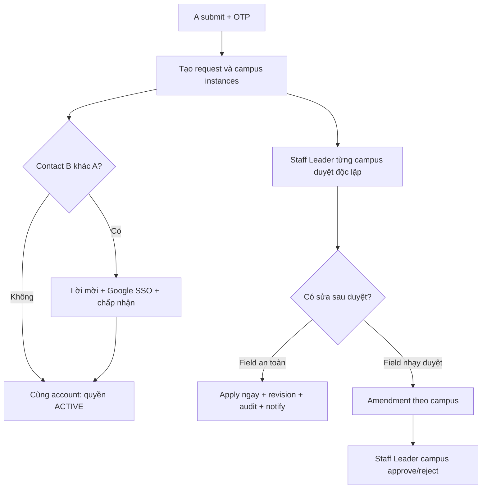

# PEMS — Master plan đã xác nhận: form riêng theo campus, sửa sau duyệt và quản lý đầu mối

> **Trạng thái tài liệu:** Implementation-ready specification cho quyết định 1–5. Không còn business blocker trong phạm vi 1–5. Đây là đặc tả đích; chưa có nghĩa code/SQL hiện tại đã triển khai xong.

## 1. Phạm vi và mốc code đã kiểm tra

- Repository: `quangthoai04/PEMS`
- Nhánh: `Dev`
- Commit được kiểm tra: `4aa929e89d13a2d415508213116f752dcfc3bf62` — `UnitTest_IntegrationTest_ViewDepartmentList` (15/07/2026)
- Trọng tâm: UC-17 public/authenticated submit, Visitor edit/resubmit, màn hình review sau submit, màn hình Staff Leader/HO/Host/Visitor xem nội dung đã gửi, account provisioning và SQL hiện tại.

### 1.1. Kết quả rà soát baseline thật

| Thành phần hiện tại | Kết quả rà soát | Hệ quả triển khai |
|---|---|---|
| `visit_requests` | Đang giữ gần như toàn bộ nội dung form ở cấp request | Chưa thể có purpose, danh sách khách, contact, ngôn ngữ… khác nhau theo campus |
| `visit_request_campuses` | Chỉ giữ campus, thời gian, lifecycle, host và quyết định | Phải bổ sung form detail/revision/amendment theo `visit_instance_id` |
| `visit_guest_members` | Chỉ liên kết bằng `visit_request_id` | Phải thêm liên kết theo campus và chống cross-request link |
| Create/OTP hiện tại | Sau OTP của registrant, backend provision cả registrant và contact rồi gán `visitor_user_id` ngay | Phải dừng cấp quyền contact khác email trước khi người đó tự xác nhận |
| Google SSO | Đã validate Google token, normalize email và có thể auto-provision VISITOR ACTIVE | Có thể dùng Google SSO + nút chấp nhận để claim; user có thể được tạo lúc login nhưng chưa có quyền request |
| `email_action_tokens` | Đã lưu hash, expiry, single-use metadata; handler hiện có thể thực thi theo token | Chỉ tái sử dụng storage/hash; không tái sử dụng nguyên handler token-only cho claim/transfer đầu mối |
| `audit_logs` + `audit_log_changes` | Có actor/action/entity và old/new text | Khung DB dùng được nhưng logging visit đang thủ công, không đồng nhất; có handler chỉ ghi header, không ghi diff |
| `notifications` | Đã có request/instance/campus, related entity, action URL và dedupe | Đủ nền tảng; thêm event/template, không dùng `metadata_json` làm nguồn dữ liệu |
| Search list hiện tại | Search sau khi áp scope, nhưng chỉ trên dữ liệu global/campus/host/owner hiện hữu | Giữ nguyên nguyên tắc scope-before-search, bổ sung detail per-campus và match context |
| Duration DB | Chỉ có `end > start` | Phải thêm guard tối thiểu 30 phút ở FE + BE + DB |

### 1.2. Năm quyết định nghiệp vụ đã xác nhận

| # | Quyết định đã khóa | Kết quả mong muốn |
|---:|---|---|
| 1 | A submit và xác minh OTP; request được tạo ngay. Nếu B khác A, B nhận lời mời, đăng nhập đúng Google email và bấm chấp nhận. Approval không chờ B | Không cấp quyền nhầm email nhưng không làm tắc luồng duyệt |
| 2 | Cho sửa sau duyệt theo amendment: field an toàn áp dụng ngay; field ảnh hưởng phê duyệt phải được Staff Leader campus đó duyệt lại | Nội dung đã duyệt không bị thay âm thầm; campus khác không bị reset |
| 3 | Registrant được cancel khi contact ban đầu chưa xác nhận, nhưng vẫn phải qua toàn bộ guard lifecycle/24h hiện hành | Request không bị mắc kẹt khi B chưa claim hoặc email B sai |
| 4 | Invitation đầu tiên 72h; transfer 24h; resend vô hiệu token cũ; record thất bại giữ 90 ngày rồi redact; APPLIED theo audit policy | Quản lý expiry/retention rõ ràng và không giữ secret/PII vô hạn |
| 5 | Search trên dữ liệu chung và mọi campus mà actor có quyền thấy; trả request một lần kèm nơi khớp | Tìm đúng dữ liệu mà không rò rỉ nội dung campus ngoài scope |

### 1.3. Luồng tổng quát đã khóa



## 2. Kết luận kiến trúc

Không thể đáp ứng yêu cầu chỉ bằng cách sửa frontend.

Hiện tại dữ liệu bị gộp ở cấp `visit_requests`:

- `delegation_name`
- `visit_type`, `visit_type_other`
- `purpose`, `working_content`
- thông tin đầu mối
- ngôn ngữ, phương tiện, truyền thông, ghi chú

Danh sách khách và đội hỗ trợ nằm ở `visit_guest_members` theo `visit_request_id`.

`visit_request_campuses` chỉ lưu campus, thời gian và trạng thái vận hành. Vì vậy mọi campus đang buộc phải dùng chung toàn bộ nội dung ngoài lịch trình.

Kiến trúc đích phải là:

1. `visit_requests` là request cha, giữ danh tính, quyền sở hữu, scope, trạng thái aggregate và audit.
2. Mỗi `visit_request_campuses` là một campus instance độc lập.
3. Mỗi campus instance có một snapshot form đầy đủ riêng.
4. Danh sách khách/đội hỗ trợ phải được liên kết theo campus instance.
5. Frontend luôn gửi dữ liệu đã resolve đầy đủ cho từng campus. Tính năng “dùng giống nhau” chỉ là thao tác sao chép một lần trong UI, không phải cơ chế kế thừa hoặc đồng bộ ngầm ở backend.

## 3. Phân loại dữ liệu đích

### 3.1. Giữ ở cấp request cha

| Nhóm | Dữ liệu |
|---|---|
| Hệ thống | request code, submission id, fingerprint, schema version, trạng thái aggregate, timestamps, row version |
| Người đăng ký | snapshot họ tên, quốc tịch, đơn vị, chức danh, điện thoại, email; `registrant_user_id` |
| Người quản lý yêu cầu | `visitor_user_id` và snapshot đầu mối chính dùng để đăng nhập/theo dõi/chỉnh sửa request |
| Quan hệ chung | partner, created source, visit scope, cancel/resubmit metadata |

### 3.2. Chuyển xuống từng campus instance

| Nhóm | Dữ liệu |
|---|---|
| Cơ sở và lịch | campus, bắt đầu, kết thúc |
| Thông tin chuyến thăm | tên đoàn/tên hiển thị tại campus, loại hình, loại hình khác, mục tiêu, nội dung làm việc |
| Con người | khách tham dự tại campus, đội hỗ trợ bên ngoài tại campus |
| Đầu mối vận hành | đầu mối làm việc riêng tại campus; có thể copy từ đầu mối chính |
| Yêu cầu bổ sung | ngôn ngữ, nhận diện phương tiện, chấp thuận truyền thông, ghi chú truyền thông, ghi chú FPTU |
| Xử lý nội bộ | chế độ SEND_FOR_REVIEW/SELF_HOST/ASSIGN_HOST của authenticated create |

### 3.3. Bắt buộc tách hai khái niệm “đầu mối”

- **Đầu mối chính / người quản lý yêu cầu:** một account VISITOR ở cấp request; có quyền theo dõi và chỉnh sửa request theo lifecycle.
- **Đầu mối làm việc tại campus:** snapshot vận hành của riêng campus; có thể khác nhau giữa các campus nhưng không tự động được cấp quyền tài khoản.

Không nên tự tạo một account owner cho mỗi campus trong phiên bản đầu. Nếu sau này business bắt buộc mỗi đầu mối campus được đăng nhập và chỉ sửa campus của mình, triển khai thêm `visit_request_collaborators`; không nhồi quyền này vào email snapshot.

## 4. Thay đổi SQL đề xuất

### 4.1. Bổ sung version/cờ chuyển đổi ở request cha

Thêm vào `visit_requests`:

- `form_schema_version TINYINT UNSIGNED NOT NULL DEFAULT 1`
- `has_mixed_campus_details BOOLEAN NOT NULL DEFAULT FALSE`

Các cột form global hiện hữu chưa xóa ngay. Trong giai đoạn chuyển đổi, chúng là compatibility/default snapshot, không còn là nguồn dữ liệu vận hành chính cho form v2.

### 4.2. Tạo bảng one-to-one cho nội dung từng campus

Tạo `visit_instance_form_details`:

```sql
visit_instance_id                BIGINT UNSIGNED PK/FK
delegation_name                  VARCHAR(200) NOT NULL
visit_type                       ENUM(...) NOT NULL
visit_type_other                 VARCHAR(255) NULL
purpose                          TEXT NOT NULL
working_content                  TEXT NULL
operational_contact_full_name    VARCHAR(150) NOT NULL
operational_contact_organization VARCHAR(255) NOT NULL
operational_contact_phone        VARCHAR(50) NOT NULL
operational_contact_email        VARCHAR(150) NOT NULL
working_language                 ENUM('VI','EN') NOT NULL
transportation_note              TEXT NULL
media_consent_status             ENUM('AGREED','DECLINED') NOT NULL
media_consent_note               TEXT NULL
note_to_fptu                     TEXT NULL
form_revision                    INT UNSIGNED NOT NULL DEFAULT 1
row_version                      INT UNSIGNED NOT NULL DEFAULT 0
created_at, created_by, updated_at, updated_by
```

Constraint bắt buộc:

- `visit_type = OTHER` thì `visit_type_other` phải có giá trị.
- Các trường contact bắt buộc không được là chuỗi rỗng.
- FK `visit_instance_id -> visit_request_campuses.visit_instance_id` dùng `ON DELETE CASCADE`, vì pending edit hiện cho phép bỏ một campus instance.

Không lưu cờ `same_as_other_campus` trong DB. Mỗi row luôn là snapshot hoàn chỉnh và độc lập.

### 4.3. Liên kết khách/đội hỗ trợ theo campus

Giữ `visit_guest_members` để không phá các FK hiện có từ minutes, feedback, face tags, OCR và partner links.

Tạo bảng nối `visit_instance_guest_members`. Bắt buộc mang cả `visit_request_id` để DB có thể bảo đảm member và instance thuộc cùng request:

```sql
visit_request_id  BIGINT UNSIGNED NOT NULL
visit_instance_id BIGINT UNSIGNED NOT NULL
guest_member_id   BIGINT UNSIGNED NOT NULL
display_order     INT UNSIGNED NOT NULL DEFAULT 0
PRIMARY KEY (visit_instance_id, guest_member_id)
```

Bổ sung unique key `(visit_request_id, visit_instance_id)` ở `visit_request_campuses` và `(visit_request_id, guest_member_id)` ở `visit_guest_members`, sau đó tạo hai composite FK từ bảng nối. Không chỉ dùng hai FK đơn vì cách đó cho phép nối member của request A vào instance của request B.

Quy tắc ghi dữ liệu mới:

- Mỗi campus tạo các row khách/support độc lập, kể cả khi người dùng bấm sao chép từ campus khác.
- Bản sao có cùng giá trị nhưng khác `guest_member_id`; nhờ đó sửa campus A không làm đổi campus B.
- `member_type` tiếp tục nằm ở `visit_guest_members`.
- Xóa campus chỉ cascade row liên kết/detail. Member row chỉ được xóa nếu không còn link và không có FK downstream; không cascade mù vào minutes, feedback, face/OCR hoặc lịch sử.

Backfill dữ liệu cũ:

- Với mỗi request cũ, link toàn bộ `visit_guest_members` hiện có vào mọi campus instance của request đó. Điều này giữ nguyên đúng semantics cũ là danh sách dùng chung.
- Khi một campus cũ được sửa lần đầu, dùng copy-on-write: clone member row cho campus đó rồi đổi link, không sửa row đang được nhiều instance dùng chung.

### 4.4. Workflow thay đổi danh tính/email

Tạo `visit_request_identity_changes` để không sửa email/FK một cách âm thầm. Bảng này là state hiện tại của invitation/transfer, không phải token store:

```sql
identity_change_id               BIGINT UNSIGNED PK
visit_request_id                 BIGINT UNSIGNED NOT NULL
change_kind                      ENUM('INITIAL_CLAIM','TRANSFER') NOT NULL
target_relation                  ENUM('PRIMARY_CONTACT') NOT NULL
confirmation_method              ENUM('GOOGLE_SSO','OTP_FALLBACK') NOT NULL
old_user_id, new_user_id         BIGINT UNSIGNED NULL
old_email_normalized             VARCHAR(150) NULL
new_email_normalized             VARCHAR(150) NULL
new_email_masked                 VARCHAR(150) NOT NULL
pending_snapshot_json            JSON NULL
status                           ENUM(
                                   'PENDING','APPLIED','DECLINED','EXPIRED',
                                   'CANCELLED','SUPERSEDED'
                                 ) NOT NULL
expected_request_row_version     INT UNSIGNED NOT NULL
requested_by                     BIGINT UNSIGNED NOT NULL
requested_at, expires_at          DATETIME NOT NULL
applied_at, declined_at           DATETIME NULL
cancelled_at, superseded_at       DATETIME NULL
retention_until, redacted_at      DATETIME NULL
reason                            VARCHAR(500) NULL
resend_count                      INT UNSIGNED NOT NULL DEFAULT 0
created_at, updated_at
```

Quy tắc:

- `INITIAL_CLAIM` cho phép old user/email `NULL`; `TRANSFER` bắt buộc chụp lại owner cũ.
- Khi `PENDING`, `new_email_normalized` và pending snapshot bắt buộc có giá trị bằng backend/trigger; chúng được phép `NULL` sau retention redaction, còn `new_email_masked` được giữ.
- `PENDING -> APPLIED` chỉ xảy ra sau authenticated Google session có email normalized đúng `new_email_normalized` và người dùng bấm POST chấp nhận.
- `visitor_user_id` chỉ được set/swap trong cùng transaction chuyển trạng thái sang `APPLIED`.
- Không lưu raw Google ID token, Google subject, OTP hoặc acceptance token trong bảng này hay audit.
- Chỉ một row `PENDING` cho một request/relation. Dùng generated nullable guard + unique index hoặc lock transaction; không chỉ `SELECT` rồi `INSERT` không lock.
- Resend đánh dấu row/token cũ `SUPERSEDED` hoặc vô hiệu token cũ trước khi phát token mới.
- Initial invitation hết hạn không hủy request; contact vẫn chưa claim và registrant vẫn là co-editor.
- Transfer hết hạn không đổi owner cũ.

Tái sử dụng `email_action_tokens` cho hash/expiry/single-use bằng cách bổ sung context/target mới, ví dụ `VISIT_CONTACT_CLAIM`, `VISIT_CONTACT_TRANSFER`, `VISIT_REQUEST_IDENTITY_CHANGE`. Tuy nhiên phải tạo handler riêng yêu cầu Google SSO; generic email-action handler hiện tại phải từ chối các context này. Nếu bật non-Google fallback, OTP giữ theo cấu hình OTP hiện hành và được bind với `identity_change_id + normalized_email + purpose`.

Thêm `visit_request_identity_change_events` dạng append-only để giữ mọi transition, kể cả resend/expire/redact:

```sql
identity_change_event_id BIGINT UNSIGNED PK
identity_change_id       BIGINT UNSIGNED NOT NULL
visit_request_id         BIGINT UNSIGNED NOT NULL
event_type               VARCHAR(80) NOT NULL
from_status, to_status   VARCHAR(30) NULL
actor_user_id            BIGINT UNSIGNED NULL
email_masked             VARCHAR(150) NULL
reason                   VARCHAR(500) NULL
correlation_id           VARCHAR(100) NULL
created_at               DATETIME NOT NULL
```

### 4.5. Thời lượng tối thiểu 30 phút

Thay rule hiện tại 3 giờ bằng 30 phút và bổ sung DB guard:

```sql
CHECK (TIMESTAMPDIFF(MINUTE, planned_start_at, planned_end_at) >= 30)
```

Trước khi add constraint phải chạy kiểm tra dữ liệu hiện hữu có duration dưới 30 phút. Không sửa seed/lịch thật một cách tự động; xuất danh sách vi phạm để xử lý trước.

### 4.6. Amendment và revision sau duyệt

Active data vẫn nằm ở bảng normalized. JSON chỉ dùng để giữ immutable snapshot/history và proposal, không dùng thay active schema.

Thêm vào `visit_instance_form_details`:

```sql
form_revision       INT UNSIGNED NOT NULL DEFAULT 1
approval_revision   INT UNSIGNED NOT NULL DEFAULT 1
row_version         INT UNSIGNED NOT NULL DEFAULT 0
```

- `form_revision` tăng với mọi thay đổi áp dụng.
- `approval_revision` chỉ tăng khi một thay đổi approval-sensitive được duyệt và apply.
- Safe change trong lúc có amendment không làm mất đề xuất; amendment apply theo field patch và kiểm tra base value, không full-replace snapshot mới nhất.

Tạo ba bảng:

```sql
visit_instance_amendments (
  amendment_id, visit_request_id, visit_instance_id,
  amendment_no, status,
  base_form_revision, base_approval_revision,
  requested_by, requested_at, reason,
  decided_by, decided_at, decision_note,
  expires_at, withdrawn_at,
  expected_instance_row_version,
  created_at, updated_at
)

visit_instance_amendment_changes (
  amendment_change_id, amendment_id,
  field_path, change_class,
  old_value_json, new_value_json,
  is_sensitive, display_order, created_at
)

visit_instance_form_revision_history (
  revision_history_id, visit_request_id, visit_instance_id,
  form_revision, approval_revision,
  source_type, source_id,
  snapshot_json,
  applied_by, applied_at, reason
)
```

`status` tối thiểu: `DRAFT`, `PENDING_APPROVAL`, `APPROVED`, `REJECTED`, `WITHDRAWN`, `EXPIRED`, `CANCELLED`. Chỉ một amendment `PENDING_APPROVAL` trên mỗi instance. `source_type` tối thiểu: `CREATE`, `SAFE_EDIT`, `AMENDMENT_APPLIED`, `MIGRATION`.

Thêm `visit_request_revision_history` cho snapshot request-level (registrant và primary-contact display fields). Email/account relation vẫn lấy identity-change event làm lịch sử chính.

### 4.7. Gia cố audit dùng chung

Hai bảng audit hiện tại dùng được nhưng chưa đủ query context và chưa bảo đảm handler nào cũng ghi diff. Bổ sung additive:

```sql
ALTER TABLE audit_logs
  ADD COLUMN correlation_id VARCHAR(100) NULL,
  ADD COLUMN visit_request_id BIGINT UNSIGNED NULL,
  ADD COLUMN visit_instance_id BIGINT UNSIGNED NULL,
  ADD COLUMN source_type VARCHAR(80) NULL,
  ADD COLUMN source_id BIGINT UNSIGNED NULL,
  ADD COLUMN reason VARCHAR(500) NULL;

ALTER TABLE audit_log_changes
  ADD COLUMN change_category VARCHAR(40) NULL,
  ADD COLUMN value_format VARCHAR(20) NOT NULL DEFAULT 'TEXT',
  ADD COLUMN is_sensitive BOOLEAN NOT NULL DEFAULT FALSE,
  ADD COLUMN display_order INT UNSIGNED NOT NULL DEFAULT 0;
```

Yêu cầu dữ liệu:

- `field_name` dùng path ổn định như `campus[123].purpose`, `request.primaryContact.phone`, `members.GUEST[456].status`.
- Email trong generic audit phải mask; token/OTP/Google subject không được ghi.
- Full proposal/snapshot có PII chỉ nằm trong bảng revision/amendment được authorize theo request/campus; email notification không chứa full diff.
- Audit header và tất cả change rows phải commit cùng transaction business. Nếu ghi audit thất bại thì mutation thất bại, không chạy kiểu best-effort.
- Không kỳ vọng middleware tự suy luận business diff. Tạo `IVisitAuditWriter`/domain service và gọi bắt buộc trong từng command handler; architecture test kiểm tra các handler mutation mới có audit call.

### 4.8. Search per-campus

- Thêm FULLTEXT/index phù hợp trên `visit_instance_form_details` cho `delegation_name`, `purpose`, `working_content`, operational contact name/org/email; giữ index request code/registrant/primary contact ở parent.
- Query phải tạo tập instance actor được phép xem trước, rồi mới áp keyword trên parent + tập instance đó.
- Guest/support member name không bật mặc định trong full search vì PII và chi phí; chỉ thêm nếu Product yêu cầu riêng và vẫn phải scope-before-search.
- API group về một request và trả `matchedContexts[]` gồm `visitInstanceId`, `campusId`, `campusName`, `matchedFields` đã lọc theo quyền.

### 4.9. Notification schema

Không bắt buộc đổi bảng `notifications`: `related_type/related_id`, request/instance/campus, action URL và dedupe key đã đủ. Dùng `related_type = VISIT_AMENDMENT` hoặc `VISIT_IDENTITY_CHANGE`; full diff luôn đọc từ endpoint được authorize, không nhét vào `metadata_json`.

`recipient_user_id` hiện bắt buộc, nên B chưa có user chỉ nhận email invitation. Nếu Google login đã auto-provision B, có thể tạo in-app notification sau login/accept bằng dedupe key; không tạo user giả chỉ để thỏa FK notification.

## 5. Contract API v2

Không tiếp tục gửi một `campusVisits[]` chỉ có campus/time cộng với các field global bên ngoài.

Contract đích:

```ts
type VisitRequestFormV2 = {
  registrant: RegistrantInput;
  primaryContact: PrimaryContactInput;
  partnerId?: number | null;
  visitScope: 'SINGLE_CAMPUS' | 'MULTI_CAMPUS';
  campusVisits: CampusVisitInput[];
  requestRowVersion?: number;
};

type CampusVisitInput = {
  visitInstanceId?: number;
  campusCode: string;
  startDatetime: string;
  endDatetime: string;
  delegationName: string;
  visitType: VisitType;
  visitTypeOther?: string | null;
  purpose: string;
  workingContent?: string | null;
  visitors: PersonInput[];
  supportMembers: PersonInput[];
  operationalContact: ContactInput;
  workingLanguage: 'VI' | 'EN';
  transportationNote?: string | null;
  mediaConsentStatus: 'AGREED' | 'DECLINED';
  mediaConsentNote?: string | null;
  notes?: string | null;
  processing?: {
    mode: 'SEND_FOR_REVIEW' | 'SELF_HOST' | 'ASSIGN_HOST';
    hostUserId?: number | null;
  };
  rowVersion?: number;
};
```

Backend luôn nhận snapshot đầy đủ. Không tin các cờ frontend kiểu `sameForAll`; backend chỉ validate dữ liệu cuối cùng của từng campus.

## 6. Backend cần sửa

### 6.1. Domain và persistence

- Thêm entity `VisitInstanceFormDetail`.
- Thêm entity/join mapping `VisitInstanceGuestMember`.
- Thêm entity `VisitRequestIdentityChange`.
- Thêm identity event, request/instance revision, amendment và amendment-change entities.
- Thêm navigation từ `VisitRequestCampus` tới form detail và guest links.
- Cập nhật `IApplicationDbContext` và `ApplicationDbContext` relationships/indexes.

### 6.2. DTO/command/validator

- Tạo `CampusVisitFormDto` chứa toàn bộ dữ liệu campus.
- Tạo interface/validator v2 thay vì tiếp tục kéo dài constructor của mọi command.
- Cập nhật các command:
  - `InitiateVisitRequestCommand`
  - `VerifyAndCreateVisitRequestCommand`
  - `CreateAuthenticatedVisitRequestCommand`
  - `UpdatePendingVisitRequestCommand`
  - `ResubmitRejectedVisitRequestCommand`
- `CampusProcessingDto` nên được đặt trong đúng campus item, không dùng một mảng song song keyed bằng campus code.

Validation trên từng campus:

- campus code bắt buộc, tồn tại, ACTIVE và không trùng.
- SINGLE đúng 1 campus; MULTI từ 2 campus trở lên.
- start đúng advance window hiện hữu: 72 giờ khi tạo mới, 24 giờ khi edit/resubmit.
- end phải sau start và duration phải `>= 30 phút`.
- visit type hợp lệ; OTHER bắt buộc mô tả.
- purpose, visitor, support team, operational contact, language, media consent bắt buộc theo rule hiện tại.
- transport note tối đa 2000 ký tự, không chứa HTML/script.
- Backend không suy ra “campus B giống campus A”; validate từng campus độc lập.

### 6.3. Create service và fingerprint

- `VisitRequestService.CreateAsync` phải tạo request cha, campus instances, form detail từng instance, member rows và member links trong cùng transaction.
- `VisitRequestFingerprintBuilder` chuyển sang v2 và canonicalize theo campus code đã sort:
  - campus code
  - start/end
  - delegation name của campus
  - visit type/other của campus
  - email người đăng ký và đầu mối chính
- Không đưa purpose/notes/list người vào fingerprint nếu muốn giữ duplicate semantics hiện tại là “core identity”.
- Lưu/nhận biết fingerprint version để không hiểu nhầm hash v1 và v2.

### 6.4. Edit/resubmit

- Quyền **sửa nội dung form/edit-resubmit** không còn chỉ là `visitor_user_id`.
- Tạo policy riêng cho form editing:

```text
actor là editor nếu actor == visitor_user_id
                  hoặc actor == registrant_user_id
```

Policy này không tự động mở rộng quyền cancel, feedback, approve, assign host hoặc các mutation vận hành khác. Mỗi action tiếp tục có policy riêng; cancel chỉ mở ngoại lệ 3A được mô tả ở mục 16.7.

- Vẫn re-check role/status/account ACTIVE ở backend.
- Full edit trực tiếp chỉ khi request hoàn toàn pending, mọi instance `WAITING_REQUEST_APPROVAL`, lịch sớm nhất còn >=24h.
- Resubmit chỉ khi toàn bộ instance REJECTED và campus set không đổi.
- Sau khi một campus đã duyệt: field safe apply ngay; field approval-sensitive tạo amendment cho đúng campus; structural changes dùng add/cancel/amendment tương ứng.
- Diff/update theo `visitInstanceId` hoặc campus id.
- Full replace guest/support chỉ trong phạm vi campus đang sửa.
- Dùng request row version và instance row version để chống người đăng ký và đầu mối ghi đè lẫn nhau.
- Audit phải ghi field diff theo từng `visit_instance_id`; amendment/revision history là deliverable cùng release, không để lại “phase sau”.

### 6.5. Query/màn hình đọc

Các query có context `visit_instance_id` phải đọc detail/member của instance, không đọc field global từ request cha:

- submitted form detail
- editable detail
- visit process detail
- visit instance summary/contribution
- staff calendar detail
- department invitation/request detail
- host/participant invitation
- email/notification nội dung campus

Quyền hiển thị phải giữ nguyên campus scope:

- Staff Leader: chỉ detail/member của campus mình.
- Host/participant/department assignee: chỉ instance được liên kết.
- HO: xem mọi campus read-only.
- Người đăng ký và đầu mối chính: xem toàn bộ request.

Đây là yêu cầu bảo mật, không chỉ là format response. Không được trả toàn bộ campus detail rồi ẩn bằng frontend.

## 7. Frontend form đề xuất

### 7.1. Cấu trúc dữ liệu React Hook Form

Đổi từ:

```text
global visit info + visits[{ campus, start, end }] + global people/contact/additional
```

thành:

```text
registrant + primaryContact + campusVisits[{ campus/time + detail + people + contact + additional }]
```

`useFieldArray` cấp cao quản lý `campusVisits`; mỗi campus block quản lý field array riêng cho visitors/support.

### 7.2. UX cho “giống nhau hoặc khác nhau”

Đề xuất dùng thao tác sao chép một lần, không dùng inheritance ở backend:

1. Người dùng chọn danh sách campus.
2. Campus đầu tiên hiển thị block đầy đủ.
3. Khi thêm campus thứ hai, hỏi:
   - “Sao chép thông tin từ campus đầu tiên” — mặc định/recommended.
   - “Nhập thông tin riêng”.
4. Mỗi campus là accordion/card có header:
   - tên campus;
   - thời gian;
   - badge “Đã đủ thông tin” hoặc “Còn N lỗi”;
   - nút Xóa;
   - nút “Sao chép từ campus khác”.
5. Có action “Áp dụng campus này cho tất cả campus còn lại”. Trước khi ghi đè dữ liệu đã nhập khác nhau phải có confirm nêu rõ campus bị ảnh hưởng.
6. Sau khi copy, các block độc lập. Sửa campus A không tự đổi campus B.

Không nên dùng checkbox đồng bộ liên tục vì dễ làm mất dữ liệu campus đã tùy chỉnh.

### 7.3. Tách đầu mối trong UI

Ở phần chung:

- “Đầu mối chính quản lý yêu cầu”
- Giải thích email này dùng tạo/link tài khoản VISITOR và theo dõi request.

Trong mỗi campus:

- “Đầu mối làm việc tại cơ sở này”
- Checkbox “Dùng đầu mối chính” để copy snapshot.
- Email này chỉ là thông tin vận hành, không tự cấp quyền đăng nhập.

### 7.4. Draft và backward compatibility

- Tăng `draftSchemaVersion`.
- Khi đọc draft v1 hiện tại, duplicate global visit info/people/contact/additional vào mọi campus đã chọn.
- Không để draft v1 làm mất dữ liệu khi release frontend v2.
- Auto-save theo campus block và giữ namespace public/user như hiện tại.

### 7.5. Validation thời gian 30 phút

- Đổi `MIN_DURATION_HOURS = 3` thành `MIN_DURATION_MINUTES = 30`.
- So sánh bằng milliseconds/minutes, không dùng số giờ thập phân.
- Cập nhật i18n VI/EN: “Thời gian tham quan tối thiểu 30 phút” / “Minimum visit duration is 30 minutes”.
- `datetime-local` có `step` phù hợp, ví dụ 300 giây; khi người dùng nhập start và end đang rỗng, có thể gợi ý end = start + 30 phút nhưng không tự ghi đè end đã nhập.

## 8. Cách hiển thị nội dung sau khi submit

Không tiếp tục hiển thị một section “Thông tin chuyến thăm” global rồi một bảng campus/time riêng.

### 8.1. Summary ngay sau OTP

Hiển thị:

1. Thông tin người đăng ký.
2. Đầu mối chính quản lý yêu cầu.
3. Danh sách campus dạng accordion/card.
4. Trong từng campus card:
   - campus + start/end + duration + timezone;
   - tên đoàn, loại hình, mục tiêu, nội dung;
   - khách tham dự;
   - đội hỗ trợ;
   - đầu mối vận hành;
   - ngôn ngữ, phương tiện, consent và ghi chú.

### 8.2. Màn hình Staff Leader/HO/Host/Visitor

- Staff Leader mở request liên cơ sở: panel chỉ có campus của họ và toàn bộ snapshot riêng của campus đó.
- HO: thấy các campus card, có thể expand/collapse, read-only.
- Host/participant/department assignee: chỉ thấy instance có quan hệ.
- Visitor người đăng ký/đầu mối: thấy tất cả campus.
- Header request chỉ hiển thị mã đơn, scope, trạng thái aggregate và số campus; không dùng một `purpose` global khi dữ liệu thực tế khác nhau.
- Header hiển thị contact state: `Chưa xác nhận`, `Đã xác nhận`, hoặc invitation `Đã hết hạn/Đã từ chối` lấy từ identity state mới nhất; contact state không thay status duyệt.
- Campus card hiển thị `Phiên bản đang hiệu lực vN`; nếu có amendment pending, thêm badge và panel proposal riêng, không trộn vào nội dung active.

### 8.3. Danh sách/accordion request

- Dòng cha: request code, người đăng ký/đầu mối, trạng thái aggregate, số campus, khoảng thời gian sớm nhất–muộn nhất.
- Dòng con theo campus: tên đoàn tại campus, visit type, lịch, trạng thái, host/quyết định.
- Nếu mọi campus có cùng tên đoàn/type có thể hiển thị giá trị chung; nếu khác nhau hiển thị “Khác nhau theo cơ sở”, không lấy campus đầu tiên làm đại diện mà không báo.
- Search result chỉ render authorized `matchedContexts`, ví dụ “Khớp tại: TP.HCM — mục tiêu chuyến thăm”; không render snippet từ campus ẩn.
- Timeline business hiển thị ai đề xuất, field nào đổi, ai duyệt và version nào đang active; IP/user-agent/raw security audit chỉ ở màn quản trị phù hợp.

## 9. Cơ chế sửa thông tin người đăng ký và đầu mối

### 9.1. Phân biệt snapshot form và hồ sơ account

- Sửa họ tên/đơn vị/chức danh/điện thoại trong request chỉ cập nhật snapshot của request.
- Không tự động sửa `users.full_name`, `users.phone` của account toàn hệ thống.
- Nếu muốn cập nhật hồ sơ cá nhân, dùng UC/profile riêng và có checkbox/action tách biệt.

### 9.2. Cả hai người đều có thể sửa

Trong lifecycle cho phép, cả `registrant_user_id` và `visitor_user_id` là co-editor.

Mọi endpoint mutation phải re-check quan hệ từ DB ở thời điểm request; không cache quyền này trong JWT.

### 9.3. Email không sửa như text thông thường

Tên/phone/org có thể lưu cùng form. Thay email phải qua workflow chuyển quan hệ:

1. Người dùng bấm “Thay đổi email”.
2. Nhập email mới, thông tin snapshot và lý do.
3. Backend validate scope/status/row version và kiểm tra email.
4. Gửi lời mời có opaque token tới email mới; token chỉ nhận diện invitation, chưa tự apply.
5. Trong lúc chờ, account cũ vẫn giữ quyền; chưa thay FK, chưa tạo owner mới.
6. Người nhận mở link, đăng nhập Google bằng đúng email, xem thông tin tối thiểu và bấm “Đồng ý làm đầu mối”. OTP chỉ là fallback nếu cấu hình cho phép non-Google user.
7. Trong một transaction:
   - ensure/link account phù hợp;
   - đổi `visitor_user_id` của primary contact;
   - đổi primary-contact email snapshot tương ứng;
   - ghi identity-change history + audit;
   - tăng row version;
   - gửi thông báo cho email/account cũ và mới.
8. Account cũ mất quyền đối với request ngay sau commit nếu không còn quan hệ còn lại.

Nếu registrant và contact đang cùng một account rồi đổi primary contact, confirm phải nói rõ hệ thống sẽ tách thành hai người. Đổi email đăng nhập của chính registrant là profile/account workflow riêng; sửa snapshot tên/đơn vị/chức danh/điện thoại của registrant vẫn thuộc safe form edit.

### 9.4. Không xóa/khóa account cũ ngay

Không hard-delete và không auto-INACTIVE account cũ khi đổi đầu mối vì account đó có thể:

- sở hữu request khác;
- là registrant của request khác;
- đã liên kết Google SSO;
- có session/audit/business history khác.

“Thu hồi” đúng nghĩa là:

- đổi FK owner/registrant của request;
- backend không còn cấp quyền trên request cho account cũ;
- hủy pending action token/invitation chỉ thuộc request đó;
- giữ account và audit history.

Có thể bổ sung job báo cáo orphan account, nhưng chưa nên tự vô hiệu hóa trong phase đầu. Chỉ cân nhắc cleanup khi account `created_via = VISITOR_FORM`, chưa từng login, không có auth provider sử dụng và không còn bất kỳ business relation nào.

### 9.5. Validation/confirm bắt buộc khi đổi email

- Email mới khác email hiện tại sau normalize.
- Contact owner phải là account VISITOR ACTIVE; email internal vẫn bị từ chối như rule hiện tại.
- Existing VISITOR cũng phải xác nhận email/lời mời trước khi nhận quyền.
- Invitation/OTP có expiry, attempt limit, cooldown/rate limit và không log plaintext.
- Chỉ một identity change PENDING cho cùng relation/request.
- Verify phải kiểm tra lại expected row version và lifecycle; lỗi conflict thì không apply.
- Người đổi chính email contact của mình được báo trước rằng sau khi chuyển thành công họ có thể mất quyền và sẽ được redirect khỏi edit page.
- Không bao giờ để request không có editor: account mới phải xác nhận trước khi swap account cũ.

## 10. Ma trận lifecycle phase đầu

| Trạng thái | Nội dung form campus | Snapshot name/phone/org | Đổi email/quan hệ |
|---|---|---|---|
| Fully pending, mọi campus waiting, >=24h | Registrant hoặc primary contact sửa toàn bộ | Cho phép | Cho phép qua verify workflow |
| Fully rejected, resubmit | Sửa toàn bộ; giữ campus set như rule hiện tại | Cho phép | Cho phép trước/đồng thời resubmit qua workflow riêng |
| Partially approved/approved/assigned/before visit, còn >=24h | Field an toàn apply ngay; field nhạy tạo amendment riêng cho campus | Name/phone/org apply ngay + audit/notify | Cho transfer đã verify; không reset approval |
| Còn <24h nhưng chưa bắt đầu | Khóa self-service amendment mới; field privacy khẩn cấp như rút consent media được apply ngay + notify | Chỉ hỗ trợ/correction có audit | Transfer self-service khóa; support flow nếu cần |
| During/after/closed/cancelled | Không sửa snapshot lịch sử | Không sửa self-service | Không chuyển quyền qua self-service |

Nếu amendment đang `PENDING_APPROVAL` mà instance chuyển `DURING_VISIT`, job/state transition đánh dấu amendment `EXPIRED`; snapshot đang được duyệt trước đó tiếp tục là active snapshot.

## 11. File/nhóm code bị ảnh hưởng trực tiếp

### Frontend

- `features/visit-request/types/visitRequest.types.ts`
- `features/visit-request/schema/visitRequest.schema.ts`
- `features/visit-request/api/visitRequestApi.ts`
- `features/visit-request/hooks/useVisitRequestForm.ts`
- `features/visit-request/utils/visitRequestDraftStorage.ts`
- `features/visit-request/components/sections/VisitInfoSection.tsx`
- `VisitorListSection.tsx`, `ContactSection.tsx`, `AdditionalSection.tsx`
- `CampusProcessingSection.tsx`
- `SubmittedVisitRequestSummary.tsx`
- `components/modals/VisitingFormPopup.tsx`
- `pages/dashboard/visit/EditVisitRequest.tsx`
- `features/delegations/components/SubmittedVisitRequestInfoPanel.tsx`
- `features/delegations/components/RequestInfoReadOnly.tsx`
- `features/delegations/types/delegations.types.ts`
- i18n VI/EN và Playwright tests.

### Backend

- Domain entities + `ApplicationDbContext`.
- `VisitFormDtos.cs`, shared form command interface/rules.
- Initiate/Verify/CreateAuthenticated/UpdatePending/Resubmit commands + validators + handlers.
- `VisitRequestService`.
- `VisitRequestFingerprintBuilder`.
- Submitted form detail/edit detail/process/summary/contribution/calendar/invitation queries.
- Không provision/link contact chỉ vì A gõ email. Visitor user có thể được SSO auto-provision khi chính B đăng nhập; request relation chỉ được set khi B explicit accept.
- Thêm identity-change commands, validators, handlers và controller endpoints.
- `ViewGuestDelegationListQueryHandler` hiện trả registered tab read-only và chỉ thêm Visitor owner actions; phải đổi allowedActions theo exact registrant relation nhưng không mở rộng role toàn cục.
- `CancelVisitRequestCommandHandler` hiện tính `isVisitorOwner` chỉ từ `visitor_user_id`; phải thêm nhánh 3A và audit diff/event.
- `UpdatePendingVisitRequestCommandHandler` hiện chỉ ghi audit header; phải chuyển sang audit writer + field changes.
- `LoginViaSsoCommandHandler` giữ chức năng Google validate/auto-provision; claim handler gọi sau login, không nhét request relation vào generic SSO login.
- `ExecuteEmailActionCommandHandler` hiện có semantics token-action; phải reject/reroute identity contexts để không accept contact chỉ bằng token.

### Database

- Migration additive tạo detail/link/identity-change tables.
- Backfill và preflight duration.
- Constraint tối thiểu 30 phút.
- Không drop cột global trong cùng release.

## 12. Kế hoạch triển khai theo phase

### Phase 0 — Freeze contract và decision record

- Các quyết định 1–5 trong mục 1.2 đã khóa; cập nhật canonical business rules/permission docs trước khi code.
- Freeze field classification safe/amendment/structural ở mục 16.6.
- Chốt các giới hạn cấu hình không ảnh hưởng kiến trúc: mặc định 10 campus, 200 member mỗi loại/campus, file 5 MB.
- Gắn feature flags và error codes trước khi backend/FE phát triển song song.

### Phase 1 — Database additive + backfill

- Tạo bảng/cột mới.
- Preflight duration <30 phút.
- Backfill detail cho mọi instance từ global request.
- Backfill member links.
- Kiểm tra count/checksum và rollback script.

### Phase 2 — Backend dual-read/dual-write

- Đọc detail v2; fallback global cho record chưa backfill.
- Viết v2 theo transaction.
- Giữ parent compatibility fields tạm thời.
- Sửa query instance-context và visibility trước khi bật frontend.
- Đặt feature flag `PerCampusVisitFormV2`.

### Phase 3 — Frontend form + review/detail

- Refactor form shape.
- Campus accordion, copy/overwrite confirm, error summary.
- Draft migration v1 -> v2.
- Post-OTP summary và mọi read-only panel hiển thị theo campus.

### Phase 4 — Co-editor + identity transfer

- Policy registrant/contact co-editor.
- Initiate/verify/cancel identity change.
- Concurrency, audit, notifications, old/new access tests.

### Phase 4B — Safe edit và amendment sau duyệt

- Server-side field classifier, revision history và amendment state machine.
- Staff Leader approve/reject theo campus; current approver mới có quyền quyết định.
- Đồng bộ calendar/reminder/logistics sau khi amendment được apply.
- Diff UI cho Visitor/Staff Leader/Host/HO theo đúng scope.

### Phase 4C — Search 5A

- Scope authorized instance trước search.
- Bổ sung per-campus detail index/query và match context.
- Chạy test chống hidden-campus inference và benchmark query.

### Phase 5 — Cutover và cleanup

- Bật flag theo môi trường/canary.
- Theo dõi lỗi validation, payload, query scope và mismatch detail.
- Sau thời gian ổn định mới ngừng dual-write/đánh dấu cột global deprecated.
- Không drop schema cũ trước khi toàn bộ report/invitation/calendar query đã chuyển.

## 13. Test bắt buộc

### Database/migration

- Mọi campus instance có đúng một detail row.
- Member link backfill đúng semantics request cũ.
- Không có orphan link/FK.
- 29 phút fail; 30 và 31 phút pass.
- Identity pending unique guard hoạt động dưới concurrent insert/resend.
- Amendment pending unique guard và revision FK/unique không cho cross-request/cross-instance.
- Cleanup 90 ngày redact đúng field nhưng không xóa minimal event/audit.

### Backend

- Single-campus v2 không regression.
- Multi-campus cùng dữ liệu tạo snapshot riêng.
- Multi-campus khác purpose/type/people/contact/language/consent lưu và đọc đúng.
- Staff Leader campus A không nhận detail/member campus B.
- Host/participant chỉ nhận instance liên quan.
- Public OTP và authenticated create cùng contract/rule.
- Edit campus A không đổi campus B.
- Registrant và primary contact đều edit được khi eligible.
- Người ngoài quan hệ 403.
- Concurrent edits trả 409 row-version conflict.
- Đổi contact: account mới chưa verify thì owner cũ còn quyền; verify xong owner mới có quyền và owner cũ mất quyền.
- Account cũ không bị xóa/inactive.
- Existing ACTIVE VISITOR link được; internal/inactive/locked bị chặn đúng error code.
- Identity transfer idempotent, OTP replay không swap hai lần.
- Google account sai email không claim được; GET invitation không mutation; POST accept mới apply.
- Campus approval vẫn chạy khi contact chưa claim; claim sau đó không reset quyết định.
- Safe edit tạo revision + field audit + notification đúng recipient.
- Approval-sensitive edit không đổi active snapshot trước khi duyệt; approve apply đúng patch, reject giữ snapshot cũ.
- Staff Leader campus A không approve amendment campus B; original reviewer đã nghỉ không chặn current Leader.
- Search keyword chỉ có ở campus ẩn không làm request xuất hiện cho actor không có quyền.
- Registrant cancel được khi initial contact chưa claim, nhưng fail đúng rule nếu <24h/đã bắt đầu/trạng thái không hợp lệ.
- Sau khi contact ACTIVE, registrant không còn quyền cancel trừ khi cùng account.

### Frontend/E2E

- Add 2+ campus, copy từ campus A, sửa campus B và payload giữ hai giá trị khác nhau.
- Confirm trước khi “áp dụng cho tất cả” ghi đè dữ liệu.
- Error badge/scroll tới đúng campus và field.
- Excel import theo đúng campus.
- Post-submit summary group đúng campus.
- Draft v1 phục hồi thành v2 không mất dữ liệu.
- 29 phút báo lỗi, 30 phút submit được.
- Identity-change pending/success/conflict UX.
- Google invitation: account switch/mismatch/expired/resend/decline/success UX.
- Amendment diff, status badge, approved version và proposed version hiển thị rõ.
- Search trả một request, badge “Khớp tại: [campus]”, không render hidden match.
- Mobile 390px không horizontal overflow và footer submit luôn tới được.

## 14. Acceptance criteria cuối

1. Multi-campus có thể gửi dữ liệu giống nhau hoặc khác nhau trên từng campus trong cùng request.
2. Copy trong UI tạo snapshot độc lập; sửa một campus không làm đổi campus khác.
3. Mọi màn hình đọc hiển thị nội dung theo campus, không dùng purpose/people/contact global sai ngữ cảnh.
4. Backend lọc dữ liệu theo campus scope trước khi trả response.
5. Single-campus tiếp tục hoạt động như trước.
6. Thời lượng tối thiểu là 30 phút ở frontend, backend và DB.
7. Registrant và primary contact đều có thể edit trong lifecycle cho phép.
8. Đổi email phải qua xác nhận; account cũ chỉ mất quyền request, không bị xóa/khóa tự động.
9. Có row version, audit và notification cho mọi identity transfer và edit quan trọng.
10. Migration không làm mất dữ liệu lịch sử và có dual-read/rollback rõ ràng.
11. Approved snapshot không đổi cho tới khi amendment của đúng campus được duyệt; campus khác giữ nguyên status/version.
12. Mọi mutation trong phạm vi 1–5 có audit header + field diff/event trong cùng transaction và không chứa secret.
13. Search chỉ xét dữ liệu actor được phép thấy, kể cả điều kiện khớp; không có side-channel qua count/badge.

## 15. Các điều không nên làm

- Không chỉ nhân đôi UI mà vẫn gửi field global.
- Không lưu một JSON blob toàn bộ form vào `visit_request_campuses` thay cho schema quan hệ.
- Không dùng `sameForAll=true` làm nguồn dữ liệu backend.
- Không tự động update profile account khi sửa snapshot request.
- Không đổi `visitor_user_id` ngay khi người dùng mới nhập email chưa verify.
- Không xóa/inactive account cũ ngay sau khi đổi đầu mối.
- Không trả detail của mọi campus rồi ẩn bằng frontend.
- Không drop các cột global trong release đầu.
- Không thay mọi biểu thức `>= 3` trong report; chỉ thay rule duration của visit request sau khi xác định đúng ngữ cảnh.

## 16. Các quyết định nghiệp vụ đã khóa để triển khai phase đầu

Các rule dưới đây là mặc định triển khai, nhằm loại bỏ khoảng trống mà developer/AI có thể tự suy diễn khác nhau.

### 16.1. Source of truth và xử lý tài liệu legacy

- Source of truth số 1 là code/schema thật tại commit đã nêu ở mục 1.
- Source of truth nghiệp vụ là addendum campus-independent approval mới nhất: Staff Leader xử lý từng campus; HO chỉ monitor/read-only; Admin không có quyền nghiệp vụ visit.
- Không triển khai lại các đoạn legacy mô tả HO duyệt request liên cơ sở hoặc Staff Leader không thấy multi-campus pending.
- Không tạo `permissions`/`role_permissions`; project dùng fixed policy từ role/sub-role/relation/scope/status trong handler.

### 16.2. Các loại contact

- Request có đúng một `primary contact` cấp request để quản lý tài khoản/quyền truy cập.
- Mỗi campus có đúng một `operational contact` snapshot; email này không tự có quyền đăng nhập.
- Nếu Product Owner muốn mỗi operational contact đăng nhập và chỉ sửa campus của mình, đó là scope mới `visit_request_collaborators`, không nằm trong phase đầu.

### 16.3. Trạng thái cho phép sửa

| Tình huống | Form/campus detail | Identity/account relation |
|---|---|---|
| Tất cả instance `WAITING_REQUEST_APPROVAL`, sớm nhất còn >=24h | Cho registrant hoặc active primary contact sửa; pending edit được thêm/xóa campus | Cho phép theo verified workflow |
| Tất cả instance `REJECTED`, sớm nhất còn >=24h | Chỉ sửa trong resubmit; campus set giữ nguyên | Cho phép qua workflow riêng trước resubmit |
| `PARTIALLY_APPROVED`, `APPROVED`, `ASSIGNED`, `BEFORE_VISIT`, còn >=24h | Safe field apply ngay; approval-sensitive field tạo amendment cho từng campus | Có thể transfer identity đã verify; audit + báo các actor bị ảnh hưởng |
| Trước visit nhưng còn <24h | Khóa amendment self-service mới; cho rút media consent khẩn cấp | Khóa transfer self-service; support flow có audit |
| Có instance `DURING_VISIT`, `AFTER_VISIT`, `CLOSED` hoặc request `CANCELLED` | Khóa snapshot lịch sử | Không transfer qua self-service; correction là quy trình hỗ trợ riêng ngoài scope |

Approval và amendment là hai state machine độc lập. Campus đã duyệt không bị đưa về `WAITING_REQUEST_APPROVAL`; amendment pending được hiển thị bằng trạng thái riêng. Campus chưa duyệt có thể nhận pending edit theo rule hiện tại; campus đã duyệt dùng amendment. Một payload không được âm thầm trộn hai cơ chế: backend phân loại từng campus/field và trả kết quả rõ cho client.

### 16.4. Initial primary-contact claim

Đây là phần bắt buộc để tránh người đăng ký gõ nhầm email và vô tình cấp quyền cho một người không liên quan:

- Public OTP hiện tại chỉ xác minh email người đăng ký.
- Nếu email primary contact sau normalize bằng email registrant: dùng cùng account đã verify, set cả hai FK vào cùng user và contact access `ACTIVE`.
- Nếu hai email khác nhau: tạo request sau khi registrant OTP thành công nhưng **chưa cấp quyền contact**. Lưu contact snapshot, tạo invitation/identity-change `PENDING`, gửi link tới email contact. B mở link, đăng nhập đúng Google account và bấm chấp nhận; chỉ lúc đó mới link VISITOR và set `visitor_user_id`.
- Existing VISITOR email vẫn phải xác nhận lời mời trước khi nhận quyền request; việc account đã tồn tại không chứng minh người submit được phép gán request cho account đó.
- Google SSO có thể auto-provision một VISITOR ACTIVE lúc B login. Việc đó chỉ tạo identity; request relation vẫn chưa tồn tại cho tới explicit POST accept.
- Trước khi contact claim, registrant là editor đã verify, có thể sửa/cancel pending invitation, resend hoặc nhập lại email đúng.
- Không dùng `INACTIVE` hoặc `LOCKED` của user để biểu diễn invitation pending; trạng thái invitation nằm ở identity-change.
- Campus approval không chờ contact claim. Staff Leader thấy badge “Đầu mối chưa xác nhận”; claim sau duyệt không reset quyết định.
- OTP chỉ là fallback khi Product bật hỗ trợ non-Google; không chạy cả Google và OTP bắt buộc nối tiếp nhau.

SQL cấp request cần thêm:

```sql
primary_contact_access_status ENUM('PENDING_CONFIRMATION','ACTIVE')
  NOT NULL DEFAULT 'PENDING_CONFIRMATION',
primary_contact_verified_at DATETIME NULL
```

Backfill record cũ: `ACTIVE` khi `visitor_user_id IS NOT NULL`; record bất thường thiếu owner phải được report để xử lý, không tự đoán email/account.

### 16.5. Email normalize

- Chuẩn hóa bằng `Trim()` và lowercase invariant.
- Không áp dụng rule riêng của Gmail như bỏ dấu chấm hoặc `+tag`.
- So sánh và unique theo collation/canonical rule thống nhất với `users.email` hiện hữu.
- Mọi lookup/provision email phải transaction-safe trước race condition; unique violation được map thành conflict có mã lỗi ổn định.

### 16.6. Quyết định 2 — field classification và amendment

Backend là nguồn phân loại duy nhất; frontend chỉ hiển thị dự đoán/UX.

| Loại | Field/action | Cách xử lý sau duyệt |
|---|---|---|
| Safe/correction | registrant full name/org/job title/phone; primary-contact name/org/phone; transportation note; note to FPTU; media note/consent | Apply ngay, tăng `form_revision` hoặc request revision, field-level audit, notify Staff Leader/Host liên quan |
| Privacy urgent | `media_consent_status` chuyển sang `DECLINED` | Apply ngay kể cả <24h, ưu tiên HIGH/URGENT notification; không chờ approval |
| Approval-sensitive | delegation name, visit type/other, purpose, working content, guest/support list, working language, operational contact có tác động phối hợp, logistics-impacting requirement | Tạo amendment per-campus; active snapshot giữ nguyên cho tới Staff Leader duyệt |
| Structural | thêm/bỏ/đổi campus, thay lịch | Thêm campus = instance mới chờ duyệt; bỏ campus đã duyệt = cancel flow; đổi campus = cancel cũ + add mới; đổi lịch của campus đã duyệt = amendment |

Quy trình amendment:

1. Registrant hoặc primary contact gửi patch + reason + row versions.
2. Backend normalize, diff và phân loại từng field.
3. Safe fields apply trong transaction; sensitive changes tạo amendment `PENDING_APPROVAL`.
4. Notify current Staff Leader; original reviewer nhận thông báo nếu account còn ACTIVE; Host nhận thông báo nhưng không có quyền approve.
5. Current Staff Leader của campus xem old/new diff và approve/reject.
6. Approve: apply patch, ghi revision history, tăng revisions/row version, cập nhật calendar/reminder/logistics liên quan, audit + notify.
7. Reject/expire/withdraw: approved snapshot cũ giữ nguyên; chỉ ghi decision/event/audit.

Không reset approval request/campus chỉ vì có amendment. Không cho self-service amendment từ `DURING_VISIT` trở đi. Một campus đang có amendment pending không nhận thêm amendment sensitive thứ hai; user phải sửa draft/withdraw hoặc chờ quyết định.

### 16.7. Quyết định 3 — registrant cancel khi contact chưa claim

- Cho phép khi `primary_contact_access_status = PENDING_CONFIRMATION` của initial claim.
- Áp dụng cho các trạng thái mà cancel hiện tại vốn cho phép; không bỏ rule 24h, không cho cancel campus đã bắt đầu và vẫn yêu cầu lý do.
- Khi contact đã `ACTIVE`, registrant không được cancel chỉ vì là co-editor; cancel trở lại exact primary-contact owner rule, trừ khi registrant và contact cùng user id.
- Khi transfer từ owner cũ sang owner mới đang pending, owner cũ vẫn ACTIVE; registrant không được hưởng ngoại lệ này.
- Cần sửa đồng thời `CancelVisitRequestCommandHandler`, `allowedActions` list query, permission docs và trigger `trg_visit_requests_cancel_validate_bu`.

### 16.8. Quyết định 4 — expiry và retention

| Dữ liệu | Thời hạn | Khi hết hạn/retention |
|---|---:|---|
| OTP fallback | Theo cấu hình OTP hiện hành | Resend làm OTP cũ mất hiệu lực ngay |
| Initial contact invitation | 72 giờ | Mark `EXPIRED`; request không bị hủy; A có thể resend/change contact |
| Transfer invitation | 24 giờ | Mark `EXPIRED`; owner cũ giữ nguyên |
| `EXPIRED/DECLINED/CANCELLED/SUPERSEDED` | 90 ngày | Redact token refs/pending snapshot/full email; giữ event tối thiểu với email masked |
| `APPLIED` | Theo audit policy PEMS | Giữ lịch sử quyền/revision; không cleanup như pending failure |

Job chạy định kỳ phải idempotent, batch được, có metric số record expired/redacted và audit event `IDENTITY_CHANGE_REDACTED`. Redaction không xóa `visit_request_id`, actor, kind, masked email, trạng thái và timestamps cần điều tra.

### 16.9. Quyết định 5 — search đúng scope

- Registrant/primary contact: search parent + toàn bộ campus của request họ có quan hệ.
- HO: search toàn bộ request/campus nhưng read-only.
- Staff Leader: chỉ detail của `primary_campus_id`.
- Host/participant/department/student: chỉ instance có quan hệ/assignment.
- Kết quả parent chỉ xuất hiện nếu parent field hoặc ít nhất một authorized instance khớp. Hidden instance tuyệt đối không được làm thay đổi result count, sort score hay badge.
- Parent trả một lần, kèm “Khớp tại: Hà Nội/TP.HCM…” và field category an toàn; không trả snippet PII/full content vượt quyền.

## 17. SQL/migration specification hoàn chỉnh

### 17.1. Deliverable SQL bắt buộc

Không chỉ sửa file fresh-create lớn. Phải có đủ:

1. Patch `UP` cho database đang chạy.
2. Script preflight/readiness không mutation.
3. Script backfill idempotent hoặc có checkpoint/batch.
4. Script verify sau backfill: count, orphan, checksum/sample mismatch.
5. Script rollback ứng dụng/data strategy; không hứa rollback DDL transaction vì MySQL DDL có thể auto-commit.
6. Cập nhật fresh-create schema và seed hợp lệ cho môi trường mới.
7. Ghi rõ thứ tự import và MySQL version tối thiểu.

### 17.2. Ràng buộc/index bắt buộc

- `visit_instance_form_details.visit_instance_id` PK + FK cascade link/detail khi xóa pending instance.
- Named check cho `OTHER`, required trimmed strings và các enum đúng với schema hiện tại.
- Composite keys/FKs ở mục 4.3 để không có cross-request member link.
- Unique một detail trên một instance.
- Unique `(visit_request_id, campus_id)` hiện hữu tiếp tục giữ nguyên.
- Duration constraint đặt tên rõ, ví dụ `ck_visit_instance_min_duration_30m`; giữ cả rule `end > start` nếu không được bao hàm rõ.
- Index phục vụ query detail theo instance/request và contact lookup.
- Full-text/list search hiện đang dựa vào cột global phải được chuyển hoặc bổ sung index/query cho `delegation_name`, purpose và contact per-campus; không lấy campus đầu tiên làm dữ liệu search đại diện.
- Identity change có index `(visit_request_id, target_relation, status)` và unique guard chỉ cho một change in-flight trên cùng relation. Với MySQL không có partial unique index, dùng generated nullable guard hoặc transaction lock; không chỉ kiểm tra bằng application rồi insert.
- Amendment có index `(visit_instance_id, status, requested_at)`, unique active guard và FK mang cả request/instance để chống gắn proposal sai request.
- Revision history unique `(visit_instance_id, form_revision)` và index `(visit_request_id, applied_at)`.
- Audit thêm index `(visit_request_id, created_at)`, `(visit_instance_id, created_at)`, `(correlation_id)` và `(source_type, source_id)`; không cascade-delete audit khi xóa business row.
- Rà toàn bộ SQL view, trigger, stored procedure, seed insert và comment đang dùng field global hoặc giả định `visitor_user_id` là editor duy nhất. Trigger cancel hiện hữu phải được sửa đồng bộ nếu áp dụng ngoại lệ registrant-cancel-khi-contact-pending; không chỉ sửa C# handler.

### 17.3. Dữ liệu thời gian

- Schema/code hiện tại coi `planned_start_at/planned_end_at` là local wall-clock `DATETIME` và dùng `VietnamNow`; release này phải giữ nguyên convention để không lệch lịch cũ.
- API phải truyền timezone rõ; backend parse/normalize về timezone campus (`Asia/Ho_Chi_Minh` hiện tại) rồi lưu local wall-clock. Không có handler dùng UTC ở nơi khác lại dùng VietnamNow ở nơi khác.
- Duration tính sau khi cả hai mốc đã normalize cùng timezone, không tính trên chuỗi và không dùng rounded hours.
- FE hiển thị timezone của campus/system nhưng không tự cộng cứng 7 giờ; migration toàn hệ thống sang UTC là scope riêng.
- Test boundary chính xác 29m59s fail, 30m00s pass, end bằng start fail.

### 17.4. Backfill/cutover semantics

- `INSERT ... SELECT ... WHERE NOT EXISTS` hoặc batch có checkpoint để rerun an toàn.
- Với mỗi instance cũ: clone global detail vào đúng một detail row.
- Với member cũ: link vào mọi instance cùng request; lần sửa đầu áp dụng copy-on-write.
- Record legacy đặt `form_schema_version = 1`; record tạo mới v2 đặt `2`.
- `has_mixed_campus_details` do backend tính từ normalized snapshots, không nhận từ client.
- Trong dual-write, cột global chỉ là compatibility projection. Nếu mọi campus giống nhau, ghi common value; nếu khác nhau, dùng snapshot của campus có `campus_id` nhỏ nhất chỉ để thỏa các cột legacy `NOT NULL`, đặt `has_mixed_campus_details = 1`, và không expose projection đó như nội dung chung. Không query nghiệp vụ v2 từ projection này.
- Sau khi có v2 writes, rollback an toàn là tắt feature flag và chạy backend dual-read; không drop bảng v2 hoặc ép dữ liệu mixed trở lại schema v1.

### 17.5. Preflight tối thiểu

Preflight phải report, không tự sửa:

- instance <30 phút;
- request không có campus;
- duplicate request/campus;
- request thiếu GUEST hoặc EXTERNAL_SUPPORT;
- `visitor_user_id`/`registrant_user_id` không khớp role/status invariant;
- member/request mismatch;
- email blank/invalid/duplicate theo normalize;
- orphan FK hoặc row liên quan downstream gây cản trở copy-on-write.

## 18. API contract/versioning và error contract

### 18.1. Không phá client v1 trong lúc deploy

Giữ các route hiện tại làm v1:

```text
POST /api/visit-requests/initiate
POST /api/visit-requests/verify
POST /api/visit-requests/resend-otp
POST /api/visit-requests/otp/recover
POST /api/visit-requests
GET  /api/visit-requests/{id}/edit-detail
PUT  /api/visit-requests/{id}/pending-edit
POST /api/visit-requests/{id}/resubmit
```

Thêm contract v2 theo một convention nhất quán, khuyến nghị `/api/v2/visit-requests/...`. Không đổi shape âm thầm trên route cũ trong một deployment rolling.

- V1 create được adapter duplicate global snapshot vào từng campus.
- V1 read phục vụ record legacy hoặc record v2 không mixed; với mixed detail phải trả upgrade-required thay vì hiển thị projection của một campus như dữ liệu chung.
- V1 edit phải trả `409 FORM_VERSION_UPGRADE_REQUIRED` nếu request v2 có mixed campus detail; không cho payload v1 ghi đè làm mất dữ liệu.
- V2 response luôn trả `campusVisits[]` resolved đầy đủ và `allowedActions` từ backend.
- Public initiate lưu canonical v2 payload server-side trong pending session; verify chỉ xác nhận đúng session/submission/OTP, không nhận lại một form khác rồi tạo.

### 18.2. Identity endpoints

Thêm các action riêng, không nhét email transfer vào pending-edit payload:

```text
POST /api/v2/visit-requests/{id}/identity-changes
GET  /api/v2/visit-requests/{id}/identity-changes/active
POST /api/v2/visit-requests/{id}/identity-changes/{changeId}/resend
POST /api/v2/visit-requests/{id}/identity-changes/{changeId}/cancel
GET  /api/v2/visit-request-identity/invitations/{opaqueToken}
POST /api/v2/visit-request-identity/invitations/{opaqueToken}/accept
POST /api/v2/visit-request-identity/invitations/{opaqueToken}/decline
```

GET chỉ trả thông tin tối thiểu/masked và không mutation. `accept/decline` yêu cầu authenticated Visitor Google session, CSRF protection, opaque token, expiry/rate limit và normalized login email khớp invitation. Không dùng `changeId` tuần tự làm bằng chứng sở hữu. OTP fallback dùng endpoint riêng/purpose riêng khi feature bật.

### 18.3. Safe edit, amendment và search endpoints

```text
PATCH /api/v2/visit-requests/{id}/safe-details
POST  /api/v2/visit-requests/{id}/instances/{instanceId}/amendments
GET   /api/v2/visit-requests/{id}/instances/{instanceId}/amendments/active
POST  /api/v2/visit-requests/{id}/instances/{instanceId}/amendments/{amendmentId}/withdraw
POST  /api/v2/visit-instances/{instanceId}/amendments/{amendmentId}/approve
POST  /api/v2/visit-instances/{instanceId}/amendments/{amendmentId}/reject
GET   /api/v2/visit-requests/{id}/history
GET   /api/v2/visit-requests?keyword=...&...
```

Có thể dùng một endpoint `PATCH .../details` để backend tự split safe/sensitive, nhưng response bắt buộc trả rõ `appliedChanges[]`, `amendmentsCreated[]`, `conflicts[]`; không để client tưởng toàn bộ payload đã apply. Mọi approve/reject re-check current Staff Leader + campus + status + revisions.

### 18.4. Error code ổn định

Ít nhất có:

```text
VISIT_FORM_VALIDATION_FAILED
VISIT_DURATION_TOO_SHORT
DUPLICATE_CAMPUS
VISIT_NOT_EDITABLE
VISIT_NOT_RESUBMITTABLE
VISIT_FORM_CONCURRENCY_CONFLICT
VISIT_INSTANCE_SCOPE_FORBIDDEN
FORM_VERSION_UPGRADE_REQUIRED
IDENTITY_CHANGE_ALREADY_PENDING
IDENTITY_CHANGE_EMAIL_UNCHANGED
IDENTITY_CHANGE_TARGET_NOT_ALLOWED
IDENTITY_CHANGE_EXPIRED
IDENTITY_CHANGE_CONFLICT
IDENTITY_GOOGLE_EMAIL_MISMATCH
IDENTITY_CONFIRMATION_REQUIRED
IDENTITY_CHANGE_SUPERSEDED
CONTACT_EMAIL_INTERNAL_ACCOUNT_CONFLICT
CONTACT_ACCOUNT_NOT_ACTIVE
OTP_INVALID_OR_EXPIRED
OTP_RATE_LIMITED
AMENDMENT_ALREADY_PENDING
AMENDMENT_NOT_EDITABLE
AMENDMENT_BASE_REVISION_CONFLICT
AMENDMENT_APPROVER_SCOPE_FORBIDDEN
AMENDMENT_WINDOW_EXPIRED
SEARCH_SCOPE_FORBIDDEN
```

Không trả thông báo cho biết email bất kỳ có/không có account nếu endpoint là public. Validation lỗi per-campus trả path ổn định như `campusVisits[1].purpose` hoặc map theo client key để FE focus đúng field.

## 19. Backend transaction và invariant checklist

### 19.1. Create

Một transaction phải tạo request parent, campus instances, per-instance details, member rows/links, identity invitation cần thiết, audit và notification DB record. Email gửi sau commit bằng outbox/durable retry hoặc sent-email state có thể resend; không dựa duy nhất vào fire-and-forget `Task.Run` cho lời mời quan trọng. Lỗi email không rollback business transaction đã commit, nhưng invitation phải có trạng thái delivery và action resend.

Backend phải tự:

- suy ra `visit_scope` từ số campus, không tin client;
- re-query campus ACTIVE và reject campus trùng;
- revalidate authenticated processing mode chỉ trên own campus;
- canonicalize/sort fingerprint v2;
- set coordinator/decision đúng flow campus-independent hiện tại;
- nếu contact khác registrant, không gán `visitor_user_id` trong create; Google SSO có thể provision user khi chính B login nhưng request access chỉ được cấp sau explicit accept;
- không chờ contact claim để route Staff Leader/approval;
- audit `VISIT_REQUEST_CREATED_V2` phải chứa request/instance ids và summary field paths; không log full public OTP payload.

### 19.2. Pending edit

- Load request + all instances cần thiết trong transaction.
- Check actor relation, ACTIVE status, lifecycle và advance window lại ở thời điểm write.
- Check request `row_version` và row version từng instance bị sửa.
- Diff theo `visitInstanceId`; không tin campusCode hoặc instance id rời rạc từ client.
- Instance thêm mới được route đúng Staff Leader; instance bị bỏ phải revoke pending token/notification chỉ thuộc instance đó và audit lý do.
- Full replace guest/support chỉ trong instance đích; copy-on-write trước khi sửa row legacy shared.
- Recompute scope, mixed flag, fingerprint/projection và tăng row versions.
- Parent status vẫn `PENDING_APPROVAL`; không vô tình reset quyết định ngoài lifecycle được phép.
- Nếu request đã có campus approved, không đưa payload qua pending-edit full replace; route field/campus sang safe edit hoặc amendment.

### 19.3. Resubmit

- Lock request và toàn bộ instance; tất cả phải `REJECTED`.
- Campus set không đổi; instance ids giữ ổn định để không phá downstream history.
- Snapshot quyết định cũ vào audit/history trước khi clear.
- Replace detail/member theo instance, tăng resubmission count/version, route lại từng Staff Leader và gửi notification idempotent.

### 19.4. Identity apply

Trong một transaction:

1. Lock identity change và request.
2. Re-check status `PENDING`, expiry, expected row version và relation/lifecycle.
3. Verify opaque token hash và authenticated Google email đúng normalized new email; bắt buộc explicit accept.
4. Ensure/link đúng VISITOR ACTIVE đã login; không repurpose internal account.
5. Swap đúng một FK/snapshot; set access status/timestamp.
6. Mark change `APPLIED`, tăng row version, invalidate sibling tokens.
7. Ghi append-only identity event + generic audit masked old/new email, notification old/new và actor vận hành liên quan.

Retry verify phải idempotently trả kết quả đã apply; không swap lần hai. Request authorization ở mọi mutation phải đọc relation mới từ DB, nên session/JWT cũ không còn relation sẽ mất quyền ngay mà không cần khóa toàn bộ account.

### 19.5. Safe edit và amendment

Safe edit transaction:

1. Lock request/detail liên quan và re-check exact relation + lifecycle.
2. Normalize/diff; từ chối nếu payload chứa field ngoài allowlist safe.
3. Ghi revision history trước thay đổi.
4. Apply field patch, tăng `form_revision`/row versions.
5. Ghi audit header + từng field diff + notification rows.
6. Commit; external email sau commit theo durable retry.

Amendment submit transaction:

1. Lock instance/detail và active amendment guard.
2. Check trước `DURING_VISIT`, còn >=24h, field class, old values và base revisions.
3. Lưu immutable field-level proposal; không đổi active detail.
4. Ghi audit + notify current Staff Leader/Host/original reviewer phù hợp.

Amendment approve transaction:

1. Lock amendment, detail, request/instance; authorize current Staff Leader đúng campus.
2. Re-check `PENDING_APPROVAL`, lifecycle, base approval revision và old values của từng changed field.
3. Ghi current active snapshot vào revision history.
4. Apply patch, tăng `form_revision`, `approval_revision`, row versions; mark `APPROVED`.
5. Đồng bộ calendar/reminder và đánh dấu logistics bị ảnh hưởng để Host xử lý; không reset instance approval/status.
6. Ghi audit/notifications; commit atomically.

Reject/withdraw/expire không sửa active detail. Job chuyển lifecycle sang `DURING_VISIT` phải expire pending amendment trong cùng transaction hoặc trước transition.

### 19.6. Cancel ngoại lệ 3A

- `isVisitorOwner` hiện tại phải được tách thành `isActivePrimaryContactOwner` và `isRegistrantAllowedWhileInitialContactPending`.
- Mọi status/24h/started-campus guard hiện hữu giữ nguyên.
- SQL trigger chấp nhận đúng một trong hai nhánh: `(cancelled_by = visitor_user_id AND primary_contact_access_status = ACTIVE)` hoặc `(cancelled_by = registrant_user_id AND primary_contact_access_status = PENDING_CONFIRMATION AND actor role thuộc nhóm create hợp lệ VISITOR/STAFF)`. HO/Admin/Department/Student không lấy được quyền cancel chỉ nhờ role.
- Audit action riêng `VISIT_REQUEST_CANCELLED_BY_REGISTRANT_PENDING_CONTACT` để điều tra rõ ngoại lệ.
- Khi cancel, pending initial invitation/token chuyển `CANCELLED` và không còn claim được.

### 19.7. Search 5A

1. Xây `authorizedInstances` từ role/sub-role/exact relations trước khi áp keyword.
2. Search parent fields chỉ trên request actor có quyền xem; search campus fields chỉ join `authorizedInstances`.
3. Group theo request, tính match context từ authorized rows, rồi sort/page. Không page instance trước rồi group gây mất request hoặc sai count.
4. Projection detail tiếp tục lọc scope; không chỉ lọc điều kiện search.
5. Query/telemetry không log keyword chứa PII ở raw application log.

## 20. Ma trận phân quyền bắt buộc

| Action | Anonymous | Registrant đúng request | Primary contact ACTIVE | Staff Leader | Host/actor campus | HO/Admin/người ngoài |
|---|---:|---:|---:|---:|---:|---:|
| Public submit + OTP A | Có, rate limit | Có | Có | Có nếu dùng public flow | Có nếu dùng public flow | Không tạo quyền nội bộ từ public flow |
| Claim invitation B | Chỉ xem landing masked | Không thay B | Đúng invited Google email mới được accept | Không | Không | Không |
| Xem request/campus | Không | Tất cả campus của own request | Tất cả campus của own request | Chỉ campus mình | Chỉ instance có relation | HO toàn bộ read-only; Admin không có business action |
| Pending edit/resubmit | Không | Có nếu lifecycle hợp lệ | Có nếu lifecycle hợp lệ | Không do role; chỉ nếu đồng thời exact registrant | Không | Không |
| Safe edit sau duyệt | Không | Có trước cutoff | Có trước cutoff | Không | Không | Không |
| Submit amendment | Không | Có trước cutoff | Có trước cutoff | Không | Không | Không |
| Approve/reject amendment | Không | Không | Không | Current Leader đúng campus | Host chỉ xem/nhận notify | HO monitor; Admin không quyết định |
| Sửa email initial contact pending | Không | Có, tạo/resend/supersede invitation | Chưa có active actor | Không | Không | Không |
| Transfer primary contact ACTIVE | Không | Được đề xuất | Được đề xuất; old owner giữ quyền tới apply | Không | Không | Không |
| Cancel request | Không | Chỉ khi initial contact `PENDING_CONFIRMATION`, vẫn theo status/24h | Owner rule hiện hữu | Không | Host giữ cancel instance policy hiện hữu | Không |
| Approve/reject/assign/close visit | Không | Không | Không | Theo campus/status policy hiện hữu | Theo exact host/assignment policy | HO read-only; Admin không có visit business access |
| Xem business history/diff | Không | Own request, ẩn security metadata | Own request, ẩn security metadata | Campus mình | Instance mình | HO read-only toàn bộ; raw audit chỉ role security/admin được cấp riêng |

Các nguyên tắc bắt buộc:

- Quan hệ exact user id chỉ cấp quyền cho object đó, không nâng role toàn cục.
- Staff Leader chỉ nhận/đọc detail/member campus của `primary_campus_id`; host/participant/department/student chỉ instance có relation.
- HO monitor tất cả read-only theo code/addendum mới; không approve/reject request tổng.
- Không trả all-campus payload rồi filter ở client.
- `allowedActions` hỗ trợ UI nhưng mọi command vẫn authorize lại trong handler.
- Co-editor áp dụng form edit/resubmit/safe edit/amendment và identity action được liệt kê; không tự lan sang cancel/feedback/operational workflow.
- Controller phải `[Authorize]` cho route authenticated; public route chỉ đúng các route OTP/claim đã nêu.
- Raw IP/user-agent/correlation audit không trả cho Visitor/Host; UI business history dùng DTO đã mask và scope.

## 21. Frontend implementation checklist chi tiết

### 21.1. Form state

- `useFieldArray({ name: 'campusVisits' })` dùng stable client key; không dùng array index làm React key.
- Mỗi campus có nested arrays visitors/support; deep-clone khi copy để không chia sẻ object reference.
- Accordion đóng không được unregister/mất field; error ở block đóng vẫn hiện badge và focus/expand đúng block.
- Remove campus có confirm nếu block đã dirty; copy/apply-all có danh sách campus sẽ bị ghi đè.
- Excel import nằm trong campus block hoặc bắt buộc chọn campus đích; không tự apply global. Sanitize cell, giới hạn row/file size và chặn formula injection khi export lại.
- Draft v2 lưu client keys, schema version và timestamp; migration v1 duplicate snapshot, không tự overwrite draft v2 mới hơn.

### 21.2. Time UX

- End rỗng có thể suggest start +30 phút; end đã dirty không tự đổi.
- Hiển thị timezone cạnh từng campus và duration đã tính.
- Validation FE chỉ hỗ trợ UX; server error `VISIT_DURATION_TOO_SHORT` vẫn map về đúng block.
- Test input bàn phím, locale `vi-VN`, mobile và timezone conversion.

### 21.3. Read-only/review

- Reuse một `CampusVisitDetailCard` read-only cho post-submit, Visitor detail, Staff Leader/HO/Host panels để tránh mapping lệch.
- Component nhận payload đã scope từ server; không tự quyết định quyền từ role name.
- Parent row/search hiển thị `Khác nhau theo cơ sở` khi mixed.
- Export/print/email preview cũng group per-campus; không chỉ sửa màn hình chính.

### 21.4. Identity UX

- Phân biệt rõ `Đầu mối chính quản lý yêu cầu` và `Đầu mối làm việc tại cơ sở`.
- Hiển thị trạng thái contact invitation: pending/active/expired; cho registrant sửa email pending, resend có cooldown, cancel invitation.
- Transfer active contact có confirm nêu ai sẽ mất quyền, email mới phải xác nhận, và dữ liệu account cũ không bị xóa.
- Invitation landing yêu cầu Google login đúng email; nếu đang login nhầm account phải hiển thị email masked, nút đổi account và tuyệt đối chưa cấp quyền.
- Chỉ nút POST “Đồng ý làm đầu mối” mới apply; mở email/link hoặc login thành công không được coi là chấp nhận.
- Khi actor hiện tại mất relation sau apply, clear local edit state/cache và điều hướng khỏi edit page; không hiển thị success rồi tiếp tục cho sửa.
- Không lock email field đơn thuần mà không có action `Thay đổi email`.

### 21.5. Amendment/history UX

- Form edit sau duyệt hiển thị field nào “Cập nhật ngay” và field nào “Gửi duyệt thay đổi”, nhưng vẫn nhận classification cuối từ API.
- Review screen tách rõ `Nội dung đang hiệu lực` và `Đề xuất thay đổi`; không hiển thị proposal như đã được duyệt.
- Staff Leader xem old/new theo field, người yêu cầu, lý do, base revision và nút approve/reject; bắt buộc reason khi reject.
- Visitor/Host/HO thấy timeline revision/amendment theo quyền; raw audit/IP/UA không xuất hiện.
- Khi amendment được apply, invalidate query cache cho request, instance, calendar và logistics; hiển thị version mới.

### 21.6. Accessibility/i18n/performance

- Label, error message, dialog và accordion có keyboard/ARIA đúng; focus trap modal không bị phá bởi nested dialog.
- Đủ VI/EN cho label, confirm, status và server error codes mới.
- Không tạo N request danh mục campus/host khi render N blocks; cache dữ liệu reference.
- Đặt giới hạn mặc định 10 campus, 200 member mỗi loại/campus và file 5 MB ở cả FE/BE; đưa vào configuration để Product có thể điều chỉnh có kiểm soát.

## 22. Test strategy đầy đủ

### 22.1. Database test trên MySQL thật

- Fresh-create schema import thành công.
- Apply UP trên snapshot v1; rerun backfill không duplicate.
- Verify counts: mỗi instance một detail, composite link cùng request, không orphan.
- Constraint: 29m59s fail; 30m/31m pass; OTHER blank fail; cross-request member link fail.
- Backfill mixed/single/zero-member anomaly report đúng.
- Unique pending guards chống concurrent initial invitation/transfer/amendment.
- Identity expiry/redaction job: 72h/24h/90d boundaries, rerun idempotent và giữ minimal audit.
- Audit FK/index/additive migration không làm mất log hiện hữu.
- Application rollback vẫn đọc được v2 data qua dual-read; chỉ chạy DOWN khi chưa có v2 write hoặc đã export/confirm lossless.
- `EXPLAIN` các query list/detail/search chính không full-scan/N+1 ngoài ngưỡng đã chấp nhận.

### 22.2. Backend unit test

- Validator create/edit/resubmit trên từng campus và duration boundary.
- Normalize email, `same email` account reuse và internal-account conflict.
- Fingerprint v1/v2 canonical order; campus order không đổi hash, campus detail core đổi hash.
- Aggregate/mixed flag/scope derivation.
- AllowedActions cho từng actor/state.
- Copy-on-write member logic, field classifier, amendment và identity state machine/idempotency.
- Audit builder tạo stable field paths, mask sensitive value và không serialize secret.

### 22.3. Backend integration/authorization test

- Public initiate -> OTP -> verify v2 và authenticated create cho VISITOR/IC Staff/Staff Leader.
- Pending payload được bind với submission; sửa form ở request verify không có hiệu lực.
- Multi-campus same/different data round-trip đúng.
- Update A không đổi B; add/remove campus route/revoke đúng.
- Resubmit giữ campus ids, clear/snapshot quyết định đúng.
- IDOR: giả request id/instance id/member id/campus id của object khác trả 403/404 theo convention mà không leak data.
- Staff Leader A, host A, department/student relation A không đọc detail/member B; HO chỉ read; Admin forbidden.
- Registrant/contact co-edit đúng nhưng registrant không tự có cancel sau contact ACTIVE.
- Initial wrong contact: chưa claim không có quyền; registrant sửa invite; email cũ không claim được sau cancel.
- Active contact transfer: before verify old owner còn quyền; after apply new owner có quyền, old owner mất relation; account cũ còn ACTIVE.
- Google SSO: exact email accept; wrong account/missing verified email/GET-only/replay/expired/superseded đều không cấp quyền.
- Approval vẫn độc lập khi contact pending; claim sau approval không reset status/decided fields.
- Safe edit/amendment: active snapshot bất biến trước approve, correct current Staff Leader scope, reject/expire/withdraw giữ version cũ.
- Amendment approve cập nhật đúng calendar/reminder/logistics signal và không ảnh hưởng campus khác.
- Registrant cancel initial-pending đúng rule; contact ACTIVE/transfer-pending không dùng được ngoại lệ 3A.
- Locked/inactive/internal target, OTP fallback expiry/replay/brute-force/resend/cooldown/concurrent apply.
- Concurrent form edit/identity transfer trả 409 và không partial write.
- Search hidden-campus keyword không ảnh hưởng hit/count/order/match context của actor ngoài scope.
- Notification/audit không duplicate khi retry idempotent; mutation test assert audit header + expected field changes trong cùng commit.

### 22.4. Frontend unit/component test

- Zod/RHF shape v2, deep copy độc lập, nested errors và dirty state.
- Draft v1 -> v2, reload draft v2, remove/copy/apply-all confirm.
- Read-only cards render same/different campus snapshots.
- Server error path map đúng campus.
- Identity pending/active/expired/conflict states.
- Invitation Google account mismatch/switch-account/explicit accept states.
- Amendment active-vs-proposed diff, approve/reject, safe-edit confirmation và history timeline.
- Search match context theo campus; không render hidden context.
- Accessibility keyboard/focus và responsive 390px.

Hiện `package.json` chỉ có `lint` và `build`; để có unit test frontend thực, bổ sung Vitest + React Testing Library hoặc framework tương đương, cùng script `test:unit`. Playwright đã là dependency nhưng cần script/config/spec chạy trong CI.

### 22.5. E2E/regression downstream

- Public OTP submit 2 campus; authenticated submit; edit; resubmit; contact claim/transfer; safe edit/amendment/cancel 3A.
- Post-submit summary, edit detail, submitted-form-detail, list/search, process detail, calendar, invitations, notification/email, export/print.
- Minutes, feedback, partner links, face/OCR và gallery vẫn resolve đúng member/campus sau copy-on-write.
- Single-campus v1/v2 không regression.
- Old frontend + new backend và new frontend + compatible backend trong rolling deployment.
- Không XSS từ purpose/note/contact/member; không log OTP/token/PII đầy đủ; file import chống malformed/oversize/formula injection.

### 22.6. Lệnh quality gate tối thiểu

```text
dotnet test tests/PEMS.UnitTests/PEMS.UnitTests.csproj
dotnet test tests/PEMS.IntegrationTests/PEMS.IntegrationTests.csproj
dotnet test tests/PEMS.ArchitectureTests/PEMS.ArchitectureTests.csproj
cd frontend/pems-react && npm ci
npm run lint
npm run test:unit
npm run build
npx playwright test
```

Nếu môi trường không chạy được test nào, báo chính xác test chưa chạy và lý do; không ghi `pass` dựa trên code review.

## 23. Security, privacy và audit

- Không log OTP, acceptance token, session token, full payload chứa PII hoặc pending snapshot JSON.
- Token lưu hash, single-use, expiry; rotate/supersede khi resend.
- Rate limit theo email normalized + IP/device/session ở initiate/resend/verify/recover; response public chống account enumeration.
- Authorization re-check từ DB sau mỗi request; không nhét danh sách request ownership lâu dài vào JWT.
- CSRF protection theo cơ chế auth hiện hữu; CORS không mở rộng cho identity endpoints.
- Audit mutation gồm actor, relation, request/instance, field names changed, masked old/new email, timestamp, trace/correlation id; không ghi secret.
- Escape/sanitize text ở output HTML/email/print; server vẫn giới hạn length và reject control/script input theo rule dự án.
- Pending identity records có retention/cleanup job; expired token bị vô hiệu, PII pending không giữ vô hạn.
- Không hard-delete user có history; orphan cleanup chỉ report ở phase đầu.

### 23.1. Kết luận audit hiện tại

`audit_logs` và `audit_log_changes` hiện hữu **có thể lưu** actor/action/entity và old/new, nhưng **chưa bảo đảm nội dung mới sẽ được log đầy đủ** nếu giữ nguyên code:

- Có handler visit như `UpdatePendingVisitRequestCommandHandler`/cancel chỉ ghi audit header mà không ghi field changes.
- Một số handler khác như resubmit hoặc update campus có ghi `AuditLogChange`, chứng tỏ schema và EF navigation hoạt động, nhưng cách ghi đang thủ công theo từng handler.
- Không có cơ chế hiện tại tự động hiểu field nào safe, field nào amendment, revision nào được apply hoặc email nào phải mask.

Vì vậy implementation chỉ đạt DoD khi có `IVisitAuditWriter` + dedicated revision/identity/amendment events và integration test audit completeness. Không được đánh dấu “đã có audit” chỉ vì hai bảng tồn tại.

### 23.2. Event/action bắt buộc

| Action | Entity chính | Diff/event tối thiểu |
|---|---|---|
| `VISIT_REQUEST_CREATED_V2` | VisitRequest | schema version, actor relation, instance ids, contact access state |
| `PRIMARY_CONTACT_INVITATION_CREATED` | IdentityChange | masked target, method, expiry, request/version |
| `PRIMARY_CONTACT_INVITATION_RESENT` | IdentityChange | resend count, old token superseded, new expiry |
| `PRIMARY_CONTACT_INVITATION_DECLINED/EXPIRED/CANCELLED` | IdentityChange | transition, actor/system, reason |
| `PRIMARY_CONTACT_CLAIM_APPLIED` | VisitRequest + IdentityChange | old/new user id, masked email, access state |
| `PRIMARY_CONTACT_TRANSFER_REQUESTED/APPLIED` | IdentityChange | old/new relation, reason, expiry; masked email |
| `VISIT_SAFE_FIELDS_UPDATED` | VisitRequest/VisitInstance | từng stable field path old/new, source revision |
| `VISIT_AMENDMENT_SUBMITTED` | Amendment | campus, base revisions, changed field paths, reason |
| `VISIT_AMENDMENT_APPROVED/REJECTED/WITHDRAWN/EXPIRED` | Amendment | decision actor, transition, note |
| `VISIT_INSTANCE_FORM_REVISION_APPLIED` | VisitInstance | old/new form + approval revision, source amendment |
| `VISIT_REQUEST_CANCELLED_BY_REGISTRANT_PENDING_CONTACT` | VisitRequest | old/new status, reason, relation state, affected instances |
| `IDENTITY_CHANGE_REDACTED` | IdentityChange | retention cutoff và danh sách nhóm field đã redact, không ghi raw value |

### 23.3. Audit payload policy

- Generic audit dùng masked/summarized diff; dedicated authorized history giữ immutable full snapshot cần thiết cho nghiệp vụ.
- Member list audit dùng member id + action `ADDED/UPDATED/REMOVED` và field path; không dump cả danh sách vào một JSON khó query.
- `reason`, `correlation_id`, `visit_request_id`, `visit_instance_id`, `source_type/source_id` phải đi cùng audit header khi áp dụng được.
- `created_at` của audit/change/event do backend clock thống nhất set; DB default chỉ là fallback.
- Audit/history không có endpoint update/delete thường. Cleanup chỉ được chạy bởi retention job và bản thân cleanup phải tạo event.
- Không gửi full old/new purpose/member/contact qua notification hoặc email; recipient mở màn hình diff được authorize.

## 24. Deployment, observability và rollback gate

### 24.1. Thứ tự deploy zero-downtime

1. Ghi decision 1–5 vào canonical business/permission docs và freeze contract v2.
2. Backup + chạy preflight trên bản sao production.
3. Apply additive SQL/index an toàn; chưa bật feature.
4. Deploy backend dual-read/v1-compatible/v2-write sau flag OFF.
5. Backfill theo batch; verify counts/checksum/latency.
6. Chạy security/integration/smoke trên staging clone.
7. Deploy frontend v2 nhưng flag OFF.
8. Bật canary cho nội bộ/test account, sau đó tăng dần.
9. Theo dõi ít nhất create/edit/read/error/scope metrics trước full rollout.
10. Chỉ deprecate v1 sau khi không còn v1 client/draft/query consumer.

### 24.2. Metric/log bắt buộc

- create/edit/resubmit success/failure theo schema version;
- validation errors per-campus, duration errors;
- v1 fallback reads và `FORM_VERSION_UPGRADE_REQUIRED`;
- missing detail/member mismatch;
- 403 scope violations/IDOR signals;
- identity invitation/verify/expire/conflict/rate-limit;
- amendment submit/approve/reject/expire/base-revision conflict;
- safe edit applied count và audit-change count;
- audit write failure/audit header without changes;
- search latency, authorized-instance count, result count; không log raw keyword;
- email delivery failure;
- query latency/N+1 và payload size.

### 24.3. Rollback

- Kill switch tắt FE v2 và v2 write; backend dual-read vẫn chạy.
- Không drop bảng/cột mới khi rollback ứng dụng.
- Không cho v1 edit mixed request.
- Queue/email retry phải idempotent khi deploy lại.
- Down script chỉ dùng trước production v2 writes hoặc sau quy trình export/restore đã chứng minh không mất dữ liệu.

## 25. Definition of Done và handoff bắt buộc

Chỉ coi hoàn thành khi:

1. SQL UP/preflight/backfill/verify/fresh-create và rollback strategy đã review/chạy trên MySQL thật.
2. Domain/DbContext/DTO/commands/queries/controllers đồng bộ contract v2; không có stub/`NotImplementedException` mới.
3. Tất cả read path có instance context đã chuyển và có authorization test chống cross-campus leak.
4. FE create/edit/resubmit/review/read-only/identity UX hoàn chỉnh VI/EN, desktop/mobile/keyboard.
5. 30 phút được enforce thống nhất FE + BE + DB.
6. Initial contact claim và later identity transfer không cấp quyền trước verify, không xóa account cũ, không để request mất editor.
7. Unit/integration/architecture/component/E2E và regression downstream đã chạy; build backend/frontend pass.
8. Feature flag, monitoring, canary và rollback đã diễn tập.
9. Docs schema/API/business rules/changelog được cập nhật, đặc biệt xóa/đánh dấu comment cũ nói registrant chỉ read-only nếu logic mới đã đổi.
10. Handoff liệt kê file đổi, SQL import order, test command + kết quả, known limitations và bước rollout.
11. Safe field/amendment classifier có test; approved snapshot không đổi trước amendment approval và không reset campus khác.
12. Registrant cancel ngoại lệ 3A được enforce đồng nhất handler, allowedActions, SQL trigger và test.
13. Identity expiry 72h/24h, resend supersede, retention/redaction 90 ngày và APPLIED audit retention có job + test.
14. Search 5A thực hiện scope-before-search và có side-channel authorization tests.
15. Mọi mutation mới ghi audit header + field/event rows trong cùng transaction; audit completeness suite pass và không có secret/PII raw ngoài policy.

## 26. Cấu hình mặc định và phần ngoài phạm vi

Không còn blocking decision cho logic 1–5. Dùng các mặc định có thể cấu hình:

- tối đa 10 campus/request;
- tối đa 200 `GUEST` và 200 `EXTERNAL_SUPPORT`/campus;
- file Excel tối đa 5 MB;
- self-service edit/amendment/transfer cutoff 24 giờ trước planned start, ngoại trừ rút media consent;
- audit APPLIED theo retention policy chung đang được PEMS vận hành.

Ngoài phạm vi release này:

- operational contact mỗi campus có account và tự đăng nhập/sửa campus;
- Admin/HO override trực tiếp nội dung đã duyệt mà không qua support/audit workflow;
- tự động xóa/khóa account cũ sau transfer;
- search toàn văn trên tên từng guest/support member;
- drop ngay các cột form global legacy.

## 27. SQL trước và sau — bản chốt

| Nhu cầu | Trước tại commit đã rà | Sau migration |
|---|---|---|
| Form per-campus | Form ở `visit_requests` | Active detail ở `visit_instance_form_details`; parent giữ identity/aggregate/compatibility |
| Thành viên | `visit_guest_members.visit_request_id` | Thêm `visit_instance_guest_members` + composite FK; clone/copy-on-write để campus độc lập |
| Contact access | `visitor_user_id` được gán ngay khi create | Nullable tới khi B accept; thêm `primary_contact_access_status`, identity state/event tables |
| Invitation/token | Generic token contexts | Bổ sung identity contexts/target; dedicated SSO handler; raw token vẫn không lưu |
| Sửa sau duyệt | Không có proposal/version state | Amendment/change/revision tables, `form_revision`, `approval_revision` |
| Audit | Header + generic old/new; usage không nhất quán | Thêm request/instance/source/correlation/context; dedicated events + mandatory audit writer/tests |
| Cancel 3A | Trigger chỉ nhận `visitor_user_id` | Trigger nhận registrant chỉ khi initial contact pending; các guard khác giữ nguyên |
| Search | Parent global fields + campus/host | FULLTEXT/index detail per-campus, authorizedInstances trước keyword, match contexts |
| Duration | `planned_end_at > planned_start_at` | Named CHECK `TIMESTAMPDIFF(MINUTE, start, end) >= 30` + FE/BE validation |
| Notification | Đã có context/dedupe | Giữ schema; thêm event constants/templates và related entity ids |

Không drop field global trong release đầu. V2 mới là source of truth; v1 chỉ là compatibility projection/adapter và không được edit request mixed.

## 28. Báo cáo mức độ sẵn sàng triển khai

| Hạng mục | Mức sẵn sàng hiện tại | Đánh giá |
|---|---|---|
| Quyết định nghiệp vụ 1–5 | Xanh | Đã đủ rõ để code, không còn lựa chọn kiến trúc mở |
| Thiết kế dữ liệu target | Xanh | Bảng/constraint/index/backfill/retention đã xác định; cần viết migration thật |
| Google SSO nền | Xanh | Đã có validator và Visitor auto-provision; cần claim handler + exact-email binding |
| Token/email | Vàng | Hash/expiry có sẵn; generic execution không đủ an toàn và email critical cần durable retry |
| Notification | Xanh | Schema đủ; cần event/template/dedupe + recipient rules |
| Audit schema hiện tại | Vàng | Có header/changes nhưng thiếu context mới và masking metadata |
| Audit behavior hiện tại | Đỏ | Handler visit chưa ghi diff đồng nhất; chưa được coi là đáp ứng cho tới khi audit writer/tests hoàn thành |
| Backend form per-campus | Đỏ | Current create/edit/read vẫn dựa nhiều vào global fields |
| Amendment/revision | Đỏ | Chưa có state machine/table/API/UI hiện thực |
| Cancel 3A | Đỏ | Handler, allowedActions và DB trigger hiện vẫn yêu cầu primary owner |
| Search 5A | Vàng | Scope-first nền tảng có, nhưng chưa search detail mới/match context |
| Frontend | Đỏ | Form/review/detail chưa có snapshot độc lập, claim Google và amendment diff UX |
| Test/rollout plan | Xanh về đặc tả | Matrix/gates đã đủ; test implementation chưa tồn tại/chưa chạy |

**Kết luận readiness:** bản kế hoạch đủ chặt để bắt đầu thực hiện. Hệ thống hiện tại chưa đáp ứng logic mới; điểm rủi ro lớn nhất là ghi audit không đầy đủ và vô tình cấp quyền từ invitation/token. Hai gate này phải hoàn thành trước khi bật feature flag cho người dùng thật.

## 29. Thứ tự giao việc khuyến nghị

1. **PR-1 — Docs/contracts:** canonical rules, permission matrix, DTO/error/event constants, feature flags.
2. **PR-2 — SQL additive:** preflight, tables/columns/index/check/trigger changes, fresh schema; feature OFF.
3. **PR-3 — Persistence/read path:** entities/DbContext, backfill, dual-read, scoped per-campus detail, regression queries.
4. **PR-4 — Create/edit v2:** public/auth create, 30-minute rule, member links, post-submit/read-only UI.
5. **PR-5 — Identity 1/4:** invitation + Google claim/transfer, durable email/resend, retention job, cancel 3A.
6. **PR-6 — Amendment 2:** safe classifier, revision/amendment handlers, notification/calendar/logistics sync, diff UI.
7. **PR-7 — Audit hardening:** có thể phát triển song song từ PR-2 nhưng phải merge trước feature enable; audit writer, event tables, masking, admin/business history DTO, completeness tests.
8. **PR-8 — Search 5A:** scoped query/index/match context, side-channel tests và benchmark.
9. **PR-9 — Cutover:** E2E/regression/security/performance, backfill verification, canary, metrics, rollback drill.

Mỗi PR phải nhỏ theo vertical slice nhưng không merge mutation business thiếu audit. Không bật `PerCampusVisitFormV2`, `PrimaryContactClaimV2` hoặc `VisitAmendmentV1` cho production trước khi SQL verify, authorization tests và audit completeness tương ứng pass.
