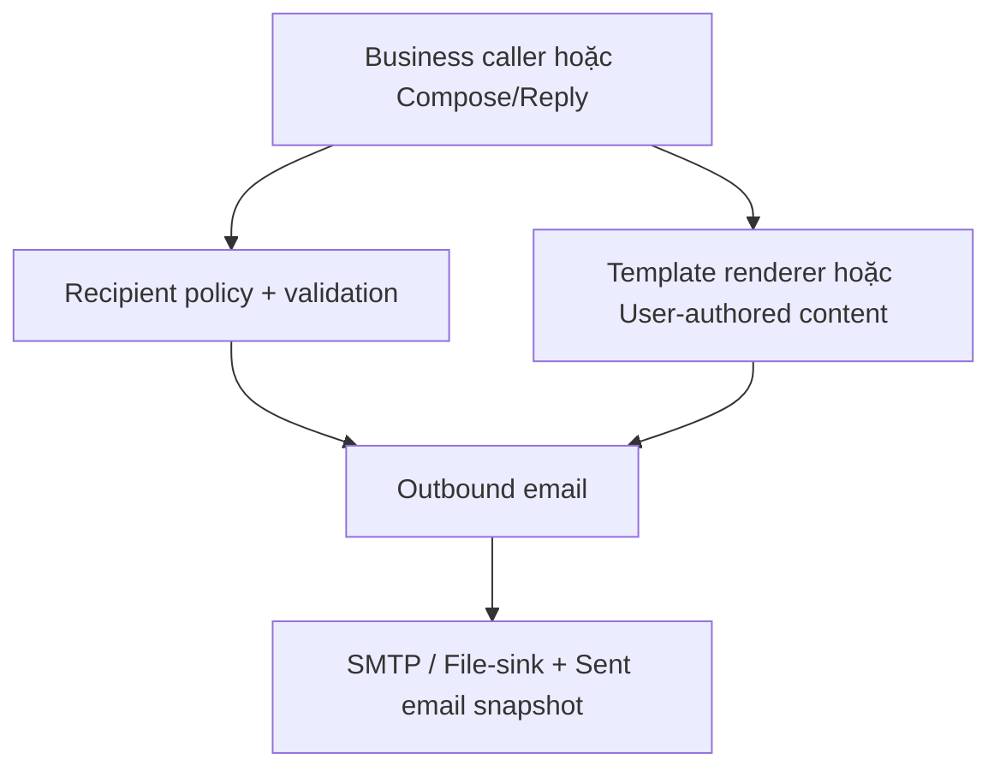

# KẾ HOẠCH TRIỂN KHAI CHUẨN HÓA EMAIL TEMPLATE VÀ TO/CC/BCC CHO PEMS

> Phiên bản kế hoạch: 1.0  
> Ngày lập: 2026-07-26  
> Repository mục tiêu: `quangthoai04/PEMS`  
> Nhánh mục tiêu dự kiến: `Dev` — phải xác minh lại tại thời điểm triển khai  
> Trạng thái tài liệu: Kế hoạch triển khai; chưa phải bằng chứng hệ thống đã hoàn tất

---

## 1. Mục đích tài liệu

Tài liệu này chuyển hai yêu cầu lớn thành một kế hoạch triển khai có thể thực hiện và kiểm chứng:

1. Chuẩn hóa toàn bộ email tự động để bảng `email_templates` trong database trở thành nguồn nội dung duy nhất cho subject/body.
2. Hỗ trợ đúng nghĩa `TO`, `CC`, `BCC` xuyên suốt Backend, SMTP, Database, API, Frontend, draft/reply, file-sink và kiểm thử.

Kế hoạch được viết để một AI Agent hoặc nhóm phát triển khác có thể:

- Biết chính xác phải đọc và kiểm tra gì trước khi sửa.
- Không dựa mù quáng vào kết quả audit cũ.
- Triển khai theo đúng thứ tự phụ thuộc.
- Không vô tình tạo thêm nghiệp vụ email ngoài yêu cầu.
- Có cổng nghiệm thu rõ ràng sau từng giai đoạn.
- Có phương án đồng bộ database đang tồn tại và rollback an toàn.
- Chứng minh email thực gửi, preview và lịch sử database khớp nhau.

---

## 2. Kết quả cuối cùng cần đạt

Sau khi toàn bộ kế hoạch được triển khai và xác minh:

- Mọi email tự động đang có production caller thật đều lấy subject/body từ `email_templates`.
- Không còn subject/body nghiệp vụ tự động được hard-code hoặc dùng làm fallback trong production code.
- Preview và gửi thật sử dụng cùng một renderer.
- Thay đổi nội dung template trực tiếp trong database có hiệu lực ở lần preview/gửi tiếp theo, không cần build hoặc restart ứng dụng.
- Template lỗi, thiếu, inactive hoặc thiếu biến phải thất bại bằng mã lỗi ổn định; không âm thầm quay về nội dung cứng.
- Email thủ công, draft và reply tiếp tục dùng nội dung do người dùng soạn; không bị ép thành system template.
- Một email thủ công có nhiều `TO/CC/BCC` được gửi dưới dạng một MIME message đúng chuẩn.
- `CC` xuất hiện đúng trong header CC.
- `BCC` nhận được email nhưng không bị lộ cho `TO/CC` hoặc người không có quyền.
- Database lưu đúng loại người nhận mà SMTP thực sự sử dụng.
- Sau khi SMTP/provider chấp nhận message, trạng thái là `SENT`; chỉ là `DELIVERED` khi có xác nhận thật.
- Email chứa OTP, token hoặc action URL riêng vẫn được gửi riêng từng người và cấm CC/BCC.
- SQL canonical chỉ còn một nguồn seed template rõ ràng, không phụ thuộc numeric ID.
- Có script đồng bộ idempotent cho database đang tồn tại.
- Fresh import, sync hai lần, backend tests, frontend tests, fake SMTP/file-sink và real-stack journeys đều đạt.

---

## 3. Nguồn phải đọc trước khi triển khai

Agent thực thi phải đọc phiên bản mới nhất của:

1. `AGENTS.md`, `CLAUDE.md`, project instructions hoặc file hướng dẫn tương đương trong repository.
2. `PEMS_CLAUDE_PROJECT_INSTRUCTIONS_v8_4_refined_v6_v10_FULL_UPDATED.md`.
3. `PEMS_CANONICAL_BUSINESS_RULES_v8_4_refined_v6_v10_FULL_UPDATED.md`.
4. `PEMS_UC_IMPLEMENTATION_RULEBOOK_FRONTEND_BACKEND_DATABASE_VALIDATION_SECURITY_v8_4_refined_v6_v10_FULL_UPDATED.md`.
5. `CLEAN_ARCHITECTURE.md`.
6. `PROJECT_STRUCTURE_FULL.md`.
7. `PEMS_UI_DESIGN_SYSTEM_PROMPT.md`.
8. `PERMISSION_MATRIX.md`.
9. `PERMISSION_RULES.md`.
10. `USE_CASE_LIST.md`.
11. `PEMS_PER_CAMPUS_V2_MASTER_HANDOFF_PROMPT(1).md`.
12. File SQL canonical mới nhất trong repository.

Bản SQL được cung cấp khi lập kế hoạch:

```text
PEMS_FULL_V2_NO_SEED_DATA_GALLERY(2).sql
```

Nếu repository có bản canonical mới hơn, phải:

- Xác định file nào thực sự được dùng cho fresh import.
- Ghi lại đường dẫn, commit và lý do chọn.
- Thực hiện thay đổi trên nguồn canonical thật.
- Không chỉ sửa bản đính kèm rồi bỏ quên bản trong repository.

### Thứ tự ưu tiên khi tài liệu mâu thuẫn

1. Quy tắc bảo mật, phân quyền và nghiệp vụ canonical mới nhất.
2. Production flow thực tế tại HEAD sau khi đã chứng minh bằng code.
3. Test đang phản ánh hợp đồng nghiệp vụ hợp lệ.
4. SQL canonical.
5. Báo cáo/audit cũ chỉ là manh mối, không phải sự thật tuyệt đối.

Mọi mâu thuẫn phải được ghi vào decision log; không tự chọn im lặng.

---

## 4. Hiện trạng đã xác nhận từ tài liệu và SQL được cung cấp

Các điểm dưới đây là dữ kiện khởi đầu, nhưng vẫn phải được kiểm tra lại với HEAD:

### 4.1. Quy tắc kiến trúc

- Controller chỉ nhận request, gọi MediatR và trả response.
- Input validation thuộc FluentValidation.
- Business validation cần database thuộc Handler/Application layer.
- SMTP/MailKit và dịch vụ bên thứ ba thuộc Infrastructure.
- Domain entity không được trả trực tiếp qua API.
- Authorization phải được thực thi tại backend; frontend chỉ hỗ trợ UX.

### 4.2. Phạm vi email

- PEMS có UC-42 đến UC-49 cho quản lý template, soạn, gửi, xem và reply email.
- UC-48 `View Email` là own-scope, không phải quyền đọc toàn bộ email.
- Người dùng chỉ được xem/reply nếu là sender, recipient/CC/BCC phù hợp, participant được lưu rõ ràng, hoặc có quyền truy cập đối tượng liên kết theo đúng data scope.
- Không xây dựng inbox email thật trong phạm vi này.
- Không tạo thêm các bảng kiểu `email_threads`, `email_messages`, `email_message_recipients`.

### 4.3. Schema đã có khả năng lưu TO/CC/BCC

SQL hiện đã có:

- `email_draft_recipients.recipient_type ENUM('TO','CC','BCC')`.
- `sent_email_recipients.recipient_type ENUM('TO','CC','BCC')`.
- `sent_emails` lưu subject/body snapshot, provider IDs và trạng thái.
- `email_drafts` lưu nội dung soạn, template liên kết và sent email liên quan.
- `sent_email_attachments` và `email_draft_attachments`.

Vì vậy, mặc định không tạo bảng recipient mới. Trọng tâm là:

- Sửa model và pipeline gửi.
- Validate recipient.
- Lưu đúng recipient type.
- Bảo vệ BCC khi query.
- Kiểm tra trạng thái delivery.

Chỉ thay đổi schema nếu audit chứng minh cấu trúc hiện tại không thể bảo vệ một invariant bắt buộc.

### 4.4. Hai loại `purpose` khác nhau

SQL hiện thể hiện hai khái niệm độc lập:

- `otp_tokens.purpose` là enum cho mục đích OTP/token, ví dụ `VISIT_REQUEST_VERIFY`, `CHANGE_SENSITIVE_ACTION`.
- `email_templates.purpose` là `VARCHAR(100)` dùng để phân nhóm template như `ACCOUNT`, `LOGISTICS`, `VISIT_PARTICIPANT`, `REPORT`.

Không được lấy allowlist của OTP áp vào API quản lý email template.

### 4.5. Seed template hiện đang cần chuẩn hóa

Bản SQL được cung cấp đang có:

- Hai khối `INSERT INTO email_templates`.
- Numeric `email_template_id` từ 1 đến 16.
- Nhiều khối `UPDATE email_templates` theo numeric ID.
- Một khối patch/professionalization cập nhật theo `template_code`.
- Placeholder viết không thống nhất giữa PascalCase và lower camel case.
- Một số active template cũ có thể không có production caller.
- Seed lịch sử `sent_emails` đang tham chiếu trực tiếp template ID.

Đây là lý do phải audit hai chiều trước khi viết lại seed.

### 4.6. Token/action qua email

Quy tắc đã có:

- Chỉ lưu `token_hash`, không lưu raw token.
- Token phải có thời hạn.
- Token chỉ dùng một lần.
- Backend validate target type, target ID, recipient và trạng thái hiện tại.
- Action đã xử lý không được làm thay đổi nghiệp vụ lần hai.

Việc chuẩn hóa template không được làm suy yếu các quy tắc này.

---

## 5. Các quyết định kiến trúc đã chốt

### D-01. Database là nguồn nội dung duy nhất

Đối với system-generated automated email:

- `subject_vi`, `body_vi`, `subject_en`, `body_en` lấy từ `email_templates`.
- Code không giữ subject/body nghiệp vụ dự phòng.
- Registry trong code chỉ giữ template code và metadata chính sách.

### D-02. Không cache nội dung template theo cách gây stale

Lựa chọn mặc định:

- Query nội dung template ở thời điểm preview/send.
- Không dùng cache dài hạn.

Chỉ được dùng cache nếu:

- Có version/invalidation đáng tin cậy.
- Cập nhật SQL trực tiếp cũng làm cache mất hiệu lực.
- Có integration test chứng minh thay đổi DB được phản ánh mà không restart.

Nếu không chứng minh được, không cache nội dung.

### D-03. Preview và gửi thật dùng chung renderer

Không được có hai logic thay placeholder độc lập.

### D-04. CC/BCC là phong bì người nhận

- Không lưu địa chỉ CC/BCC cố định trong template.
- Template chỉ chứa subject/body.
- Caller hoặc người soạn email quyết định danh sách recipient.
- Dispatch layer kiểm tra recipient policy.

### D-05. Không tạo email nghiệp vụ mới từ seed cũ

Template cũ không có production caller không phải lý do để thêm caller.

Đặc biệt không tự biến notification thành email cho:

- Approve request.
- Reject request.
- Cancel request.
- Assign host.
- Các mã seed cũ không có caller thật.

### D-06. Email nhạy cảm gửi riêng từng người

Email có OTP, token, action URL riêng hoặc personalization riêng:

- Một `TO`.
- Không `CC`.
- Không `BCC`.
- Không gộp nhiều người vào một MIME message.

### D-07. BCC được lọc tại backend trước khi tạo DTO

Không lấy toàn bộ dữ liệu rồi ẩn bằng CSS hoặc frontend.

### D-08. Không giả lập trạng thái delivered

- Provider accept thành công: `SENT`.
- Provider/webhook xác nhận giao thành công: `DELIVERED`.
- Không có webhook/xác nhận: giữ `SENT`.

### D-09. Không tái kiến trúc vượt phạm vi

Không tự thêm outbox, event bus, inbox hoặc hệ thống campaign nếu codebase hiện tại không cần chúng để đáp ứng yêu cầu.

---

## 6. Phạm vi thực hiện

### 6.1. Trong phạm vi

- Audit toàn bộ caller gửi email.
- Audit toàn bộ template seed.
- Registry system template.
- Renderer tập trung.
- Placeholder validation.
- HTML sanitization và encoding biến.
- Subject/header injection protection.
- Action block bảo mật.
- Outbound model hỗ trợ TO/CC/BCC.
- SMTP mapping chính xác.
- Draft/compose/reply.
- Email history và BCC authorization.
- Frontend compose UI.
- File-sink/fake SMTP.
- Canonical SQL và sync script.
- Unit, integration, architecture, frontend, E2E, real-stack tests.
- Tài liệu audit, catalog và final report.

### 6.2. Ngoài phạm vi

- Tạo inbox email hoàn chỉnh.
- Thêm email nghiệp vụ mới không có caller.
- Tạo campaign/bulk marketing.
- Thay đổi permission hoặc lifecycle Visit Form v2 không liên quan.
- Sửa Gallery, FAQ, Translation hoặc module khác không liên quan.
- Gửi email thật trong test.
- Chạy script trực tiếp trên `pems_db`.
- Commit, push, merge hoặc tạo PR nếu chưa được yêu cầu riêng.

---

## 7. Kiến trúc mục tiêu



### 7.1. Luồng system template

1. Caller chọn template code từ registry.
2. Caller tạo dictionary biến có kiểu/ngữ nghĩa rõ ràng.
3. Renderer tải template active từ database.
4. Renderer chọn ngôn ngữ.
5. Renderer validate biến.
6. Renderer encode biến và render subject/body.
7. Backend gắn action block tin cậy nếu cần.
8. Recipient policy xác nhận TO/CC/BCC hợp lệ cho nhóm template.
9. Outbound pipeline tạo MIME message.
10. SMTP/file-sink gửi hoặc ghi artifact.
11. Database lưu template ID, subject/body snapshot và đúng recipient type.
12. Trạng thái chuyển theo kết quả provider thực tế.

### 7.2. Luồng email do người dùng soạn

1. Người dùng nhập subject/body và TO/CC/BCC.
2. Backend validate recipient và sanitize nội dung theo policy hiện tại.
3. Draft lưu đúng từng recipient type.
4. Khi gửi, tạo một MIME message với đúng To/Cc/Bcc.
5. `sent_emails` và `sent_email_recipients` phản ánh đúng message đã gửi.
6. Query history lọc BCC theo viewer.

---

## 8. Tổng quan các giai đoạn và cổng nghiệm thu

| Giai đoạn | Nội dung | Cổng nghiệm thu |
|---|---|---|
| 0 | Preflight và baseline | G0: môi trường an toàn, không gửi mail thật |
| 1 | Audit hai chiều | G1: 100% caller và seed đã phân loại |
| 2 | Chốt contract/decision | G2: registry, renderer, recipient policy và status model được thống nhất |
| 3 | Nền backend | G3: renderer + outbound pipeline + fake SMTP pass |
| 4 | Di chuyển automated callers | G4: từng batch không còn hard-code và test pass |
| 5 | Draft/compose/reply/history | G5: TO/CC/BCC đúng và BCC không lộ |
| 6 | Frontend | G6: compose/reply/autosave/preview hoạt động đúng |
| 7 | SQL canonical và sync | G7: fresh import + sync hai lần đạt |
| 8 | File-sink và E2E | G8: preview/SMTP/history khớp |
| 9 | Full regression và final scan | G9: tất cả suite và static scan đạt |
| 10 | Triển khai môi trường | G10: smoke test và rollback readiness đạt |

Không đi tiếp nếu cổng trước chưa đạt, trừ khi có decision log nêu rõ lý do, rủi ro và phần bị chặn.

---

# PHẦN A — THỰC HIỆN THEO GIAI ĐOẠN

## 9. Giai đoạn 0 — Preflight và baseline an toàn

### 9.1. Mục tiêu

Xác nhận đúng repository, đúng nhánh, bảo toàn worktree, tạo môi trường kiểm thử không ảnh hưởng database/email thật.

### 9.2. Công việc

- [ ] Xác nhận repository URL.
- [ ] Xác nhận branch hiện tại.
- [ ] Ghi HEAD SHA.
- [ ] Fetch remote theo cách không làm thay đổi worktree.
- [ ] Ghi ahead/behind với remote branch.
- [ ] Ghi `git status --short`.
- [ ] Ghi danh sách file untracked/modified.
- [ ] Không reset, rebase, clean, checkout đè hoặc drop stash.
- [ ] Xác định file SQL canonical thật.
- [ ] Xác định cấu hình SMTP, file-sink và test environment.
- [ ] Bảo đảm `Smtp.Enabled=false` hoặc dùng fake SMTP/file-sink.
- [ ] Tạo disposable database từ SQL canonical.
- [ ] Không dùng `pems_db`.
- [ ] Chạy baseline build/test hiện tại trước khi sửa.
- [ ] Ghi rõ test nào đã fail từ trước.

### 9.3. Baseline cần ghi

- Backend build.
- Unit tests.
- Integration tests.
- Architecture tests.
- Frontend unit tests.
- Frontend build.
- Fresh import SQL.
- Số lượng template active hiện tại.
- Số lượng `sent_emails`, `sent_email_recipients`, `email_drafts`.

### 9.4. Đầu ra

Tạo tài liệu:

```text
docs/email-standardization/00-preflight-baseline.md
```

Tài liệu phải có command, exit code, số test pass/fail và timestamp.

### 9.5. Gate G0

Chỉ đạt khi:

- Không có nguy cơ ghi vào database production/dev thật.
- Không có nguy cơ gửi email thật.
- Worktree hiện hữu được bảo toàn.
- Baseline được ghi lại.
- File SQL canonical đã được xác định.

---

## 10. Giai đoạn 1 — Audit hai chiều

### 10.1. Mục tiêu

Lập bản đồ đầy đủ giữa production caller và template, đồng thời phân loại mọi seed template.

### 10.2. Audit chiều Caller → Template

Tìm toàn bộ:

- `IEmailService` và các implementation.
- `EmailService`, `SmtpEmailSender`, MailKit, `MimeMessage`.
- File-sink hoặc test sink.
- Command/query handlers gọi gửi mail.
- Background/hosted services.
- Reminder jobs.
- Account creation và email confirmation.
- Change pending email/activate/change role/replace leader.
- Forgot password/password reset.
- Visit OTP.
- Contact claim/transfer.
- Participant/student/department invitation.
- Department staff assignment.
- Logistics request/assignment/change/reminder.
- Report/invoice export/send.
- Email attachment.
- Draft, compose, reply.
- Preview template.
- Helper/builder chứa subject/body HTML.
- String literal có dấu hiệu là email subject/body.
- Caller lấy `email_template_id` nhưng vẫn dùng body từ code.
- Loop gửi từng recipient và luôn thêm vào `To`.

Ví dụ lệnh tìm kiếm, phải điều chỉnh theo cấu trúc HEAD:

```bash
rg -n "IEmailService|EmailService|SmtpEmailSender|MimeMessage|MailKit|SendAsync|SendEmail|FileSink" backend
rg -n "Subject|Body|HtmlBody|TextBody|To\.Add|Cc\.Add|Bcc\.Add" backend
rg -n "EmailComposeModal|CreateEmailDraft|UpdateEmailDraft|SendEmailDraft|Reply" frontend backend
rg -n "template_code|TemplateCode|email_template_id|EmailTemplateId" backend
```

### 10.3. Audit chiều Seed → Caller

Với từng dòng `email_templates`:

- [ ] Template code.
- [ ] Active/inactive.
- [ ] Có production caller hay không.
- [ ] Có chỉ được test dùng hay không.
- [ ] Có trùng nghĩa với template khác không.
- [ ] Có code cũ/mới khác nhau không.
- [ ] Subject/body DB có thực sự được dùng không.
- [ ] Có `sent_emails` hoặc `email_drafts` tham chiếu không.
- [ ] Có thể xóa khỏi fresh seed không.
- [ ] Có phải giữ `INACTIVE` trong existing DB không.
- [ ] Có placeholder/variables không khớp không.

### 10.4. Ma trận audit bắt buộc

Tạo:

```text
docs/email-standardization/01-email-caller-template-audit.md
```

Mỗi dòng có tối thiểu:

| Cột | Nội dung |
|---|---|
| Group | Account/Auth/Visit/Participant/Logistics/Reminder/Report/Manual |
| Trigger | Sự kiện nghiệp vụ gây gửi |
| Caller | Class/method production |
| File | Đường dẫn file |
| Condition | Điều kiện gửi |
| Mandatory | Mandatory hay best-effort |
| To | Người nhận chính |
| Cc | Nguồn CC hiện tại |
| Bcc | Nguồn BCC hiện tại |
| Current content source | Code/DB/User-authored |
| Current template code | Mã hiện tại |
| Target template code | Mã sau chuẩn hóa |
| Variables | Placeholder cần thiết |
| Language | VI/EN/recipient preference |
| Sensitive action | OTP/token/action URL |
| Attachment | Có/không |
| Sent log | Có ghi `sent_emails` không |
| Classification | Phân loại chuẩn |
| Test evidence | Test cần dùng |

### 10.5. Phân loại chuẩn

Mỗi caller/seed phải thuộc đúng một loại:

- `ACTIVE_AUTOMATED_TEMPLATE`
- `USER_AUTHORED`
- `DEAD_CODE_NO_CALLER`
- `NOTIFICATION_ONLY`
- `TEST_ONLY`

Không được để “unknown” khi kết thúc audit.

### 10.6. Baseline template cần đối chiếu

Danh sách dưới đây là giả thuyết từ audit trước, không phải danh mục cuối cùng.

#### Account và bảo mật

- `ACCOUNT_EMAIL_CONFIRMATION`
- `ACCOUNT_PENDING_EMAIL_CHANGED_OLD_NOTICE`
- `ACCOUNT_ACTIVATED`
- `ACCOUNT_EMAIL_CHANGED_OLD_NOTICE`
- `ACCOUNT_EMAIL_CHANGED_NEW_NOTICE`
- `ACCOUNT_ROLE_CHANGED`
- `ACCOUNT_STAFF_LEADER_ASSIGNED`
- `ACCOUNT_STAFF_LEADER_REPLACED`
- `AUTH_PASSWORD_RESET_OTP`

#### Visit request và đầu mối chính

- `VISIT_REQUEST_OTP`
- `VISIT_CONTACT_CLAIM`
- `VISIT_CONTACT_TRANSFER`

#### Thành phần tham gia

- `VISIT_PARTICIPANT_INVITATION`
- `VISIT_STUDENT_INVITATION`
- `VISIT_DEPARTMENT_LEADER_INVITATION`
- `VISIT_DEPARTMENT_STAFF_ASSIGNMENT`

#### Nhắc lịch

- `VISIT_REMINDER_HOST`
- `VISIT_REMINDER_PARTICIPANTS`

#### Hậu cần

- `LOGISTICS_REQUEST_TO_DEPARTMENT`
- `LOGISTICS_ASSIGNEE_ASSIGNMENT`
- `LOGISTICS_CHANGE_PROPOSAL_TO_HOST`
- `LOGISTICS_EXPENSE_REPORT_REMINDER`

#### Báo cáo

- `REPORT_CAMPUS_OPERATION`
- `REPORT_DEPARTMENT_INVOICE`
- `REPORT_DEPARTMENT_PERSONNEL_PERFORMANCE`
- `REPORT_DEPARTMENT_COLLABORATION`
- `REPORT_CAMPUS_PERSONNEL_PERFORMANCE`

### 10.7. Sai lệch bắt buộc giải quyết

Audit cũ nói có 6 luồng gửi report/invoice nhưng baseline chỉ có 5 template report.

Phải:

1. Liệt kê tất cả report/invoice caller.
2. Ghi class, method, route/job và attachment.
3. Xác định caller nào dùng chung template hợp lệ.
4. Hoặc xác định template thứ sáu còn thiếu.
5. Hoặc chứng minh audit cũ đếm nhầm.

Không được tiếp tục viết final catalog nếu sai lệch chưa được giải quyết.

### 10.8. Hai nội dung nghi là dead code

Kiểm tra:

- Xác nhận đã gửi đơn cho primary contact.
- Xác nhận đã gửi đơn cho registrant khi khác primary contact.

Nếu không có production caller:

- Không seed active.
- Không tự thêm caller.
- Chỉ xóa dead code khi không còn reference/test hợp lệ.

### 10.9. Gate G1

Chỉ đạt khi:

- 100% điểm gửi email được đưa vào ma trận.
- 100% seed template được phân loại.
- Report discrepancy đã có kết luận bằng evidence.
- Không còn background job/helper/builder chưa phân loại.
- Danh mục template mục tiêu đã được review.

---

## 11. Giai đoạn 2 — Chốt contract và decision log

### 11.1. Mục tiêu

Chốt hợp đồng kỹ thuật trước khi thay hàng loạt caller.

### 11.2. System template registry

Registry trong code phải giữ:

- Template code.
- Group/purpose.
- Recipient policy.
- Có sensitive action hay không.
- Có cho CC/BCC hay không.
- Có yêu cầu gửi riêng từng recipient không.
- Ngôn ngữ/fallback policy hợp lệ.

Registry không được giữ:

- Subject.
- Body.
- HTML nội dung nghiệp vụ.
- Địa chỉ CC/BCC cố định.

### 11.3. Renderer contract

Input tối thiểu:

```text
templateCode
language
optional campus context nếu caller thực sự cần
declared variable dictionary
optional trusted action block
cancellationToken
```

Output tối thiểu:

```text
emailTemplateId
templateCode
subject
body
bodyFormat
languageUsed
```

Renderer phải:

1. Tìm đúng template.
2. Kiểm tra status.
3. Chọn nội dung đúng ngôn ngữ.
4. Parse danh sách biến khai báo.
5. Phát hiện thiếu/thừa biến.
6. HTML-encode biến thông thường.
7. Render subject/body.
8. Chặn CR/LF trong subject.
9. Phát hiện placeholder còn sót.
10. Trả kết quả dùng chung cho preview/send/snapshot.

### 11.4. Stable errors

Chốt mapping theo error convention hiện tại:

- `EMAIL_TEMPLATE_NOT_FOUND`
- `EMAIL_TEMPLATE_INACTIVE`
- `EMAIL_TEMPLATE_LANGUAGE_CONTENT_MISSING`
- `EMAIL_TEMPLATE_VARIABLE_MISSING`
- `EMAIL_TEMPLATE_VARIABLE_UNKNOWN`
- `EMAIL_TEMPLATE_UNRESOLVED_PLACEHOLDER`
- `EMAIL_TEMPLATE_CONTENT_INVALID`
- `EMAIL_RECIPIENT_REQUIRED`
- `EMAIL_RECIPIENT_INVALID`
- `EMAIL_RECIPIENT_DUPLICATE`
- `EMAIL_RECIPIENT_CROSS_GROUP_DUPLICATE`
- `EMAIL_RECIPIENT_LIMIT_EXCEEDED`
- `EMAIL_RECIPIENT_TYPE_NOT_ALLOWED`
- `EMAIL_HEADER_INVALID`

Tên chính xác có thể điều chỉnh theo convention, nhưng ý nghĩa phải ổn định và có test.

### 11.5. Placeholder contract

- Chỉ dùng lower camel case.
- `variables_text` phải khớp chính xác placeholder thật.
- Không còn PascalCase kiểu `{{FullName}}`, `{{RequestCode}}`.
- Không để raw token/action URL trong seed.
- Không cho raw HTML từ dictionary thông thường.
- Trusted HTML phải là kiểu riêng do backend tạo.
- Không chấp nhận placeholder chưa render.

### 11.6. HTML/security contract

Chốt một sanitizer backend dùng cho create/update template:

- Allowlist tag/attribute rõ ràng.
- Loại `<script>`.
- Loại inline event handler.
- Loại `javascript:`.
- Loại iframe/object/embed nguy hiểm.
- Loại CSS/URL nguy hiểm.
- Không tin dữ liệu frontend.
- `PLAIN_TEXT` không được xử lý như HTML.

Chốt rule:

- Sanitize khi create/update.
- Renderer vẫn encode biến.
- Preview và actual send dùng cùng nội dung đã xử lý.
- Không log full body, OTP, raw token hoặc sensitive URL.

### 11.7. Action block contract

Backend chịu trách nhiệm:

- Tạo OTP/token.
- Tạo URL một lần.
- Encode URL.
- Sinh button/action block từ component tin cậy.
- Gắn action block sau render.
- Preview dùng action giả, không tạo token thật.

Nếu action block tách riêng:

- Loại `acceptUrl`, `declineUrl`, `confirmUrl` khỏi nội dung quản trị tự do.
- `variables_text` không khai báo các URL đó như biến editable.

### 11.8. Outbound recipient model

Chốt kiểu dữ liệu tương đương:

```text
EmailRecipient
- Email
- DisplayName?

OutboundEmail
- To[]
- Cc[]
- Bcc[]
- Subject
- Body
- BodyFormat
- Attachments[]
- TemplateMetadata?
- RelatedObject?
- Provider/Thread metadata?
```

Không để manual compose/reply tiếp tục phụ thuộc contract chỉ có `ToEmail`.

### 11.9. Recipient validation

Backend bắt buộc:

- Normalize email theo cơ chế hiện tại.
- So sánh không phân biệt hoa/thường.
- Từ chối duplicate trong cùng nhóm.
- Từ chối cùng email ở nhiều nhóm.
- Từ chối email sai format.
- Chặn CR/LF trong email/display name.
- Mặc định yêu cầu ít nhất một `TO`.
- Giới hạn tổng recipient bằng config.
- Không rải magic number ở nhiều layer.

### 11.10. Recipient policy

| Nhóm email | TO | CC/BCC |
|---|---|---|
| Account confirmation | Một người | Cấm |
| OTP/password reset | Một người | Cấm |
| Đổi email nhạy cảm | Một người | Cấm |
| Claim/transfer | Một người | Cấm |
| Invitation có token cá nhân | Gửi riêng | Cấm |
| Assignment có token cá nhân | Gửi riêng | Cấm |
| Manual compose/draft/reply | Một hoặc nhiều | Cho phép |
| Logistics/reminder/report | Theo caller | Chỉ khi caller truyền rõ |
| Nhóm khác | Theo caller | Mặc định cấm |

Dispatch layer phải validate policy, không chỉ tin caller.

### 11.11. Status model

Chốt transition:

```text
QUEUED -> SENT
QUEUED -> FAILED
SENT -> DELIVERED      chỉ khi có provider confirmation
SENT -> BOUNCED        khi có provider event hợp lệ
```

Không suy diễn recipient-level delivered nếu provider chỉ trả message-level accept.

### 11.12. BCC visibility

| Viewer | BCC được thấy |
|---|---|
| Sender/owner | Toàn bộ BCC |
| TO | Không |
| CC | Không |
| BCC recipient | Chỉ chính họ nếu UI cần |
| Người không liên quan | Không được xem email |
| Audit role | Chỉ khi permission canonical cho phép rõ |

Không tự cấp quyền chỉ vì role là ADMIN hoặc HO.

### 11.13. Purpose catalog

Tạo một catalog duy nhất cho `email_templates.purpose`, dùng chung ở:

- Backend constants.
- Validator.
- Entity comment.
- API DTO.
- Frontend options.
- Unit tests.
- SQL seed.

Không sửa `otp_tokens.purpose` chỉ vì tên cột giống nhau.

### 11.14. Đầu ra

```text
docs/email-standardization/02-decisions-and-contracts.md
docs/email-standardization/03-system-template-catalog.md
```

### 11.15. Gate G2

Chỉ đạt khi:

- Template catalog cuối đã chốt.
- Registry metadata đã chốt.
- Renderer contract đã chốt.
- Purpose catalog đã chốt.
- Recipient policy đã chốt.
- BCC authorization đã chốt.
- Status transition đã chốt.

---

## 12. Giai đoạn 3 — Xây nền backend

### 12.1. Thứ tự thực hiện

1. Domain/value objects cho recipient.
2. Application interfaces.
3. Recipient normalizer/validator.
4. Recipient policy registry.
5. Template repository/read service.
6. Renderer.
7. HTML sanitizer.
8. Trusted action block.
9. Outbound dispatcher.
10. SMTP implementation.
11. Persistence snapshot/status.
12. File-sink/fake sender.
13. Unit/integration tests nền.

### 12.2. Các vị trí code cần kiểm tra tại HEAD

Theo project structure được cung cấp, các điểm ứng viên gồm:

```text
backend/PEMS.Application/**/IEmailService.cs
backend/PEMS.Application/**/EmailTemplates/**
backend/PEMS.Application/**/CreateEmailDraft/**
backend/PEMS.Application/**/UpdateEmailDraft/**
backend/PEMS.Application/**/SendEmailDraft/**
backend/PEMS.Application/**/PreviewEmailTemplate/**
backend/PEMS.Application/**/GetSentEmailsHistory/**
backend/PEMS.Infrastructure/**/EmailService.cs
backend/PEMS.Infrastructure/**/EmailTemplateRenderer.cs
backend/PEMS.Infrastructure/**/SmtpEmailSender.cs
backend/PEMS.Infrastructure/**/VisitReminderDispatchHostedService.cs
```

Đường dẫn thật phải lấy từ HEAD; không tạo file trùng chỉ vì tài liệu tree cũ ghi như trên.

### 12.3. Renderer implementation

- [ ] Một entry point duy nhất.
- [ ] Không fallback hard-code.
- [ ] Load template active.
- [ ] Language selection rõ ràng.
- [ ] Parse `variables_text`.
- [ ] Validate exact variable set.
- [ ] Encode variable.
- [ ] Render subject.
- [ ] Strip/reject CR/LF.
- [ ] Render body theo format.
- [ ] Detect unresolved placeholder.
- [ ] Trả template ID.
- [ ] Không log sensitive values.

### 12.4. Outbound pipeline

Pipeline phải nhận một `OutboundEmail`, sau đó:

1. Validate recipient list.
2. Validate template recipient policy nếu là system email.
3. Tạo `sent_emails` ở trạng thái phù hợp với flow hiện tại.
4. Tạo recipient rows đúng type.
5. Tạo MIME message:
   - `To` → `message.To`
   - `Cc` → `message.Cc`
   - `Bcc` → BCC/envelope đúng chuẩn
6. Gửi một lần cho manual multi-recipient message.
7. Nhận kết quả provider.
8. Cập nhật `SENT` hoặc `FAILED`.
9. Không đánh dấu `DELIVERED` nếu chưa có confirmation.

Không tuyên bố SMTP send và database transaction là atomic. Phải ghi rõ cách xử lý nếu:

- DB ghi thành công nhưng SMTP lỗi.
- SMTP accept nhưng cập nhật DB lỗi.
- Retry xảy ra.

Không mở rộng thành outbox nếu không cần; nhưng phải giữ idempotency hiện có và tránh duplicate send.

### 12.5. SMTP correctness tests

Dùng fake SMTP/raw MIME:

- [ ] Nhiều TO nằm trong To.
- [ ] CC nằm trong Cc.
- [ ] BCC được chuyển qua envelope đúng.
- [ ] BCC không xuất hiện trong raw message mà TO/CC nhìn thấy.
- [ ] Chỉ một MIME message cho manual compose.
- [ ] Attachment và thread headers được giữ.
- [ ] Display name được encode an toàn.

### 12.6. File-sink contract

Artifact test phải lưu:

```text
to[]
cc[]
bcc[]
templateCode
emailTemplateId
subject
body
bodyFormat
attachments metadata
relatedType/relatedId
provider/thread metadata
timestamp/status
```

Không log raw OTP/token ra console.

### 12.7. Gate G3

Chỉ đạt khi:

- Renderer contract tests pass.
- Recipient validation tests pass.
- Security template từ chối CC/BCC.
- Fake SMTP chứng minh To/Cc/Bcc đúng.
- BCC không xuất hiện trong header hiển thị cho TO/CC.
- Status sau provider accept là `SENT`.
- File-sink lưu đủ ba nhóm.

---

## 13. Giai đoạn 4 — Di chuyển toàn bộ automated caller

### 13.1. Nguyên tắc di chuyển

Mỗi caller phải:

- Dùng code từ registry.
- Chuẩn bị dictionary biến rõ nghĩa.
- Render từ database.
- Dùng action block tin cậy nếu cần.
- Đi qua cùng outbound pipeline.
- Lưu đúng `email_template_id`.
- Lưu subject/body snapshot đã render.
- Giữ attachment/thread behavior.
- Xóa hard-code cũ sau khi test pass.

Không di chuyển tất cả trong một thay đổi lớn không có checkpoint.

### 13.2. Batch 1 — Account confirmation và account notices

Phạm vi dự kiến:

- `ACCOUNT_EMAIL_CONFIRMATION`
- `ACCOUNT_PENDING_EMAIL_CHANGED_OLD_NOTICE`
- `ACCOUNT_ACTIVATED`
- `ACCOUNT_EMAIL_CHANGED_OLD_NOTICE`
- `ACCOUNT_EMAIL_CHANGED_NEW_NOTICE`
- `ACCOUNT_ROLE_CHANGED`
- `ACCOUNT_STAFF_LEADER_ASSIGNED`
- `ACCOUNT_STAFF_LEADER_REPLACED`

Kiểm tra bắt buộc:

- Tài khoản mới ở `PENDING_EMAIL_CONFIRMATION`.
- Email đầu tiên là email xác nhận.
- Login trước xác nhận bị chặn.
- Không quay lại nội dung “tài khoản đã được tạo, đăng nhập ngay”.
- Confirmation link chỉ cho đúng người nhận.
- Cấm CC/BCC.

### 13.3. Batch 2 — Forgot password

- `AUTH_PASSWORD_RESET_OTP`

Kiểm tra:

- OTP không bị log.
- Cấm CC/BCC.
- Expiry/retry/attempt giữ nguyên.
- Subject/body lấy DB.

### 13.4. Batch 3 — Visit request OTP

- `VISIT_REQUEST_OTP`

Kiểm tra:

- Không làm thay đổi validation Per-Campus v2.
- OTP snapshot và token lifecycle giữ nguyên.
- Cấm CC/BCC.

### 13.5. Batch 4 — Contact claim/transfer

- `VISIT_CONTACT_CLAIM`
- `VISIT_CONTACT_TRANSFER`

Kiểm tra:

- Action URL riêng.
- Recipient và target được validate.
- Gửi riêng.
- Cấm CC/BCC.
- Không làm thay đổi claim/transfer lifecycle.

### 13.6. Batch 5 — Invitation

- `VISIT_PARTICIPANT_INVITATION`
- `VISIT_STUDENT_INVITATION`
- `VISIT_DEPARTMENT_LEADER_INVITATION`

Kiểm tra:

- Mỗi người nhận có token/action riêng.
- Gửi riêng từng người.
- Cấm CC/BCC.
- Accept/decline token không dùng chéo.
- Preview Student dùng đúng `VISIT_STUDENT_INVITATION`, không dùng mã cũ `VISIT_STUDENT_SUPPORT_INVITATION`.

### 13.7. Batch 6 — Department staff assignment

- `VISIT_DEPARTMENT_STAFF_ASSIGNMENT`

Kiểm tra:

- Assignment token/link đúng người.
- Không gộp recipient.
- Không làm thay đổi department scope.

### 13.8. Batch 7 — Logistics

- `LOGISTICS_REQUEST_TO_DEPARTMENT`
- `LOGISTICS_ASSIGNEE_ASSIGNMENT`
- `LOGISTICS_CHANGE_PROPOSAL_TO_HOST`
- `LOGISTICS_EXPENSE_REPORT_REMINDER`

Kiểm tra:

- Caller nào có token riêng phải gửi riêng.
- Caller không có token chỉ dùng CC/BCC nếu danh sách được caller truyền rõ.
- Không tự thêm recipient từ template.
- Không thay đổi logistics status/lifecycle.

### 13.9. Batch 8 — Visit reminders

- `VISIT_REMINDER_HOST`
- `VISIT_REMINDER_PARTICIPANTS`

Kiểm tra:

- Job không gửi duplicate.
- Recipient scope đúng instance/campus.
- Participant reminder không lộ danh sách người khác.
- CC/BCC chỉ có nếu nghiệp vụ hiện tại truyền rõ.

### 13.10. Batch 9 — Report/invoice

Đối chiếu catalog cuối sau audit.

Kiểm tra:

- Đủ tất cả report caller.
- Giải quyết sai lệch 6 caller/5 template.
- Attachment đúng.
- Tên file và content type đúng.
- Recipient theo permission/scope.
- Không gộp nếu nội dung cá nhân hóa.

### 13.11. Batch 10 — Caller còn lại

Chỉ gồm caller tìm thấy bằng audit và đã được phê duyệt trong catalog.

Không dùng batch này để tự thêm email nghiệp vụ.

### 13.12. Gate sau mỗi batch

Sau từng batch:

- [ ] Targeted unit tests pass.
- [ ] Targeted integration tests pass.
- [ ] File-sink evidence đúng.
- [ ] Không còn hard-code subject/body cho nhóm vừa chuyển.
- [ ] Template ID được lưu đúng.
- [ ] Preview/send dùng cùng renderer.
- [ ] Error handling giữ mandatory/best-effort policy.
- [ ] Không có regression ở lifecycle nghiệp vụ.

### 13.13. Gate G4

Chỉ đạt khi:

- Tất cả automated caller trong audit đã di chuyển.
- Không còn production caller hard-code nội dung.
- Không còn active system template không có caller.
- Mọi caller có template code hợp lệ.
- Các batch test đều pass.

---

## 14. Giai đoạn 5 — Draft, compose, reply và email history

### 14.1. Backend draft

Kiểm tra và sửa:

- `CreateEmailDraft`.
- `UpdateEmailDraft`.
- `GetEmailDraft`.
- `SendEmailDraft`.
- `DiscardEmailDraft`.
- Draft mapper/writer/models.

Yêu cầu:

- Lưu đúng TO/CC/BCC.
- Restore đúng TO/CC/BCC.
- Reject duplicate/cross-group duplicate.
- Khi send, không biến tất cả thành TO.
- Link draft → sent email đúng.
- Attachment không mất.

### 14.2. Manual send

- Một manual email nhiều recipient = một MIME message.
- `sent_email_recipients` có một row cho từng recipient với đúng type.
- Không lặp sender nhiều lần theo recipient.
- Provider message/thread ID được giữ nhất quán.

### 14.3. Reply

- CC/BCC người dùng thêm phải được gửi thật.
- BCC cũ không tự copy sang reply.
- Không tự triển khai Reply All nếu chưa có yêu cầu.
- Giữ thread headers hiện có.
- Không làm lộ BCC lịch sử trong reply payload.

### 14.4. Query/history authorization

Rà tất cả:

- Sent email list.
- Search.
- Detail.
- Visit-linked sent emails.
- Draft detail.
- Reply load.
- Export nếu có.

Thứ tự:

1. Xác thực viewer.
2. Kiểm tra UC-48 và own/object scope.
3. Kiểm tra sender/recipient/linked visit access.
4. Lọc BCC theo viewer.
5. Sau đó mới map DTO.

Không:

- Trả toàn bộ recipient rồi ẩn frontend.
- Trả `bccCount`.
- Trả metadata gián tiếp tiết lộ BCC.
- Log danh sách BCC.

### 14.5. Authorization tests

Với cùng một email có TO/CC/BCC:

- [ ] Sender thấy toàn bộ BCC.
- [ ] TO không thấy BCC.
- [ ] CC không thấy BCC.
- [ ] BCC chỉ thấy chính mình nếu được xem email.
- [ ] Người không liên quan bị từ chối.
- [ ] HO/ADMIN không tự động thấy BCC nếu permission không cho.
- [ ] List/search/detail/export cùng áp dụng một rule.

### 14.6. Gate G5

Chỉ đạt khi:

- Draft round-trip giữ đúng recipient type.
- Reply gửi CC/BCC thật.
- BCC cũ không bị copy.
- API không lộ BCC.
- Database khớp raw MIME/file-sink.

---

## 15. Giai đoạn 6 — Frontend compose, preview và reply

### 15.1. Vị trí cần kiểm tra

Theo project structure:

```text
frontend/**/EmailComposeModal.tsx
frontend/**/useLocalEmailDraft.ts
frontend/**/SentEmailsModal.tsx
frontend/**/SentEmailDetail.tsx
frontend/**/email API client/types
```

Phải dùng đường dẫn thật tại HEAD.

### 15.2. Compose UI

Yêu cầu:

- Trường `Đến`.
- Nút mở `CC`.
- Nút mở `BCC`.
- Multi-email chips.
- Display name/email.
- Xóa bằng chuột và bàn phím.
- Validation tại field.
- Báo duplicate.
- Báo cross-group duplicate.
- Hiển thị tổng recipient.
- Báo vượt giới hạn.
- CC/BCC mặc định thu gọn.
- Tự mở nếu draft đã có dữ liệu.
- Autosave giữ đúng ba nhóm.
- Reopen draft khôi phục đúng.

### 15.3. Accessibility và design system

- Button không submit phải có `type="button"`.
- Icon-only button có `title` và `aria-label`.
- Focus ring rõ.
- Keyboard navigation cho chip.
- Error message liên kết đúng field.
- Modal giữ style hiện có của PEMS.
- Không thay rộng giao diện ngoài phạm vi.

### 15.4. Preview

- System template preview gọi backend renderer.
- Không tự render system template ở frontend.
- Preview không tạo token thật.
- Preview hiển thị TO/CC/BCC theo quyền hiện tại.
- Không render raw HTML chưa qua backend xử lý.

### 15.5. Reply UI

- Cho thêm CC/BCC nếu policy cho phép.
- Không tự nạp BCC cũ.
- Không hiển thị BCC lịch sử cho viewer không đủ quyền.

### 15.6. Frontend tests

- [ ] Add/remove recipient chips.
- [ ] Duplicate same group.
- [ ] Duplicate cross-group.
- [ ] Invalid email.
- [ ] Recipient limit.
- [ ] Expand/collapse CC/BCC.
- [ ] Draft restore.
- [ ] Reply payload.
- [ ] API error mapping.
- [ ] Keyboard/accessibility behavior.

### 15.7. Gate G6

Chỉ đạt khi:

- Compose/reply hoạt động đầy đủ.
- Frontend không là lớp bảo vệ BCC duy nhất.
- Autosave/restore đúng.
- Frontend unit tests và build pass.

---

## 16. Giai đoạn 7 — Chuẩn hóa SQL canonical

### 16.1. Mục tiêu

Biến fresh database thành nguồn seed sạch, khớp production registry và không phụ thuộc numeric ID.

### 16.2. Dọn seed cũ

- [ ] Xóa hai khối insert template cũ.
- [ ] Xóa update theo `email_template_id = 1..16`.
- [ ] Xóa professionalization patch cũ không còn cần.
- [ ] Xóa `CASE template_code` cho mã không tồn tại/không caller.
- [ ] Không thay đổi Gallery hoặc seed ngoài phạm vi.

### 16.3. Khối seed canonical mới

Chỉ một khối seed logical, chứa:

- `template_code`
- `name`
- `purpose`
- `campus_id`
- `description`
- `status`
- `subject_vi`
- `body_vi`
- `subject_en`
- `body_en`
- `body_format`
- `variables_text`
- audit fields phù hợp

Quy tắc:

- Không hard-code `email_template_id`.
- Không active template thiếu VI/EN.
- Không raw token/URL.
- Placeholder lower camel case.
- `variables_text` khớp chính xác.
- `campus_id = NULL` nếu không có evidence campus-specific.
- Chỉ seed caller thật.

### 16.4. Seed phụ thuộc

Rà:

- `sent_emails.email_template_id`.
- `email_drafts.email_template_id`.
- Demo email action.
- Recipient seed.
- Report email seed.
- Các biến scalar ID.

Thay numeric ID bằng lookup theo `template_code`.

Email lịch sử/manual không thuộc system catalog:

- `email_template_id = NULL`.
- Giữ nguyên subject/body snapshot có ý nghĩa lịch sử.

### 16.5. Fresh import validation

Fresh import phải kiểm tra:

- Không FK lỗi.
- Không duplicate template code.
- Registry code = active system template code.
- Không active template không caller.
- Không caller thiếu template.
- Không placeholder mismatch.
- Không template update theo numeric ID.
- Gallery seed không bị thay đổi ngoài yêu cầu trước đó.

### 16.6. Script đồng bộ database đang tồn tại

Tạo file riêng, ví dụ:

```text
docs/database/scripts/email_template_cc_bcc_sync/
├── 01_preflight.sql
├── 02_sync_templates.sql
├── 03_verify.sql
└── 04_rollback_guidance.md
```

Tên/thư mục phải theo convention repository hiện tại.

Script phải:

1. Preflight schema.
2. Upsert theo `template_code`.
3. Không dựa numeric ID.
4. Không xóa unknown/user-created template.
5. Legacy có FK → chuyển `INACTIVE`.
6. Chỉ xóa legacy khi chứng minh không reference và được yêu cầu.
7. Không sửa `sent_emails.body_snapshot`.
8. Không làm mất draft.
9. Có verify query.
10. Chạy lần hai không tạo duplicate.
11. Có rollback guidance.
12. Chỉ chạy trên disposable DB trong giai đoạn phát triển.

### 16.7. Schema change policy

Không mặc định thêm bảng/cột.

Đối với cross-group duplicate:

- Backend bắt buộc chặn.
- Đánh giá có cần tăng cường unique index hay không.
- Chỉ sửa constraint nếu có migration plan, test dữ liệu hiện hữu và rollback.

### 16.8. Gate G7

Chỉ đạt khi:

- Fresh import pass.
- Sync lần một pass.
- Sync lần hai không tạo thay đổi ngoài dự kiến.
- Registry và active seed khớp.
- Legacy/history/draft được bảo toàn.
- Không đụng `pems_db`.

---

## 17. Giai đoạn 8 — File-sink, fake SMTP và E2E

### 17.1. Mục tiêu

Chứng minh hành vi thật của email pipeline thay vì chỉ kiểm tra DTO/database.

### 17.2. Kịch bản E2E bắt buộc

#### E2E-01 — Manual compose có TO/CC/BCC

1. Tạo draft với nhiều TO/CC/BCC.
2. Reload draft.
3. Xác nhận UI/API giữ đúng nhóm.
4. Gửi qua fake SMTP/file-sink.
5. Kiểm tra một MIME message.
6. Kiểm tra To/Cc/Bcc.
7. Kiểm tra database recipient rows.
8. Kiểm tra status `SENT`.

#### E2E-02 — BCC privacy

1. Gửi email có sender, TO, CC, BCC.
2. Query bằng sender.
3. Query bằng TO.
4. Query bằng CC.
5. Query bằng BCC.
6. Query bằng outsider.
7. Kiểm tra list/detail/search/reply payload.

#### E2E-03 — Security email

1. Tạo account mới.
2. Kiểm tra pending status.
3. Kiểm tra confirmation template.
4. Thử thêm CC/BCC và xác nhận bị từ chối.
5. Xác nhận login trước confirm bị chặn.
6. Xác nhận token hoạt động một lần.

#### E2E-04 — DB content hot change

1. Preview template.
2. Cập nhật subject/body trong disposable DB.
3. Không restart backend.
4. Preview lại.
5. Gửi lại.
6. Xác nhận content mới xuất hiện.

#### E2E-05 — Invitation token isolation

1. Mời hai người.
2. Xác nhận tạo hai message riêng.
3. Mỗi message một TO.
4. Không CC/BCC.
5. Token người A không dùng cho B.

#### E2E-06 — Reply

1. Mở email được phép reply.
2. Thêm CC/BCC mới.
3. Gửi.
4. Xác nhận CC/BCC được gửi thật.
5. Xác nhận BCC cũ không tự copy.

#### E2E-07 — Report/invoice

1. Gửi từng report caller đã audit.
2. Kiểm tra template code.
3. Kiểm tra attachment.
4. Kiểm tra recipient policy.
5. Xác nhận đủ cả caller thứ sáu hoặc evidence audit cũ đếm nhầm.

### 17.3. Gate G8

Chỉ đạt khi:

- File-sink, raw MIME và DB history khớp.
- BCC không lộ.
- DB edit hot-reflect thành công.
- Security email cấm CC/BCC.
- Reply CC/BCC gửi thật.

---

## 18. Giai đoạn 9 — Full regression và static final scan

### 18.1. Test suites

Chạy:

- Backend build.
- Unit tests.
- Integration tests.
- Architecture tests.
- Frontend unit tests.
- Frontend build.
- SQL fresh import tests.
- Sync idempotency tests.
- Fake SMTP tests.
- Real-stack journeys.

Không chỉ báo “pass”; phải ghi số lượng.

### 18.2. Static scan bắt buộc

Tìm và phân loại mọi kết quả còn lại:

```text
subject nghiệp vụ hard-code
HTML body nghiệp vụ hard-code
email builder cũ
single ToEmail contract
loop biến CC/BCC thành TO
CC/BCC chỉ lưu DB nhưng không gửi
template ID 1..16
preview renderer riêng
old template code
BCC query không filter
DELIVERED được set ngay sau SMTP accept
```

Được phép còn:

- Brand shell.
- Trusted action block.
- User-authored subject/body.
- Test fixture.
- Historical snapshot seed có ghi chú.

### 18.3. Requirement traceability

Tạo:

```text
docs/email-standardization/04-requirement-test-traceability.md
```

Mỗi requirement phải map tới:

- Code/module.
- Test name.
- Test layer.
- Evidence.
- Trạng thái.

### 18.4. Gate G9

Chỉ đạt khi:

- Tất cả suite bắt buộc pass.
- Không có skip ngoài dự kiến.
- Static scan không còn violation chưa giải thích.
- Tất cả requirement có test/evidence.

---

## 19. Giai đoạn 10 — Kế hoạch triển khai môi trường

> Chỉ thực hiện khi người dùng/owner cho phép triển khai. Không tự deploy chỉ vì code đã pass.

### 19.1. Thứ tự triển khai

1. Sao lưu và xác nhận database target.
2. Chạy preflight sync script.
3. Chạy template sync/upsert.
4. Chạy verify query.
5. Xác nhận mọi template code backend cần đều active.
6. Deploy backend.
7. Smoke test renderer và outbound pipeline bằng test recipient.
8. Deploy frontend.
9. Smoke test compose/draft/reply.
10. Theo dõi error/status/log không chứa sensitive data.

Database template phải sẵn sàng trước khi backend mới bắt đầu gọi template code mới vì backend không còn fallback.

### 19.2. Smoke test

- Preview một system template VI và EN.
- Gửi một manual email qua test route/environment với TO/CC/BCC.
- Gửi một security template và xác nhận CC/BCC bị từ chối.
- Query history bằng sender và recipient.
- Xác nhận trạng thái `SENT`.
- Xác nhận không lộ BCC.

### 19.3. Rollback

Nếu backend mới lỗi:

- Rollback backend về version trước.
- Không xóa template mới một cách mù quáng.
- Giữ snapshot/history.
- Dùng rollback guidance của sync script nếu thật sự cần.

Nếu frontend lỗi:

- Rollback frontend.
- Backend API vẫn phải bảo vệ BCC và validation đầy đủ.

Nếu template content lỗi:

- Sửa/upsert template theo code.
- Không cần build/restart.
- Ghi audit thay đổi.

Nếu provider gửi lỗi:

- Dừng retry nếu có nguy cơ duplicate.
- Giữ trạng thái chính xác.
- Không chuyển sang `DELIVERED`.

### 19.4. Gate G10

Chỉ đạt khi:

- Verify DB pass.
- Backend/frontend smoke pass.
- BCC privacy pass.
- Không gửi nhầm người thật trong kiểm thử.
- Có rollback point rõ ràng.

---

# PHẦN B — CHI TIẾT KIỂM THỬ VÀ NGHIỆM THU

## 20. Ma trận kiểm thử bắt buộc

### 20.1. Template contract

- [ ] Registry khớp active system seed.
- [ ] Mọi active template có production caller.
- [ ] Mọi automated caller có template hợp lệ.
- [ ] Không active seed dead code.
- [ ] Không hard-code subject/body nghiệp vụ.
- [ ] Mọi template render VI.
- [ ] Mọi template render EN.
- [ ] Không unresolved placeholder.
- [ ] `variables_text` khớp.
- [ ] Missing/inactive template trả stable error.
- [ ] Preview/send cùng renderer.
- [ ] DB edit phản ánh không restart.
- [ ] Student preview dùng đúng code.

### 20.2. Security

- [ ] Biến chứa `<script>` được encode.
- [ ] Template chứa script/event handler/`javascript:` bị sanitize hoặc từ chối.
- [ ] Subject CR/LF bị từ chối.
- [ ] Log không chứa OTP/raw token/action URL.
- [ ] Security template từ chối CC/BCC.
- [ ] Invitation token gửi riêng.
- [ ] Confirmation email không mời login trước xác nhận.
- [ ] Preview không phát hành token thật.

### 20.3. TO/CC/BCC

- [ ] Manual email nhiều recipient tạo một MIME message.
- [ ] SMTP To đúng.
- [ ] SMTP Cc đúng.
- [ ] SMTP Bcc/envelope đúng.
- [ ] BCC không lộ cho TO/CC.
- [ ] Duplicate same group bị chặn.
- [ ] Duplicate cross-group bị chặn.
- [ ] Invalid email bị chặn.
- [ ] Recipient limit hoạt động.
- [ ] Reply gửi CC/BCC thật.
- [ ] BCC cũ không tự copy.
- [ ] Draft round-trip đúng.
- [ ] File-sink lưu đủ.
- [ ] DB recipients khớp MIME.
- [ ] SMTP accept chỉ ghi `SENT`.

### 20.4. Authorization

- [ ] Sender xem BCC.
- [ ] TO không xem BCC.
- [ ] CC không xem BCC.
- [ ] BCC chỉ xem chính họ.
- [ ] Outsider bị từ chối.
- [ ] List không lộ.
- [ ] Search không lộ.
- [ ] Detail không lộ.
- [ ] Reply payload không lộ.
- [ ] Export không lộ.
- [ ] Role rộng không vượt UC-48 own-scope.

### 20.5. SQL

- [ ] Fresh import thành công.
- [ ] FK hợp lệ.
- [ ] Không numeric template ID dependency.
- [ ] Sync lần một đúng.
- [ ] Sync lần hai idempotent.
- [ ] Legacy có history được giữ inactive.
- [ ] Historical snapshot không bị rewrite.
- [ ] Draft không mất.
- [ ] Unknown/user-created template không bị xóa.
- [ ] Gallery và seed không liên quan không đổi.

### 20.6. Regression

- [ ] Backend build sạch.
- [ ] Unit test sạch.
- [ ] Integration test sạch.
- [ ] Architecture test sạch.
- [ ] Frontend test sạch.
- [ ] Frontend build sạch.
- [ ] Account confirmation journey pass.
- [ ] Password reset journey pass.
- [ ] Visit OTP journey pass.
- [ ] Claim/transfer journey pass.
- [ ] Invitation journey pass.
- [ ] Logistics journey pass.
- [ ] Reminder journey pass.
- [ ] Report/invoice journey pass.
- [ ] Manual compose/reply journey pass.

---

## 21. Negative tests bắt buộc

Không chỉ test happy path. Bổ sung:

- Template code không tồn tại.
- Template inactive.
- Thiếu nội dung VI.
- Thiếu nội dung EN.
- Thiếu biến.
- Biến thừa.
- Placeholder không đóng.
- Placeholder sai case.
- Subject có CR/LF.
- HTML có script.
- URL `javascript:`.
- Recipient trùng khác case.
- Recipient trùng giữa TO và BCC.
- Không có TO.
- Vượt recipient limit.
- Security template có CC.
- Security template có BCC.
- BCC viewer giả mạo.
- Provider reject.
- DB update status lỗi sau provider accept.
- Retry có nguy cơ duplicate.
- Sync script chạy khi legacy template có FK.
- Fresh DB thiếu một registry template.

---

## 22. Definition of Done

Không được dùng “hoàn tất”, “done”, “green” nếu thiếu bất kỳ điều kiện nào:

- Audit chưa bao phủ mọi caller.
- Sai lệch report chưa được giải quyết.
- Fresh import chưa chạy.
- Sync script chưa chạy hai lần.
- Fake SMTP/raw MIME chưa chứng minh CC/BCC.
- BCC authorization chưa kiểm thử.
- DB hot-edit chưa kiểm thử.
- Còn caller hard-code.
- Còn active seed không caller.
- Có test skip ngoài dự kiến.
- Có regression test fail.
- Chưa xác nhận account creation vẫn gửi confirmation email.
- Chưa xác nhận SMTP accept chỉ ghi `SENT`.

---

# PHẦN C — QUẢN LÝ RỦI RO, THAY ĐỔI VÀ BÀN GIAO

## 23. Rủi ro chính và biện pháp

| Rủi ro | Hậu quả | Biện pháp |
|---|---|---|
| Backend deploy trước seed | Mandatory flow lỗi template not found | Sync/verify DB trước backend |
| Cache stale | DB sửa nhưng email vẫn cũ | Không cache hoặc test invalidation |
| Xóa legacy có FK | Fresh/existing DB lỗi, mất lịch sử | Inactive nếu còn reference |
| Gộp token email | Người nhận dùng nhầm token | Gửi riêng, một TO |
| BCC lọc ở frontend | Lộ dữ liệu qua API | Filter trước DTO |
| CC/BCC bị gửi thành TO | Vi phạm riêng tư | Raw MIME integration test |
| Đánh dấu delivered sớm | Báo cáo sai | Chỉ SENT sau provider accept |
| HTML không sanitize | XSS/phishing | Backend allowlist + encode biến |
| Fallback hard-code | DB không còn source duy nhất | Stable error, không fallback |
| Hai renderer | Preview và send lệch | Một renderer dùng chung |
| Purpose bị trộn với OTP | Validator từ chối seed hợp lệ | Tách hai catalog |
| Retry gửi trùng | Người dùng nhận nhiều email | Giữ idempotency/provider IDs |
| Audit bỏ sót background job | Vẫn còn hard-code | Caller→seed audit + final scan |
| Sửa module ngoài phạm vi | Regression lớn | Diff review theo scope |

---

## 24. Logical change sets

Nếu cần chia nhỏ review, sử dụng các change set logic sau; không tự commit nếu chưa được phép:

1. Audit docs và decision log.
2. Template registry + renderer contract.
3. Recipient model + policy + SMTP/file-sink.
4. Account/Auth caller migration.
5. Visit/claim/invitation caller migration.
6. Logistics/reminder/report migration.
7. Draft/compose/reply/history authorization.
8. Frontend TO/CC/BCC.
9. Canonical SQL + sync scripts.
10. E2E, regression và final documentation.

Mỗi change set phải tự có test liên quan và không để code ở trạng thái nửa chuyển đổi không build được.

---

## 25. Danh sách tài liệu/artefact phải bàn giao

```text
docs/email-standardization/
├── 00-preflight-baseline.md
├── 01-email-caller-template-audit.md
├── 02-decisions-and-contracts.md
├── 03-system-template-catalog.md
├── 04-requirement-test-traceability.md
└── 05-final-verification-report.md

docs/database/scripts/email_template_cc_bcc_sync/
├── 01_preflight.sql
├── 02_sync_templates.sql
├── 03_verify.sql
└── 04_rollback_guidance.md
```

Ngoài ra:

- Backend changes.
- Frontend changes.
- Canonical SQL changes.
- Test fixtures/fake SMTP evidence.
- Real-stack run evidence.

---

## 26. Mẫu báo cáo cuối cùng

Final report phải có:

### 26.1. Preflight

- Repository.
- Branch.
- HEAD.
- Dirty state.
- Canonical SQL.
- Disposable DB.
- SMTP/file-sink mode.

### 26.2. Audit summary

- Tổng caller.
- Tổng automated caller.
- Tổng user-authored flow.
- Tổng active template.
- Dead code.
- Notification-only.
- Test-only.

### 26.3. Template catalog

Với từng template:

- Code.
- Purpose.
- Caller.
- Recipient policy.
- Sensitive action.
- Language.
- Test.

### 26.4. Report discrepancy

Nêu rõ:

- 6 caller thật hay audit cũ sai.
- Template thứ sáu là gì nếu có.
- Evidence file/method.

### 26.5. Kiến trúc

- Renderer.
- Registry.
- Recipient model.
- Dispatcher.
- SMTP/file-sink.
- BCC filter.

### 26.6. File changes

Chia:

- Backend.
- Frontend.
- SQL.
- Tests.
- Documentation.

### 26.7. Legacy handling

- Xóa khỏi fresh seed.
- Inactive trong existing DB.
- Giữ vì history.
- Không chạm vì user-created/unknown.

### 26.8. Verification

- Fresh import.
- Sync lần một.
- Sync lần hai.
- Build/test counts.
- Real-stack journeys.
- DB hot-edit evidence.
- Raw MIME CC/BCC evidence.
- BCC API evidence.
- Account confirmation evidence.

### 26.9. Git

- `git diff --stat`.
- File ngoài phạm vi: phải là 0 hoặc có giải thích.
- Không báo commit/push nếu chưa thực hiện.

### 26.10. Rủi ro còn lại

Nêu trung thực:

- Test chưa chạy.
- Provider webhook chưa có.
- Environment limitation.
- Legacy data chưa thể xác minh.

---

## 27. Chỉ dẫn thực thi ngắn gọn cho Agent

1. Đọc tài liệu và HEAD.
2. Làm preflight; không gửi mail thật, không chạm `pems_db`.
3. Audit hai chiều và chốt catalog.
4. Giải quyết sai lệch report.
5. Chốt renderer, purpose, recipient policy và BCC visibility.
6. Dựng backend foundation và fake SMTP trước.
7. Di chuyển caller theo từng batch, test sau mỗi batch.
8. Hoàn thiện draft/compose/reply/history.
9. Hoàn thiện frontend.
10. Viết lại canonical seed và sync script.
11. Fresh import, sync hai lần.
12. Chạy E2E/raw MIME/BCC authorization.
13. Chạy full regression và final scan.
14. Chỉ kết luận hoàn tất nếu toàn bộ Definition of Done đạt.

---

## 28. Các điều cấm cuối cùng

Không được:

- Dựa hoàn toàn vào danh sách template cũ mà không audit HEAD.
- Tạo caller mới chỉ vì seed có template.
- Hard-code template ID.
- Hard-code fallback subject/body.
- Đặt CC/BCC trong template.
- Gửi CC/BCC cho security email.
- Gộp email token cá nhân.
- Lưu raw token/OTP.
- Để token URL trong nội dung template quản trị.
- Chỉ bảo vệ BCC ở frontend.
- Ghi `DELIVERED` ngay sau SMTP accept.
- Xóa legacy/unknown template không kiểm tra FK.
- Rewrite historical body snapshot.
- Tự chạy trên `pems_db`.
- Gửi email thật trong test.
- Reset/clean/rebase làm mất thay đổi.
- Sửa module ngoài phạm vi.
- Commit/push/merge/PR nếu chưa được yêu cầu.

---

**Kết thúc kế hoạch.**
