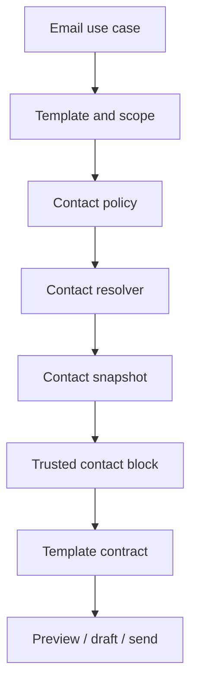

# PEMS — Kế hoạch tổng thể sửa bảng HTML email và bổ sung thông tin liên hệ có thể cấu hình

> Tài liệu giao việc trực tiếp cho AI Agent triển khai trên codebase PEMS.  
> Phạm vi: điều tra và sửa lỗi hiển thị bảng HTML trong email; thiết kế, triển khai và kiểm thử khối thông tin liên hệ dùng chung, có cấu hình, cho toàn bộ hệ thống email.  
> Nguyên tắc: không vá riêng một template, không gửi email thật trong quá trình kiểm thử, không làm mất WIP hiện hữu, không tự ý thay đổi nghiệp vụ hoặc dữ liệu ngoài phạm vi.

---

## 1. Bối cảnh và vấn đề cần giải quyết

Hệ thống PEMS hiện đã có cơ chế template email, preview/draft/send, trusted HTML block và guard fail-closed. Template `VISIT_SETUP_PROGRESS_UPDATE` đã được sửa contract cho `{{setupSummaryBlock}}`. Tuy nhiên còn hai vấn đề cấp hệ thống:

1. Một số bảng HTML trong preview/email bị vỡ bố cục: tiêu đề bị dồn, cột quá hẹp, chữ xuống dòng bất thường, khả năng chịu tác động từ HTML sinh bởi backend, CSS email hoặc CSS toàn cục của frontend.
2. Một số email hướng dẫn khách “liên hệ Host/người phụ trách” nhưng không hiển thị email, số điện thoại hoặc đầu mối thay thế. Người nhận vì vậy không biết phải liên hệ bằng cách nào.

Việc sửa phải bao phủ toàn bộ chuỗi:

`nguồn dữ liệu nghiệp vụ → resolver → trusted HTML block → template contract → renderer → preview/draft/send → history → Reply-To → giao diện cấu hình → database/defaults/SQL → test`.

---

## 2. Mục tiêu bắt buộc

Sau khi hoàn thành:

- Bảng trong preview, file `.eml`/file-sink và email gửi thử có kiểm soát hiển thị đúng cấu trúc.
- Tiêu đề bảng không bị ghép hoặc ép thành chuỗi khó đọc.
- Bảng dài vẫn đọc được trên desktop và màn hình hẹp.
- HTML tương thích hợp lý với Gmail và Outlook; không phụ thuộc CSS hiện đại hoặc stylesheet ngoài.
- Email có câu yêu cầu liên hệ phải hiển thị một đầu mối thực hiện được, hoặc fallback hợp lệ.
- Phân biệt rõ `Host`, `Sender` và `Reply contact`.
- Không lấy Host của cơ sở khác trong yêu cầu nhiều cơ sở.
- Người quản trị có thể cấu hình chính sách hiển thị khối liên hệ theo giới hạn an toàn.
- Không cho quản trị viên tự nhập HTML hoặc giả mạo email/số điện thoại của Host trong template.
- Dữ liệu người dùng luôn được HTML encode; chỉ markup do backend sinh mới là trusted HTML.
- Preview, draft, send và history dùng cùng một snapshot thông tin liên hệ.
- Contract fail-closed: thiếu placeholder, thiếu block, cấu hình sai hoặc không tìm được contact bắt buộc đều phải thất bại rõ ràng.
- VI và EN đồng bộ.
- Không phá chính sách template nhạy cảm, TO/CC/BCC, authorization, attachment hoặc các batch email đã hoàn thành.

---

## 3. Nguồn chuẩn và thứ tự ưu tiên

Trước khi sửa code, agent phải đọc các tài liệu liên quan và đối chiếu code hiện tại. Tối thiểu gồm:

1. `PEMS_CANONICAL_BUSINESS_RULES_v8_4_refined_v6_v10_FULL_UPDATED.md`
2. `PEMS_UC_IMPLEMENTATION_RULEBOOK_FRONTEND_BACKEND_DATABASE_VALIDATION_SECURITY_v8_4_refined_v6_v10_FULL_UPDATED.md`
3. `VISITOR_MANAGEMENT_SYSTEM_v8_4_refined_v6_v10_FULL_UPDATED.md`
4. `PROJECT_OVERVIEW_v8_4_refined_v6_v10_FULL_UPDATED.md`
5. `PERMISSION_MATRIX.md`
6. `PERMISSION_RULES.md`
7. `USE_CASE_LIST.md`
8. `PROJECT_STRUCTURE_FULL.md`
9. `CLEAN_ARCHITECTURE.md`
10. `PEMS_UI_DESIGN_SYSTEM_PROMPT.md`
11. `PEMS_CLAUDE_PROJECT_INSTRUCTIONS_v8_4_refined_v6_v10_FULL_UPDATED.md`
12. `PEMS_PER_CAMPUS_V2_MASTER_HANDOFF_PROMPT(1).md`

Thứ tự quyết định khi có mâu thuẫn:

1. Nghiệp vụ canonical đã được xác nhận mới nhất.
2. Schema/database và code runtime hiện tại.
3. Test đang bảo vệ hành vi hợp lệ.
4. Tài liệu kiến trúc, permission và UI.
5. Giả định của agent.

Không được tự chọn một phương án làm thay đổi nghiệp vụ đáng kể khi các nguồn chưa thống nhất. Phải ghi rõ bằng chứng và xin xác nhận.

---

## 4. Ràng buộc an toàn và điều kiện dừng

### 4.1. Không được làm

- Không dùng `git add -A`, `git commit -a`, amend hoặc reset phá hủy WIP.
- Không đưa file WIP ngoài phạm vi vào commit.
- Không push khi chưa được yêu cầu rõ ràng.
- Không gửi email thật trong quá trình phát triển và test.
- Không bật SMTP thật khi reminder/job còn có thể gửi ngoài ý muốn.
- Không sửa trực tiếp dữ liệu production.
- Không ghi đè template người dùng đã tùy chỉnh nếu không nhận diện chắc chắn trạng thái stale.
- Không tin cậy HTML từ frontend, template variable hoặc dữ liệu người dùng.
- Không đưa trusted block vào subject.
- Không tự động thêm Host/Sender vào CC/BCC của token email.
- Không dùng Host của request/campus khác làm fallback âm thầm.
- Không thêm hàng loạt cột boolean vào schema trước khi đánh giá mô hình cấu hình.

### 4.2. Phải dừng và báo cáo nếu

- Không xác định được nguồn canonical của Host/contact cho một nghiệp vụ.
- Schema không có dữ liệu cần thiết và việc bổ sung làm thay đổi phạm vi đáng kể.
- Baseline test/build đang đỏ không liên quan và không thể phân biệt regression mới.
- Database có drift không thể nhận diện an toàn bằng hash/revision/điều kiện nghiệp vụ.
- SMTP/file-sink không thể vô hiệu hóa an toàn.
- Cần thay đổi permission hoặc làm lộ thông tin cá nhân ngoài đối tượng nhận hợp lệ.

---

## 5. Giai đoạn 0 — Preflight và baseline

### Công việc

- Ghi nhận branch, HEAD, upstream, ahead/behind.
- Ghi nhận `git status --short`, staged/unstaged/untracked và số stash.
- Hash mọi file WIP ngoài phạm vi cần bảo toàn.
- Xác định hai commit gần nhất liên quan attachment/template đã tồn tại hay chưa.
- Xác định API/frontend/database đang chạy, PID, cổng, environment và database thực tế.
- Xác định `Smtp.Enabled`, hosted jobs, file-sink và cơ chế gửi email hiện tại.
- Trong test runtime, dùng SMTP disabled hoặc file-sink an toàn.
- Chụp baseline build/test hiện tại trước khi sửa.
- Chụp hash/version/revision của:
  - SQL canonical;
  - `email-template-defaults.json`;
  - các row `email_templates` liên quan;
  - renderer/contract/contact hiện có.
- Lập inventory toàn bộ template code, send point, preview endpoint, draft endpoint và history policy.

### Bằng chứng đầu ra

- Bảng preflight.
- Danh sách WIP cần bảo toàn kèm hash.
- Baseline build/test, phân biệt lỗi sẵn có.
- Danh sách template và đường gửi thực tế; không chỉ dựa vào seed.

### Gate G0

Chỉ tiếp tục khi có thể phân biệt rõ thay đổi của batch với WIP/baseline và đã bảo đảm không gửi email thật.

---

## 6. Giai đoạn 1 — Điều tra lỗi bảng HTML

Không sửa CSS theo cảm tính. Phải chứng minh lỗi ở tầng nào.

### 6.1. Audit HTML backend

Audit từng bảng được sinh trong `setupSummaryBlock` và các trusted block khác:

- Danh sách khách.
- Thành phần phía FPT.
- Lịch trình chi tiết.
- Trạng thái chuẩn bị.
- Các bảng tương tự ở template khác.

Với mỗi bảng, kiểm tra:

- Cấu trúc `table/thead/tbody/tr/th/td` hợp lệ.
- Mỗi dòng có số ô phù hợp với header.
- Không thiếu thẻ đóng.
- Không dùng `colspan` sai.
- Giá trị rỗng vẫn tạo đúng ô hoặc đúng fallback.
- Không nối chuỗi HTML không kiểm soát.
- Dữ liệu dài và ký tự đặc biệt không làm hỏng markup.
- Dữ liệu người dùng được encode đúng một lần.

Tạo test parser/DOM để kiểm tra cấu trúc thay vì chỉ `Contains()`.

### 6.2. Audit CSS email

Ưu tiên HTML email đơn giản, CSS inline và thuộc tính tương thích:

- `width: 100%`
- `border-collapse: collapse`
- `table-layout: fixed` chỉ khi phù hợp; phải kiểm thử nội dung dài
- `vertical-align: top`
- `overflow-wrap: anywhere` hoặc fallback tương thích
- padding/border đặt trực tiếp trên `th/td`
- độ rộng cột bằng `%`
- không dùng flex/grid trong bảng
- không dùng stylesheet ngoài
- không phụ thuộc selector phức tạp
- cân nhắc các thuộc tính HTML truyền thống nếu Outlook cần

Độ rộng gợi ý, phải xác nhận bằng render thực tế:

| Bảng | Cột | Phân bổ gợi ý |
|---|---|---|
| Danh sách khách | Họ tên / Đơn vị / Vai trò | 32% / 43% / 25% |
| Thành phần FPT | Họ tên / Đơn vị / Vai trò | 32% / 43% / 25% |
| Lịch trình | Thời gian / Nội dung / Mô tả / Địa điểm / Phụ trách | 19% / 21% / 24% / 18% / 18% |

### 6.3. Audit frontend preview

Xác định preview đang dùng iframe, DOM trực tiếp hay sanitizer. Kiểm tra:

- CSS global/reset có tác động lên `table`, `thead`, `tr`, `th`, `td` không.
- Sanitizer có loại `style`, `width`, `cellpadding` hoặc thẻ bảng không.
- Container có quá hẹp hoặc ép `display` sai không.
- Preview có phản ánh cùng HTML sẽ được gửi không.

Khuyến nghị dùng iframe/sandbox hoặc vùng cách ly CSS. Nếu dùng iframe, cấu hình sandbox phải cân bằng hiển thị và bảo mật; không bật script.

### 6.4. Deliverable điều tra

Lập bảng:

| Hiện tượng | Tầng gây lỗi | Bằng chứng | File/hàm | Cách sửa tối thiểu |
|---|---|---|---|---|

Không triển khai fix lớn trước khi hoàn tất bảng root cause.

### Gate G1

- Có test tái hiện lỗi trước sửa.
- Xác định được nguyên nhân HTML/CSS/preview hoặc kết hợp.
- Phạm vi sửa không ảnh hưởng sanitizer/XSS policy.

---

## 7. Giai đoạn 2 — Sửa bảng HTML và preview

### Công việc

- Chuẩn hóa helper/component sinh bảng email dùng chung nếu thực sự có lặp.
- Sửa semantic HTML và inline CSS tại nguồn backend.
- Giữ markup đủ đơn giản cho Gmail/Outlook.
- Cách ly CSS preview khỏi frontend global styles.
- Hỗ trợ màn hình hẹp: preview có thể cuộn ngang; email vẫn phải đọc được khi client bỏ `overflow`.
- Không thay đổi nội dung nghiệp vụ của các section.

### Test bắt buộc

- VI/EN.
- Dữ liệu rỗng và đầy đủ.
- Tên người/tổ chức rất dài.
- Nội dung lịch trình dài.
- Ký tự tiếng Việt, Unicode và ký tự đặc biệt.
- Payload HTML/XSS.
- Đúng số cột, đúng header/data alignment.
- Desktop và mobile preview.
- HTML snapshot/DOM assertions.

### Gate G2

- Test tái hiện trước đó xanh.
- Không còn header/cột bị dồn trong preview chuẩn.
- Trusted HTML đúng, user data vẫn encode.
- Không có regression renderer/template contract.

---

## 8. Giai đoạn 3 — Audit toàn bộ template cần thông tin liên hệ

Không chỉ sửa `VISIT_SETUP_PROGRESS_UPDATE`.

### 8.1. Tìm kiếm song ngữ

Tìm trong code, defaults, SQL và database các câu:

- “Vui lòng liên hệ”
- “Liên hệ Host”
- “người phụ trách”
- “đầu mối”
- “Contact the host”
- “Please contact”
- “person in charge”
- “For further assistance”
- các biến thể VI/EN khác

### 8.2. Ma trận bắt buộc

Lập ma trận cho toàn bộ template:

| Template code | Người nhận | Send point | Có lời gọi liên hệ VI/EN | Contact phù hợp | Bắt buộc | Visit/campus scope | Reply-To | Ghi chú |
|---|---|---|---|---|---:|---|---|---|

Phân loại tối thiểu:

- Cập nhật chuẩn bị.
- Mời tham quan/invitation.
- Phân công nhân sự.
- Nhắc lịch.
- Thay đổi lịch trình/amendment.
- Claim/transfer contact.
- Báo cáo/hóa đơn.
- OTP, xác nhận email, reset password.
- Các template logistics và manual email nếu có.

OTP/token email không tự động dùng Host contact nếu không có nghiệp vụ rõ ràng; có thể dùng support chung, đồng thời giữ nguyên sensitive policy.

### Gate G3

Mỗi template có quyết định rõ: `NO_CONTACT`, `OPTIONAL_CONTACT`, `REQUIRED_CONTACT`, nguồn contact và fallback.

---

## 9. Giai đoạn 4 — Chốt mô hình Host, Sender và Reply contact

### 9.1. Ba khái niệm độc lập

| Khái niệm | Định nghĩa |
|---|---|
| Host | Người phụ trách tiếp đoàn tại đúng visit instance/campus |
| Sender | Tài khoản thực hiện thao tác tạo/gửi email |
| Reply contact | Người hoặc địa chỉ mà người nhận nên liên hệ/trả lời |

Không tái sử dụng một DTO `name/email` cho cả ba nếu nghiệp vụ cho phép chúng khác nhau.

### 9.2. Thứ tự resolver đề xuất

Thứ tự phải được chốt theo từng policy/template, không áp cứng cho mọi email:

1. Host của đúng `visit_instance/campus`.
2. Đầu mối chịu trách nhiệm chính tại cơ sở.
3. Sender, nếu policy cho phép dùng làm contact.
4. Contact mặc định của campus/department.
5. Support contact cấp hệ thống.

Quy tắc bắt buộc:

- Không lấy Host của campus khác.
- HO gửi thay không đồng nghĩa HO là reply contact.
- User inactive hoặc dữ liệu contact không hợp lệ phải được xử lý rõ.
- Không hiện `N/A`; chỉ hiện trường có dữ liệu.
- Nếu contact bắt buộc không có email/phone đủ dùng và không có fallback, phải chặn.

### 9.3. Snapshot consistency

Chốt thời điểm snapshot contact:

- Preview có thể resolve live.
- Khi draft được tạo, lưu snapshot cần thiết.
- Send phải dùng snapshot của draft hoặc quy tắc refresh có kiểm soát, không âm thầm đổi người liên hệ.
- History phản ánh đúng nội dung đã gửi.

Phải nêu rõ dữ liệu nào lưu, mục đích, thời hạn và tác động riêng tư.

### Gate G4

Có decision record cho Host/Sender/Reply contact, fallback, inactive user, multi-campus và snapshot.

---

## 10. Giai đoạn 5 — Thiết kế backend và template contract

### 10.1. Thành phần đề xuất

Tên có thể điều chỉnh theo kiến trúc hiện tại:

- `EmailContactResolver`
- `EmailContactInformation`
- `EmailContactPolicy`
- `EmailContactHtmlRenderer`
- `ContactInformationBlock`
- `EmailReplyToPolicy`

Luồng chuẩn:



### 10.2. Trusted block

Placeholder đề xuất:

```text
{{contactInformationBlock}}
```

Block có thể hiển thị:

- Họ tên.
- Vai trò nghiệp vụ.
- Chức vụ/role phù hợp.
- Department.
- Campus.
- Email công việc.
- Số điện thoại công việc.
- Dòng “Được gửi bởi” nếu policy bật.

Mọi giá trị động phải encode. Chỉ cấu trúc HTML cố định của renderer là trusted.

### 10.3. Contract fail-closed

Bổ sung hoặc tái sử dụng error code rõ nghĩa:

- `EMAIL_CONTACT_REQUIRED_BUT_NOT_FOUND`
- `EMAIL_TEMPLATE_REQUIRED_CONTACT_BLOCK_NOT_IN_BODY`
- `EMAIL_CONTACT_CONFIGURATION_INVALID`
- `EMAIL_REPLY_TO_INVALID`

Ma trận contract tối thiểu:

| Body có placeholder | Caller có block | Policy bắt buộc | Kết quả |
|---:|---:|---:|---|
| Có | Có | Có/Không | Render |
| Có | Không | Có | Fail |
| Không | Có | Có | Fail |
| Không | Không | Có | Fail |
| Không | Không | Không | Render |

Ngoài ra:

- Cấm trusted block trong subject.
- Validate Reply-To bằng validator/policy hiện hữu.
- Token email giữ nguyên CC/BCC và sensitive restrictions.
- Preview/draft/send phải dùng cùng renderer/contract, không có đường bypass.

### Gate G5

Unit test phủ resolver, fallback, renderer, contract, Reply-To và security matrix.

---

## 11. Giai đoạn 6 — Mô hình cấu hình an toàn

### 11.1. Cấu hình được phép

Theo template:

- Bật/tắt contact block.
- Mức `NONE`, `OPTIONAL`, `REQUIRED`.
- Nguồn: `HOST`, `SENDER`, `HOST_THEN_SENDER`, `CAMPUS_DEFAULT`, `DEPARTMENT_DEFAULT`, `SUPPORT_CONTACT` hoặc enum được chốt.
- Hiển thị email.
- Hiển thị điện thoại.
- Hiển thị department/campus.
- Hiển thị sender.
- Tiêu đề block VI/EN.
- Có dùng Reply-To hay không và lấy từ nguồn nào.

### 11.2. Không cho cấu hình

- User ID cụ thể trong template content.
- Email/số điện thoại Host do admin tự gõ vào body.
- HTML tùy ý cho contact block.
- URL/script/style nguy hiểm.

### 11.3. Cascade cấu hình

Đề xuất:

`Template override → Campus default → Department default → System support default`.

Phải xác định rõ giá trị nào kế thừa, giá trị nào override và cách phân biệt `unset` với `false`.

### 11.4. Quyết định schema

Trước khi migrate, so sánh:

1. Policy cố định trong code.
2. JSON policy có schema/version.
3. Bảng cấu hình riêng được chuẩn hóa.

Đánh giá theo: khả năng mở rộng, validate, query, audit, permission, migration và 3NF. Không chọn JSON chỉ vì nhanh, cũng không tạo nhiều boolean rời rạc nếu khó mở rộng.

### Gate G6

Có ADR ngắn nêu lựa chọn, phương án bị loại, schema cuối và backward compatibility.

---

## 12. Giai đoạn 7 — Database, defaults và patch

Phải đồng bộ bốn nguồn:

1. SQL canonical.
2. Patch cho database hiện hữu.
3. `email-template-defaults.json`.
4. Contract/policy trong code.

### Yêu cầu patch

- Idempotent.
- Có preflight và verdict.
- Chỉ sửa template known-stale bằng code/revision/hash/điều kiện rõ ràng.
- Không ghi đè customization không nhận diện chắc chắn.
- Revision tăng đúng một lần nếu nội dung/policy thay đổi.
- Lần chạy thứ hai không đổi revision, hash hoặc `updated_at`.
- Không sửa template ngoài ma trận.
- Có hash trước/sau cho body VI/EN, subject, variables/policy.
- Có rollback khả thi hoặc ghi rõ giới hạn rollback.

Nếu canonical SQL đã đúng thì không sửa vô ích; patch vẫn cần cho DB cũ. Nếu canonical chưa đúng, cập nhật cả canonical và defaults cùng một thay đổi logic.

### Gate G7

Fresh import và upgrade existing DB đều tạo cùng trạng thái canonical; patch chạy hai lần vẫn an toàn.

---

## 13. Giai đoạn 8 — Frontend quản lý template

Thêm khu vực **Cấu hình thông tin liên hệ**:

- Bật/tắt block.
- Mức bắt buộc.
- Nguồn contact.
- Các trường được hiển thị.
- Sender line.
- Reply-To policy.
- Tiêu đề VI/EN.
- Preview bằng dữ liệu mẫu an toàn.

Yêu cầu UI/validation:

- Khi policy là required, không cho lưu body thiếu `{{contactInformationBlock}}`.
- Hiển thị lỗi từ backend rõ ràng, không nuốt error code.
- Restore defaults dùng default mới nhất.
- Dùng `revision` optimistic concurrency.
- Nếu có conflict, không ghi đè âm thầm.
- Không cho nhập HTML contact tùy ý.
- Preview được cách ly CSS và không chạy script.
- Dịch VI/EN đầy đủ, không sót text cứng.
- Permission theo matrix hiện tại; không mở quyền quản lý template cho role mới.

### Gate G8

Frontend typecheck/build/test xanh; permission và concurrency được kiểm thử.

---

## 14. Giai đoạn 9 — Bộ kiểm thử bắt buộc

### 14.1. Bảng HTML

- Đúng số cột và thứ tự cột.
- Header/data thẳng hàng.
- Dữ liệu rất dài.
- Trường rỗng.
- VI/EN.
- Unicode/ký tự đặc biệt.
- XSS trong tên khách, đơn vị, agenda, Host.
- Preview desktop/mobile.
- Gmail/Outlook nếu môi trường cho phép.

### 14.2. Contact resolver

- Host đủ email và phone.
- Host thiếu phone.
- Host thiếu email.
- Chưa phân công Host.
- Sender khác Host.
- HO gửi thay Host.
- Multi-campus có Host khác nhau.
- Host inactive sau khi tạo draft.
- Campus/department/system fallback.
- Không có contact và không có fallback.
- VI/EN.

### 14.3. Pipeline

- Preview, draft, send và history thống nhất snapshot.
- Reply-To đúng policy.
- Restore/edit template giữ optimistic concurrency.
- Required placeholder/block matrix.
- Optional/no-contact template không bị ép sai.
- Không còn đường legacy bypass contract.

### 14.4. Bảo mật

- HTML/script/event handler trong mọi field contact.
- Email/phone không hợp lệ.
- `javascript:`/URL tùy ý.
- Trusted block không nhận HTML frontend.
- Contact block không xuất hiện subject.
- Token email không tự thêm CC/BCC.
- History không lưu bí mật hoặc dữ liệu không cần thiết.
- Authorization đúng campus/role.

### 14.5. Runtime test

- Build backend/frontend.
- Chạy unit, integration, architecture và frontend test.
- Restart đúng backend binary mới nếu cần.
- Giữ `Smtp__Enabled=false` hoặc file-sink.
- Preview tối thiểu bốn case VI/EN × có/thiếu dữ liệu.
- Test Host/Sender khác nhau và multi-campus.
- Xác nhận `sent_emails`/SMTP logs không có email thật.
- Lưu response/ảnh không chứa token hoặc dữ liệu nhạy cảm.

### Gate G9

Không có regression mới so với baseline; mọi test mới thực sự fail trước fix hoặc chứng minh hành vi mới.

---

## 15. Giai đoạn 10 — Commit strategy

Tách tối thiểu thành ba commit logic:

```text
fix(email): stabilize responsive table rendering
feat(email): add configurable contact information blocks
feat(email): expose template contact settings
```

Nếu migration/default/patch lớn, có thể tách commit DB riêng, nhưng mỗi commit phải build/test hợp lý.

Trước mỗi commit:

- Stage đúng danh sách file bằng đường dẫn cụ thể.
- `git diff --cached --name-status`.
- `git diff --cached --check`.
- Kiểm tra file WIP ngoài phạm vi không staged.
- Không thêm AI/Claude trailer.
- Không push.

Sau commit:

- Ghi hash commit và danh sách file.
- Chứng minh WIP/stash nguyên vẹn.

---

## 16. Definition of Done

Chỉ đánh dấu hoàn tất khi tất cả điều sau đạt:

- [ ] Root cause bảng HTML có bằng chứng.
- [ ] Test tái hiện lỗi bảng đã xanh sau fix.
- [ ] Preview không còn vỡ cột/header ở VI và EN.
- [ ] Ma trận toàn bộ template đã hoàn tất.
- [ ] Mỗi template có contact policy rõ ràng.
- [ ] Host/Sender/Reply contact được phân biệt.
- [ ] Multi-campus không lấy nhầm Host.
- [ ] Trusted contact block encode dữ liệu động.
- [ ] Contract fail-closed phủ đủ ma trận.
- [ ] Reply-To được validate và policy-enforce.
- [ ] UI cấu hình có permission, validation và concurrency.
- [ ] Canonical/defaults/patch/code đồng bộ.
- [ ] Patch idempotent và không ghi đè customization.
- [ ] Fresh DB và existing DB đạt cùng trạng thái.
- [ ] Unit/integration/architecture/frontend test xanh hoặc không có regression mới.
- [ ] Runtime preview đạt với SMTP tắt.
- [ ] Không có email thật được gửi.
- [ ] WIP và stash nguyên vẹn.
- [ ] Commit đúng phạm vi, chưa push.

---

## 17. Mẫu báo cáo cuối bắt buộc

Agent phải báo cáo theo cấu trúc sau:

### 17.1. Preflight

- Branch/HEAD/upstream.
- Baseline build/test.
- WIP/stash và hash bảo toàn.
- SMTP/runtime safety.

### 17.2. Root cause

- Nguyên nhân bảng ở backend/CSS/preview.
- Bằng chứng trước sửa.
- Phạm vi ảnh hưởng.

### 17.3. Thiết kế contact

- Mô hình Host/Sender/Reply contact.
- Resolver priority và fallback.
- Snapshot/Reply-To/privacy decisions.
- Schema/config lựa chọn và lý do.

### 17.4. Template audit

- Ma trận toàn bộ template.
- Template nào required/optional/no-contact.
- VI/EN đã đồng bộ thế nào.

### 17.5. Database/defaults

- File đã cập nhật.
- Revision/hash trước/sau.
- Kết quả chạy patch lần hai.
- Fresh import/upgrade verdict.

### 17.6. Kiểm thử

- Build/test counts trước và sau.
- Test mới.
- Bốn preview VI/EN × có/thiếu dữ liệu.
- Host/Sender, multi-campus và fallback cases.
- XSS/contract/Reply-To/security results.
- Xác nhận không gửi email thật.

### 17.7. Git

- Hash/message/danh sách file từng commit.
- `git status --short`.
- WIP hash và stash count.
- Xác nhận chưa push.

### 17.8. Tồn đọng

- Việc chưa làm, lý do, rủi ro và bước tiếp theo.
- Không gọi “hoàn tất” nếu còn gate chưa đạt.

---

## 18. Lệnh giao việc ngắn gọn cho agent

Thực hiện toàn bộ kế hoạch trong tài liệu này theo thứ tự G0 → G9. Trước tiên chỉ audit và báo cáo root cause/decision record; không triển khai schema hoặc thay đổi nghiệp vụ khi chưa có bằng chứng từ code/database/tài liệu canonical. Sau khi thiết kế đã rõ, triển khai theo dependency order: bảng HTML → template audit → contact model/resolver → contract → config/database/defaults → frontend → full tests → runtime preview với SMTP tắt → commits. Bảo toàn toàn bộ WIP, stash và commit hiện hữu; không push. Mọi kết luận phải kèm file/hàm/test/hash hoặc bằng chứng runtime tương ứng.

