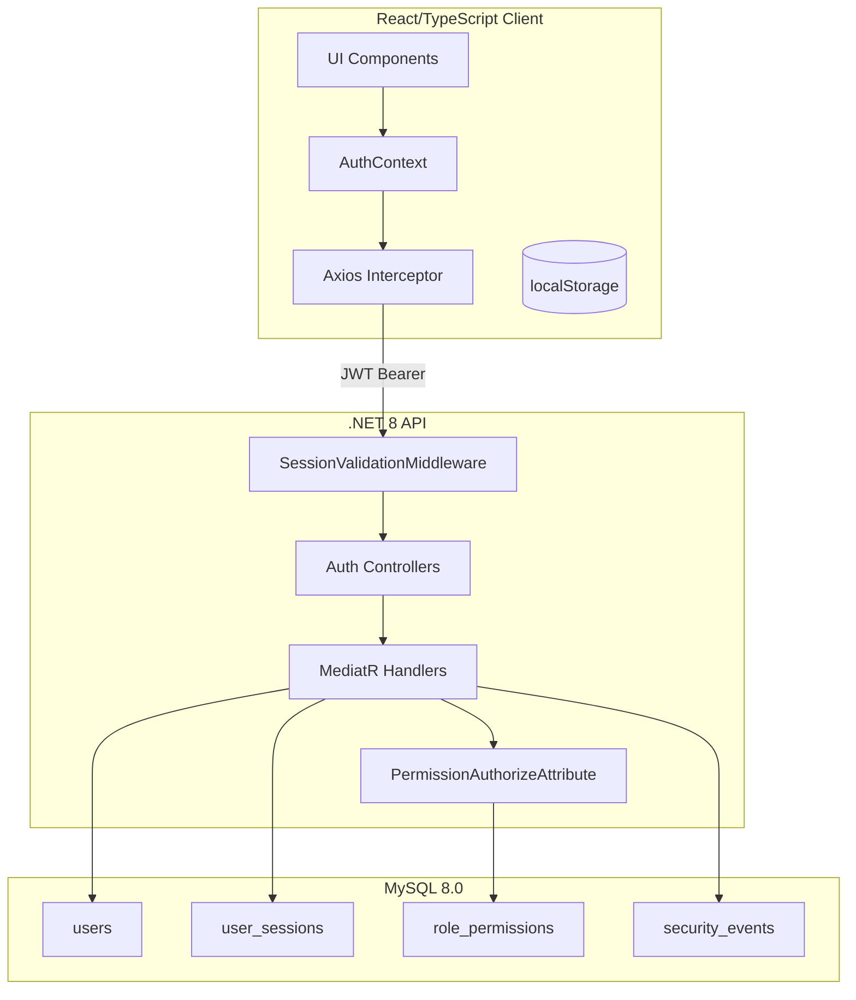
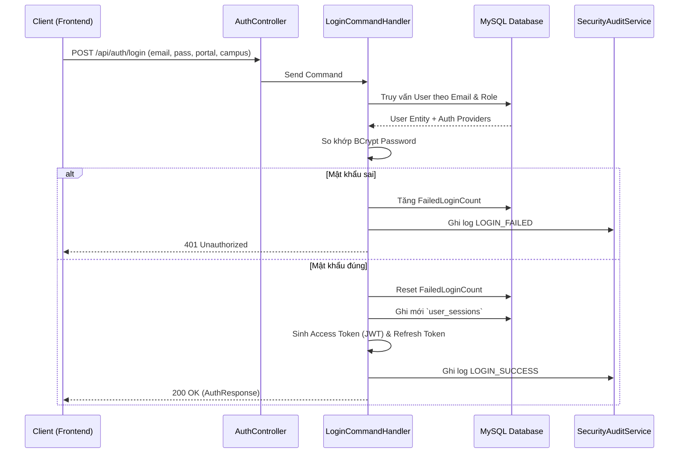

# BÁO CÁO KIỂM TOÁN KIẾN TRÚC & BẢO MẬT: LUỒNG AUTHENTICATION & RBAC
**Dự án:** PEMS (FPT University)
**Ngày thực hiện:** 18/06/2026
**Phạm vi:** Phân tích luồng Đăng nhập (Credentials & SSO), Quản lý Session, Cơ chế Phân quyền (RBAC) và Tích hợp Frontend.

---

## 1. TỔNG QUAN KIẾN TRÚC (ARCHITECTURE OVERVIEW)

Hệ thống PEMS sử dụng cơ chế bảo mật kết hợp giữa **Stateless Authentication (JWT)** và **Stateful Session Management (Database-backed)**. Cấu trúc này cho phép hiệu năng cao của JWT nhưng vẫn giữ được khả năng kiểm soát truy cập thời gian thực (thu hồi session ngay lập tức).

---

## 2. PHÂN TÍCH CÁC LUỒNG XÁC THỰC (AUTHENTICATION FLOWS)

### 2.1. Đăng Nhập Bằng Mật Khẩu (Credential Login)
Hệ thống duy trì hai cổng đăng nhập riêng biệt: `INTERNAL` (nhân viên/sinh viên FPT) và `VISITOR` (khách).

**Đánh giá bảo mật:**
- Mật khẩu được băm an toàn bằng thuật toán **BCrypt (WorkFactor 12)**.
- Backend phân định rõ `selectedCampusId` với cổng INTERNAL, không bắt buộc với VISITOR.
- Ghi log audit chặt chẽ cho mọi lần đăng nhập (thành công, thất bại, bị khóa).

### 2.2. Đăng Nhập SSO (Google Sign-In)
Xử lý đăng nhập thông qua Google Workspace, đặc biệt quan trọng với sinh viên/cán bộ dùng email `@fpt.edu.vn`.

**Quy trình kỹ thuật:**
1. Frontend gọi SDK Google trả về `idToken`.
2. Backend sử dụng `GoogleTokenValidator` để tự fetch public keys (JWKS) từ Google, parse JWT và kiểm tra chuỗi Signature/Audience/Expiry.
3. Kiểm tra email đã được xác thực (email_verified).
4. Khớp email với `user_auth_providers` (`ProviderType = GOOGLE_SSO`).

> [!WARNING]
> **Điểm cần lưu ý (Auto-provisioning):** Cấu hình `AutoProvision` trong `appsettings.json` hiện đang tắt (`false`). Khi tài khoản Google mới tinh đăng nhập, hệ thống sẽ từ chối vì chưa có chính sách tự động gán `role_id` và `primary_campus_id`. Cần FPTU thống nhất rule trước khi bật.

---

## 3. QUẢN LÝ PHIÊN & MIDDLEWARE (SESSION MANAGEMENT)

PEMS giải quyết được bài toán hóc búa nhất của JWT là **"Thu hồi Token (Revocation)"**.

### 3.1. Cơ chế hoạt động
- Trong payload JWT chứa claim `session_id`.
- `SessionValidationMiddleware` chặn **mọi request** yêu cầu xác thực.
- Nó truy vấn bảng `user_sessions` xem session này có bị đánh dấu `revoked_at` hay không. 
- **Kết quả:** Ngay khi Admin khóa tài khoản hoặc User đổi mật khẩu, token lập tức mất tác dụng.

### 3.2. Bảo mật Refresh Token
- Refresh token được gửi xuống Client là chuỗi ngẫu nhiên trong suốt (opaque token).
- Trong DB (`user_sessions`), hệ thống **chỉ lưu mã băm (SHA-256 hash)** của refresh token này (`refresh_token_hash`).
- Nếu DB bị lộ, hacker không thể dùng hash này để refresh access token.

### 3.3. Thay Đổi Mật Khẩu (Change Password)
Khi Handler `ChangePasswordCommandHandler` chạy thành công, nó tự động cập nhật `revoked_at` cho **tất cả các session khác** của User đó ngoại trừ session hiện hành.

---

## 4. QUẢN LÝ TRUY CẬP (RBAC - DATABASE FIRST)

Quyền hạn được kiểm soát hoàn toàn thông qua database (`permissions`, `roles`, `role_permissions`), tuyệt đối không hard-code quyền vào code logic.

### 4.1. Ma Trận Phân Quyền (Cấu trúc DB)

| Bảng | Trách nhiệm | Ví dụ |
|---|---|---|
| `roles` | Nhóm chức danh cốt lõi | ADMIN, HO, STAFF, DEPT, STUDENT, VISITOR |
| `permissions` | Định nghĩa mã hành động (UC) | `UC-117.VIEW_ROLE_LIST`, `UC-012.LOGOUT` |
| `role_permissions` | Giao điểm kết nối quyền | Role: STAFF, SubRole: Leader, Perm: `UC-117`, Level: F |

### 4.2. Khái niệm `sub_role` (Leader vs Staff)
Thay vì tạo ra hàng loạt role rác (`STAFF_LEADER`, `STAFF_MEMBER`, `DEPT_LEADER`...), PEMS giữ lại 6 roles nguyên bản và thêm trường `sub_role` vào bảng `role_permissions`.
- Tại `PermissionAuthorizeAttribute`, backend tự động phân giải: Nếu user là STAFF, nó tự check xem user đó đang mang `sub_role` nào để đọc đúng quyền trong DB.

### 4.3. Cấp độ quyền (Permission Levels)
Sử dụng `AuthConstants.PermissionLevels`:
1. **F (Full)**: Toàn quyền (Tạo/Đọc/Sửa/Xóa).
2. **E (Execute)**: Thực thi/Chỉnh sửa.
3. **O (Own)**: Chỉ áp dụng trên dữ liệu sở hữu của User hoặc Campus. (Yêu cầu `OwnershipChecker` duyệt tiếp).
4. **R (Read)**: Chỉ xem.

---

## 5. TÍCH HỢP FRONTEND (REACT / AXIOS)

### 5.1. Refresh Token Tự Động (Single-Flight Promise)
Tại `httpClient.ts`, interceptor tự động bắt lỗi `401 Unauthorized`.
- Nhờ biến `refreshPromise`, nếu có 10 API đồng thời ném lỗi 401, frontend chỉ gọi `/auth/refresh` đúng **1 lần duy nhất**, các request khác sẽ xếp hàng chờ token mới rồi retry. Cực kỳ tối ưu.

### 5.2. Quản Lý Trạng Thái (AuthContext)
- Dữ liệu user an toàn (`AuthUserDto`) và danh sách quyền (`UserPermissionDto[]`) được nạp xuống `AuthContext.tsx`.
- Các Route được bảo vệ bằng `ProtectedRoute.tsx` (tự động điều hướng đến `/change-password` nếu user có cờ `MustChangePassword`).
- Component UI sử dụng hook `usePermission()` để ẩn/hiện nút bấm tương ứng.

---

## 6. ĐÁNH GIÁ KIỂM TOÁN VÀ KHUYẾN NGHỊ (SECURITY CHECKLIST)

### ✅ Những Điểm Đạt Chuẩn (Compliant)
- [x] **Mật khẩu:** Hàm băm BCrypt + WorkFactor an toàn.
- [x] **SSO:** Xác thực JWKS động từ Google, an toàn hơn nhiều so với verify qua endpoint tĩnh.
- [x] **Session:** Server-side revocation chặn triệt để tấn công đánh cắp token.
- [x] **Token Leakage:** Hash OTP và Hash Refresh Token trong DB tránh rủi ro khi DB bị dump.
- [x] **RBAC:** Clean Architecture, logic nằm gọn trong Attribute và Middleware, không bị lẫn vào Business Logic.
- [x] **Error Handling:** Trả về Exception ẩn giấu chi tiết hệ thống (No Stack Traces via `ExceptionHandlingMiddleware`).

### ⚠️ Rủi Ro Cần Xử Lý Ngay (Action Items)

| Vấn đề phát hiện | Chi tiết | Mức độ | Đề xuất giải pháp |
|---|---|---|---|
| **Lệch chuẩn Permission Code** | Khai báo hằng số trong `PermissionConstants.cs` không khớp chuẩn UC DB hiện tại. | 🔴 Cao | Cần chuẩn hóa đồng bộ theo file `SEED_DATA_CONVENTION.md`. |
| **Thiếu Rate Limiting ở API Login** | Tuy có `FailedLoginCount` giới hạn số lần sai của một tài khoản, hệ thống vẫn dễ bị tấn công DDOS vào Endpoint Login. | 🟠 Trung bình | Tích hợp thư viện RateLimiter của .NET 8 vào các route `/api/auth/*`. |
| **Auto-Provisioning SSO** | Nếu bật tự động cấp account SSO, hệ thống chưa biết user mới thuộc Campus nào hay Role nào. | 🟡 Thấp | Khi bật tính năng này, yêu cầu người dùng phải chọn Campus/Role (và chờ duyệt) ở màn hình Onboarding Frontend. |
| **CORS Cấu hình tạm** | `appsettings.json` đang cho phép các port localhost tĩnh. Cần đảm bảo có cấu hình chặt trên môi trường Production. | 🟡 Thấp | Thêm biến môi trường để tiêm đúng tên miền (Domain) production vào `AllowedOrigins`. |

---
**Kết luận:** 
Kiến trúc Authentication của PEMS được thiết kế vô cùng chắc chắn và bài bản, đặc biệt là cơ chế Session Management tự viết kết hợp giữa sự linh hoạt của JWT và tính kiểm soát của Database Session. Chỉ cần hiệu chỉnh lại mã phân quyền để đồng bộ với Database là hệ thống sẵn sàng cho Production.
